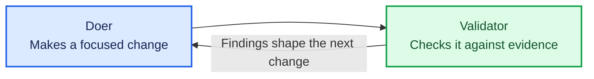

# Two-part curriculum and lexicon alignment implementation plan

> **For agentic workers:** REQUIRED SUB-SKILL: Use superpowers:subagent-driven-development (recommended) or superpowers:executing-plans to implement this plan task-by-task. Steps use checkbox (`- [ ]`) syntax for tracking.

**Goal:** Restructure the tutorial into six lessons across two parts — Part 1 teaches one agent at a time and runs everything by hand, Part 2 joins them into an assembly line — and adopt the course lexicon throughout.

**Architecture:** The curriculum is data. `docs/specs/README.md` is a ledger the tutorial engine parses into sidebar progress, and each row links to a specification the tutor reads aloud. So the work is: teach the loader about parts (Task 1), rewrite the ledger and the specifications (Tasks 2–4), align the tutor's own prompt and the surrounding prose (Tasks 5–6), then re-point the eval harness at the new artefact names and lesson numbers (Tasks 7–9).

**Tech Stack:** TypeScript with ES modules, Vitest, React (the tutor's browser view), Bash (the factory the learner builds), Pi CLI.

## Global Constraints

- Design document: `docs/plans/2026-08-04-two-part-curriculum-and-lexicon-alignment-design.md`. It is the authority on intent; this plan is the authority on mechanics.
- Canonical role names come from `~/Work/lean-software-production/workshops/docs/materials/lexicon.md`: **doer**, **validator**, **machine**, **assembly line**, **factory**, **orchestrator**, **judge**. Never write *reviewer*, *worker*, *critic*, *verifier*, *agent A*, or *agent B*.
- *Iteration* means a bounded batch of agent work, never a curriculum unit. A curriculum unit is a **lesson**.
- **machine**, **assembly line** and **orchestrator** appear in Part 2 specifications only. Lessons 001–004 must not use them.
- Prose is British English, matching the existing specifications (`behaviour`, not `behavior`).
- Do not rewrite files under `docs/plans/` other than the ones this plan names; they are a historical record.
- Every task ends with `npm run check` passing from the repository root. There is no root `npm test`; the workspace scripts are `npm run test:onboarding`, `npm run test:eval`, and `npm test --workspace=tutorial-engine`.
- Commit at the end of every task. Do not push.

---

## File Structure

**Engine — parts-aware progress**
- `tutorial-engine/src/lesson/load.ts` — parses the ledger; gains part grouping and drops the hardcoded header literal.
- `tutorial-engine/web/src/main.tsx` — renders progress; gains part separators.
- `tutorial-engine/web/src/styles.css` — styles the separator.
- `tutorial-engine/test/lesson-load.test.ts`, `tutorial-engine/test/fixtures/sample-lesson/docs/specs/README.md` — cover it.
- `evals/harness/judge.ts` — has its own copy of the ledger parser; must not drift.

**Curriculum**
- `docs/specs/README.md` — the ledger, now two tables.
- `docs/specs/001-run-an-agent-headlessly.md` … `006-route-failed-verdicts-to-repair.md` — six specifications.

**Tutor**
- `tutorial-engine/src/agent/pi-adapter.ts` — the tutor's system prompt.
- `tutorial-engine/test/coaching-prompt.test.ts` — covers it.

**Evals**
- `evals/harness/factory-stubs.ts` — runs a learner script against stubbed `pi`; must stop assuming one script at one path.
- `evals/harness/assertions.ts` — per-lesson deterministic gates.
- `evals/scenarios/lesson-00N/scenarios.ts` — canonical learner edits per lesson.
- `evals/run.ts` — wires the scenario modules together.

---

## Task 1: Parts-aware ledger parsing

**Files:**
- Modify: `tutorial-engine/src/lesson/load.ts`
- Modify: `tutorial-engine/web/src/main.tsx:120`
- Modify: `tutorial-engine/web/src/styles.css:13`
- Modify: `evals/harness/judge.ts:90-102`
- Modify: `tutorial-engine/test/fixtures/sample-lesson/docs/specs/README.md`
- Test: `tutorial-engine/test/lesson-load.test.ts`

**Interfaces:**
- Consumes: nothing from earlier tasks.
- Produces: `ProgressItem` gains an optional `part?: string`. `readProgress` recognises a table row by its status cell holding `Todo` or `Done`, not by the header cell's text — so later tasks may rename the header column freely.

- [ ] **Step 1: Update the fixture ledger to two parts**

Replace the whole of `tutorial-engine/test/fixtures/sample-lesson/docs/specs/README.md`:

```markdown
# Lessons

## Part 1 — First part

| Lesson | Goal | Status |
| --- | --- | --- |
| [001](001.md) | Fixture step | Todo |

## Part 2 — Second part

| Lesson | Goal | Status |
| --- | --- | --- |
| [002](002.md) | Second fixture step | Todo |
```

- [ ] **Step 2: Write the failing tests**

Replace the first test in `tutorial-engine/test/lesson-load.test.ts` and add two more, so the `describe` block reads:

```ts
describe("loadLesson", () => {
  it("groups lesson rows under the part heading that precedes them", async () => {
    const loaded = await loadLesson(fixture);
    expect(loaded.definition.title).toBe("Fixture tutorial");
    expect(loaded.workspace).toBe(fixture);
    expect(loaded.definition.validationCommands).toEqual([]);
    expect(loaded.progress).toEqual([
      { id: "orientation", label: "Orientation", state: "done" },
      { id: "001", label: "Fixture step", state: "current", part: "Part 1 — First part" },
      { id: "002", label: "Second fixture step", state: "upcoming", part: "Part 2 — Second part" },
    ]);
  });

  it("ignores a header row whatever its first column is called", async () => {
    const loaded = await loadLesson(fixture);
    expect(loaded.progress.some((item) => item.label === "Goal")).toBe(false);
    expect(loaded.progress.some((item) => item.id === "Lesson")).toBe(false);
  });

  it("loads the repository tutorial regardless of how many lesson rows its ledger contains", async () => {
    const loaded = await loadLesson(tutorialRoot);
    expect(loaded.definition.title).toBe("Software factory tutorial 🏭");
    expect(loaded.definition.validationCommands).toEqual([]);
    expect(loaded.progress[0]).toEqual({ id: "orientation", label: "Orientation", state: "done" });
    expect(loaded.progress.length).toBeGreaterThan(1);
    expect(loaded.progress.filter((item) => item.state === "current")).toHaveLength(1);
    expect(loaded.progress.slice(1).every((item) => item.id.length > 0 && item.label.length > 0)).toBe(true);
  });
});
```

- [ ] **Step 3: Run the tests to verify they fail**

Run: `npm test --workspace=tutorial-engine -- lesson-load`
Expected: FAIL — the first test reports progress items without a `part` property.

- [ ] **Step 4: Teach the loader about parts**

In `tutorial-engine/src/lesson/load.ts`, change the `ProgressItem` interface and replace `readProgress` entirely:

```ts
export type ProgressState = "done" | "current" | "upcoming";
export interface ProgressItem { id: string; label: string; state: ProgressState; part?: string; }
```

```ts
/** A row is a lesson when its status cell holds a status, which no header row does. */
const LEDGER_STATUSES = new Set(["Todo", "Done"]);

function readProgress(ledger: string): ProgressItem[] {
  const entries: Array<{ id: string; label: string; status: string; part?: string }> = [];
  let part: string | undefined;

  for (const line of ledger.split(/\r?\n/)) {
    const heading = line.match(/^##\s+(Part\s.+?)\s*$/);
    if (heading) { part = heading[1]; continue; }
    if (!line.trimStart().startsWith("|")) continue;
    const cells = line.split("|").slice(1, -1).map((cell) => cell.trim());
    if (cells.length < 3 || !LEDGER_STATUSES.has(cells[2] ?? "")) continue;
    const id = cells[0]?.match(/\[([^\]]+)\]/)?.[1] ?? cells[0] ?? "";
    if (!id) continue;
    entries.push({ id, label: cells[1] ?? "", status: cells[2] ?? "Todo", part });
  }

  let foundCurrent = false;
  return [
    { id: "orientation", label: "Orientation", state: "done" as const },
    ...entries.map((entry) => {
      const item = { id: entry.id, label: entry.label, part: entry.part };
      if (entry.status === "Done") return { ...item, state: "done" as const };
      if (!foundCurrent) { foundCurrent = true; return { ...item, state: "current" as const }; }
      return { ...item, state: "upcoming" as const };
    })
  ];
}
```

- [ ] **Step 5: Run the tests to verify they pass**

Run: `npm test --workspace=tutorial-engine -- lesson-load`
Expected: PASS, all three.

- [ ] **Step 6: Keep the eval harness's copy of the parser in step**

In `evals/harness/judge.ts`, inside `loadActiveSpec`, replace the header-skipping line:

```ts
    if (cells.length < 3 || cells[0] === "Iteration" || cells[0].startsWith("---")) continue;
```

with:

```ts
    if (cells.length < 3 || !["Todo", "Done"].includes(cells[2] ?? "")) continue;
```

- [ ] **Step 7: Render part separators in the browser**

In `tutorial-engine/web/src/main.tsx`, replace the `<nav className="progress">` expression on line 120:

```tsx
<nav className="progress" aria-label="Tutorial progress">{progress.map((item, index) => <Fragment key={item.id}>{item.part && item.part !== progress[index - 1]?.part ? <span className="part">{item.part}</span> : null}<span className={item.state}>{item.label}</span></Fragment>)}</nav>
```

Add `Fragment` to the existing React import at the top of the file.

- [ ] **Step 8: Style the separator**

In `tutorial-engine/web/src/styles.css`, append to the `.progress` rules on line 13:

```css
.progress .part { flex-basis: 100%; margin-top: 4px; color: #525149; font-weight: 650; text-transform: uppercase; letter-spacing: .04em; font-size: .66rem; }.progress .part + span::before { content: none; }
```

- [ ] **Step 9: Run the whole suite**

Run: `npm run check`
Expected: PASS. The repository ledger still has one table and no part headings, and the third test proves it still loads.

- [ ] **Step 10: Commit**

```bash
git add tutorial-engine/src/lesson/load.ts tutorial-engine/web/src/main.tsx tutorial-engine/web/src/styles.css tutorial-engine/test/lesson-load.test.ts tutorial-engine/test/fixtures/sample-lesson/docs/specs/README.md evals/harness/judge.ts
git commit -m "feat: group lesson ledger rows under part headings"
```

---

## Task 2: Part 1 specifications and the two-part ledger

**Files:**
- Create: `docs/specs/001-run-an-agent-headlessly.md`
- Create: `docs/specs/002-build-a-doer.md` (from `001-invoke-a-doer.md`)
- Create: `docs/specs/003-build-a-validator.md`
- Create: `docs/specs/004-feed-the-findings-back.md`
- Rename: `docs/specs/003-repeat-validation-loop.md` → `005-join-them-into-an-assembly-line.md`
- Rename: `docs/specs/004-route-failed-reviews-to-repair.md` → `006-route-failed-verdicts-to-repair.md`
- Delete: `docs/specs/001-invoke-a-doer.md`, `docs/specs/002-review-a-doer.md`
- Modify: `docs/specs/README.md`

**Interfaces:**
- Consumes: the parts-aware loader from Task 1.
- Produces: six specification files and a ledger whose first `Todo` row is `001`. Later tasks rewrite the bodies of 005 and 006; this task only renames them and fixes their vocabulary so the ledger is never broken.

- [ ] **Step 1: Move the two Part 2 specifications into their new numbers**

```bash
git mv docs/specs/003-repeat-validation-loop.md docs/specs/005-join-them-into-an-assembly-line.md
git mv docs/specs/004-route-failed-reviews-to-repair.md docs/specs/006-route-failed-verdicts-to-repair.md
git rm docs/specs/002-review-a-doer.md
git mv docs/specs/001-invoke-a-doer.md docs/specs/002-build-a-doer.md
```

- [ ] **Step 2: Write the ledger**

Replace the whole of `docs/specs/README.md`:

```markdown
# Software factory tutorial lessons

The tutorial is two pieces of work. Part 1 builds one agent at a time and runs everything by hand.
Part 2 joins those agents into an assembly line that runs itself.

## Part 1 — The validation loop

| Lesson | Goal | Status |
| --- | --- | --- |
| [001](001-run-an-agent-headlessly.md) | Run an agent headlessly | Todo |
| [002](002-build-a-doer.md) | Build a doer that changes the calculator | Todo |
| [003](003-build-a-validator.md) | Build a validator that checks the change | Todo |
| [004](004-feed-the-findings-back.md) | Feed the findings back by hand | Todo |

## Part 2 — Build the factory

| Lesson | Goal | Status |
| --- | --- | --- |
| [005](005-join-them-into-an-assembly-line.md) | Join them into an assembly line | Todo |
| [006](006-route-failed-verdicts-to-repair.md) | Route failed verdicts to repair | Todo |
```

- [ ] **Step 3: Write lesson 001**

Create `docs/specs/001-run-an-agent-headlessly.md`:

````markdown
# Run an agent headlessly

Run one agent, with one job to be done, and no human in its conversation.

## Key concept

An **agent** is a harness with a job to be done. The harness is ordinary software: it prepares the
input, calls a model, and handles what comes back. The job to be done is what you hand it.

Pi is a harness. This command gives it a job:

```sh
echo "Describe what this calculator does, in three sentences." \
  | (cd calculator && pi --no-session --tools read,grep,find,ls -p)
```

Three things in that one line are worth naming.

The text on standard input is the **job to be done**. Nothing else tells the agent what you want.

`-p` makes the run **headless**: Pi does the job and exits, with no human in the conversation while
it works. That matters because everything you build after this runs without you watching it. An
agent you have to talk to cannot be part of something that runs on its own.

`--tools read,grep,find,ls` is the **boundary**. This agent can look at the calculator and nothing
else — it cannot change a file even if it decides it should. You will draw a different boundary for
every agent in this tutorial, and each boundary is a deliberate choice.

## Implementation order

The learner creates no files in this lesson. Teach it in this order:

1. **Run the command.** From the repository root, run the command above and read what comes back.
   The answer is unremarkable; the mechanics are the lesson.
2. **Run it again without `-p`.** Drop the `-p` and run it again. Pi opens an interactive session
   instead of answering and exiting. Have the learner leave the session with `/exit`. Ask them what
   would happen if a script ran the second form and walked away.
3. **Change the job.** Have the learner replace the sentence on standard input with a question of
   their own and run it again. The harness did not change; only the job did.

## Checks

Ask the learner to answer these from what they just ran, in their own words:

- Which part of the command was the harness, and which part was the job to be done?
- What did `-p` change?
- What could this agent not have done, however it was asked?

## Pressure test

This agent only describes. The next lesson gives an agent a job that changes the calculator, which
means giving it a different boundary — and raises the question this tutorial is built around: who
checks the change?
````

- [ ] **Step 4: Rewrite lesson 002 from the old lesson 001**

Edit `docs/specs/002-build-a-doer.md`. It currently begins the tutorial and defines `success.md`;
it must now do neither. Make these changes:

- Title becomes `# Build a doer`, standfirst becomes: `Give an agent a job that changes the calculator, and check its work yourself.`
- Replace the **Key concept** section. It must say that a **doer** is the agent that does the job and produces the work product, that its boundary is the opposite of lesson 001's — it may edit, and it may not run a shell, tests, or quality tools — and that keeping those outside the doer is what makes an independent check possible later. It must not mention a validation loop, a validator, or a factory.
- Delete the **The validation loop** section and its Mermaid diagram entirely.
- Delete implementation step 1 (**Define success**) entirely. `success.md` does not exist in Part 1.
- Renumber the remaining steps. Step 1 is now **Write the doer prompt**, and because there is no `success.md`, the prompt states the job directly. Its required content: choose one small, behaviour-preserving refactoring of the calculator; edit files directly; do not run tests, npm, or shell commands; keep the response concise.
- Replace the script in step 2 (**Invoke Pi**) with exactly:

```sh
#!/usr/bin/env bash
set -euo pipefail

cd "$(dirname "$0")"
echo "Recording quality baseline..."
(cd ../calculator && node scripts/quality.mjs) > refactor-quality-before.txt || true
echo "Starting doer..."
cat refactor.md | (cd ../calculator && pi --no-session --tools read,edit,write,grep,find,ls -p)
```

- The script is `factory/refactor-do.sh`, not `factory/run.sh`. Every reference to `run.sh` in this specification becomes `refactor-do.sh`.
- Add a paragraph after the script explaining the baseline: it records what `node scripts/quality.mjs` said before the doer touched anything, so the next lesson has something to compare against. Say that `node scripts/quality.mjs` is used rather than `npm run quality` because npm appends its own error block to a non-zero exit, which reads as though the script broke. Say that the two lines around the Pi call are the harness — deterministic code wrapping a model call — and that each step announces itself so nothing the harness does is invisible.
- In **Checks**, the learner reviews the change themselves: read the diff, and run `(cd calculator && npm test)` and `node scripts/quality.mjs`. Keep the existing instruction not to ask the doer to run or interpret these checks.
- **Pressure test** becomes: you checked this by hand, and you are the only reason anyone knows whether the change was safe. The next lesson gives that job to an agent.
- Rename the **Alternatives: choose another doer** section's prose from *reviewer* wording where it appears; the section itself stays.

- [ ] **Step 5: Write lesson 003**

Create `docs/specs/003-build-a-validator.md`:

````markdown
# Build a validator

Give a second agent one job: say whether the doer's change was safe.

## Key concept

A **validator** is the agent that verifies the job was done satisfactorily. It is given the work and
the criteria, and reports what is wrong, missing, or unsupported. Because it did not write the
change, it has nothing to defend.

Its boundary is the mirror image of the doer's. The doer could edit and could not run anything; the
validator can run things and cannot edit. That is not a detail — an agent that both makes a change
and reports on it is reporting on itself.

This validator is deliberately simple. It knows one check.

## Implementation order

Keep `factory/refactor.md` and `factory/refactor-do.sh` from the previous lesson. Build this lesson
in this order:

1. **Write the validator prompt.** Create `factory/refactor-validate.md`. Its job to be done is one
   sentence: was the change a single refactoring, and did it reduce what
   `node scripts/quality.mjs` reports against the recorded baseline? Tell it to read the working-tree diff
   in `calculator/`, run `node scripts/quality.mjs`, and compare the result with the baseline
   supplied to it on standard input after the prompt. It must not modify any file, and it must not run shell
   commands that modify files.

   Require this response format:

   ```text
   VERDICT: PASS

   EVIDENCE:
   - <what you ran, and what it reported>
   ```

   The first non-empty line must be exactly `VERDICT: PASS` or `VERDICT: FAIL`.

2. **Invoke the validator.** Create `factory/refactor-validate.sh`:

   ```sh
   #!/usr/bin/env bash
   set -euo pipefail

   cd "$(dirname "$0")"
   if [ ! -f refactor-quality-before.txt ]; then
     echo "No quality baseline. Run ./refactor-do.sh first." >&2
     exit 1
   fi
   echo "Starting validation..."
   cat refactor-validate.md refactor-quality-before.txt \
     | (cd ../calculator && pi --no-session --tools read,grep,find,ls,bash -p) \
     | tee refactor-validate-findings.txt
   ```

   The validator gets `bash` so it can run the quality check, and no `edit` or `write` so it cannot
   repair what it finds. It stops rather than invent a comparison when there is no baseline. Its
   findings go to the terminal and to a file, because the next lesson needs them.

## Advanced: substitute another validator

Pi is the default validator, but Claude Code or Codex may take this role when configured for
non-interactive, read-only work with permission to run the checks. Its access must differ from the
doer's: it may inspect the calculator and run validation commands, but it must not edit files. Do
not assume another CLI's default sandbox or permission model provides that boundary.

## Checks

From the repository root:

```sh
./factory/refactor-do.sh
./factory/refactor-validate.sh
```

Verify by hand that the validator:

- announces itself before Pi is invoked;
- does not edit any file in `calculator/`;
- returns exactly one `PASS` or `FAIL` verdict on its first non-empty line; and
- quotes what it actually ran, rather than asserting a conclusion.

Then run `./factory/refactor-validate.sh` on its own, without a preceding doer turn, and confirm it
refuses rather than reporting on a stale baseline.

## Pressure test

This validator knows one check. Ask it whether the change revealed intention, or removed
duplication, and it has nothing to say — you never told it what good looks like. Hold that thought;
it is what Part 2 answers.

For now there is a more immediate gap. The validator found something, and nothing happened. Nobody
told the doer.
````

- [ ] **Step 6: Write lesson 004**

Create `docs/specs/004-feed-the-findings-back.md`:

````markdown
# Feed the findings back

Hand the validator's findings to the doer, and watch the same two agents produce a different result.

## Key concept

Nothing new gets built in this lesson. You run what you already have, in a cycle, and carry the
evidence between the turns yourself.

That is the whole idea this tutorial is built on: a doer makes a change, a validator checks it, and
what the validator found shapes the next change. The two agents did not learn anything. Their
context changed, and nothing else did.

## The loop you just ran

Show this diagram after the learner has completed a cycle, not before:



## Implementation order

No new files. Run this cycle, in this order:

1. **Get a failing verdict.** Run `./factory/refactor-do.sh` then `./factory/refactor-validate.sh`
   until the validator reports `VERDICT: FAIL`. If everything passes, have the learner make the
   validator stricter, or hand-edit the calculator to introduce something worth reporting — a
   failing verdict is the material this lesson works with.
2. **Hand the findings back.** Run the doer again with the findings appended to its prompt:

   ```sh
   cd factory
   cat refactor.md refactor-validate-findings.txt \
     | (cd ../calculator && pi --no-session --tools read,edit,write,grep,find,ls -p)
   ```

   Nothing about the doer changed. Its job to be done is the same file it always was. The only
   difference is what else was in its context.
3. **Validate again.** Run `./factory/refactor-validate.sh` and read the new verdict. Ask the
   learner what they did in this cycle that neither agent did.

## Checks

The learner should be able to say:

- what they personally decided in that cycle, and when;
- why the doer behaved differently on the second run despite an unchanged prompt file; and
- what would happen to the cycle if they walked away from the keyboard.

## Pressure test

You just were the orchestrator. You decided what ran next, you carried the evidence from one agent
to the other, and you judged when to stop. Every one of those decisions is one you would have to
make again on the next turn, and the turn after that.

That does not scale, and it cannot be left alone. Part 2 gives those decisions to software.

## End of Part 1

This is the end of the first piece of work. The learner has built a doer, built a validator, and run
the loop by hand — which is the whole idea; the rest is automation.

The tutor must stop here and offer a choice between finishing for now and continuing into Part 2. Do
not carry on into lesson 005 without that choice being made explicitly.
````

- [ ] **Step 7: Fix the vocabulary in the two Part 2 specifications**

In both `docs/specs/005-join-them-into-an-assembly-line.md` and
`docs/specs/006-route-failed-verdicts-to-repair.md`, replace *reviewer* with *validator*, *review*
with *validation* where it names the role's activity, and *worker* with *doer*. Their bodies are
rewritten in Tasks 3 and 4; this step only stops the ledger pointing at contradictory vocabulary.

Verify nothing was missed:

```bash
grep -rniE '\b(reviewer|worker|agent [ab])\b' docs/specs/
```

Expected: no output.

- [ ] **Step 8: Verify the ledger loads and the first lesson is 001**

Run: `npm run check`
Expected: PASS. `lesson-load.test.ts` asserts exactly one `current` row, which is now `001`.

- [ ] **Step 9: Commit**

```bash
git add docs/specs
git commit -m "feat: split the curriculum into two parts and add the Part 1 lessons"
```

---

## Task 3: Lesson 005 — the assembly line

**Files:**
- Modify: `docs/specs/005-join-them-into-an-assembly-line.md`

**Interfaces:**
- Consumes: `factory/refactor-do.sh`, `factory/refactor-validate.sh`, `factory/refactor.md`, `factory/refactor-validate.md` as lessons 002–003 leave them.
- Produces: the `factory/refactor/` layout — `do.sh`, `validate.sh`, `run.sh`, `refactor.md`, `validate.md`, `success.md` — which Task 4 and the evals in Tasks 8–9 depend on by exactly these names.

- [ ] **Step 1: Rewrite the specification**

Replace the body of `docs/specs/005-join-them-into-an-assembly-line.md`. It must contain these sections, in this order.

**Title and standfirst.** `# Join them into an assembly line` — Give the two agents a boundary, a fixed order, and criteria that outlive a single turn.

**Key concept.** The move comes first, the vocabulary second. An **assembly line** is an ordered sequence of **machines**, each machine's output feeding the next. A **machine** is an agent running in a non-interactive harness — handed its inputs, run to completion, no human in the conversation. A **factory** is the software containing one or more lines. The learner has been building machines since lesson 001 without the word; what they add here is the order and the edge.

**Implementation order**, in these steps:

1. **Give the line an edge.** From the repository root:

   ```sh
   mkdir factory/refactor
   mv factory/refactor-do.sh              factory/refactor/do.sh
   mv factory/refactor-validate.sh        factory/refactor/validate.sh
   mv factory/refactor.md                 factory/refactor/refactor.md
   mv factory/refactor-validate.md        factory/refactor/validate.md
   mv factory/refactor-quality-before.txt factory/refactor/quality-before.txt
   ```

   Plain `mv`, not `git mv`: `.gitignore` excludes `factory/*`, so none of the learner's work is
   tracked and `git mv` would fail on every line.

   The `refactor-` prefixes drop because the folder now carries the line's name. Every reference
   inside the two scripts drops it too — `refactor-validate.md` becomes `validate.md`,
   `refactor-validate-findings.txt` becomes `validate-findings.txt`, and
   `refactor-quality-before.txt` becomes `quality-before.txt`. Nothing in the folder should still
   be called `refactor-` anything except `refactor.md`, which names the doer's job rather than the
   line.

   Explain what this bought: a second line would be a second folder, sitting alongside this one, and
   a factory is what holds them. The line needed an edge before it could be named.

2. **Define success.** Create `factory/refactor/success.md`. Describe, in the learner's own terms,
   the well-factored calculator the line should produce after many refactorings. Default to Kent
   Beck's four rules of simple design: passes its tests, reveals intention, no duplication, and
   fewest elements. For each, name evidence a validator can quote — a command whose output it can
   paste, not a package name it must work out how to run. Make the criteria a durable strategy for
   the whole line, not a checklist for the next refactoring, and say why: the validator in lesson
   003 knew one check, which was enough while a human read every verdict. A line that runs
   unattended needs criteria that outlive a single turn.

3. **Point both prompts at the criteria.** Both `refactor.md` and `validate.md` now defer to
   `success.md` instead of carrying their own criteria — and because no prompt may tell a model to
   fetch a path, every script that invokes a machine must concatenate `success.md` onto its prompt.
   Update both standalone scripts, not only the line:

   ```sh
   # do.sh
   cat refactor.md success.md | (cd ../../calculator && pi --no-session --tools read,edit,write,grep,find,ls -p)

   # validate.sh
   cat validate.md success.md quality-before.txt \
     | (cd ../../calculator && pi --no-session --tools read,grep,find,ls,bash -p) \
     | tee validate-findings.txt
   ```

   Say plainly that this is why the criteria live in a file of their own: three different callers
   now hand the same criteria to two different machines, and a copy in each prompt would drift.

   The validator must give one finding for every criterion in `success.md`, in this format:

   ```text
   VERDICT: PASS

   FINDINGS:
   - [PASS] <success criterion>: <specific evidence>
   - [FAIL] <success criterion>: <specific evidence>
   ```

   It must not expect one small refactoring to reach the whole destination, and a passing test alone
   is not a passing verdict.

4. **Run the line.** Create `factory/refactor/run.sh`:

   ```sh
   #!/usr/bin/env bash
   set -euo pipefail

   cd "$(dirname "$0")"
   while true; do
     echo "Recording quality baseline..."
     (cd ../../calculator && node scripts/quality.mjs) > quality-before.txt || true
     echo "Starting doer..."
     cat refactor.md success.md | (cd ../../calculator && pi --no-session --tools read,edit,write,grep,find,ls -p)
     echo "Starting validation..."
     cat validate.md success.md quality-before.txt \
       | (cd ../../calculator && pi --no-session --tools read,grep,find,ls,bash -p) \
       | tee validate-findings.txt
     read -r -p "Press Enter for the next iteration, or Ctrl-C to stop. "
   done
   ```

   Note for the learner that `do.sh` and `validate.sh` still work on their own — the line did not
   replace them, it ordered them, and all three now hand the machines the same criteria. Note too
   that one full turn of this loop — baseline, doer, validator, pause — is an **iteration**: a
   bounded batch of work between check-ins. Each `echo` names a phase within the iteration, not an
   iteration of its own.

   Show the learner the folder they have ended up with, so the edge is something they can see:

   ```text
   factory/refactor/
     do.sh              validate.sh          run.sh
     refactor.md        validate.md          success.md
     quality-before.txt validate-findings.txt
   ```

   Before running anything, `chmod +x factory/refactor/run.sh`.

**Checks.** Run `./factory/refactor/run.sh`. Verify that each machine announces itself before Pi is
invoked; the doer runs before the validator on every pass; the validator reports one finding per
criterion in `success.md`; the loop waits for Enter before starting a second iteration; and
`validate-findings.txt` holds the last verdict.

**Pressure test.** The line runs in order and stops for you between iterations, but it does nothing
with what the validator found. A `FAIL` and a `PASS` produce exactly the same next turn. That is
lesson 004's copy-paste, still undone — and the next lesson gives it to the line.

- [ ] **Step 2: Check the vocabulary**

```bash
grep -rniE '\b(reviewer|worker|agent [ab])\b' docs/specs/005-join-them-into-an-assembly-line.md
```

Expected: no output.

- [ ] **Step 3: Run the suite**

Run: `npm run check`
Expected: PASS.

- [ ] **Step 4: Commit**

```bash
git add docs/specs/005-join-them-into-an-assembly-line.md
git commit -m "feat: rewrite lesson 005 around the assembly line and shared success criteria"
```

---

## Task 4: Lesson 006 — the repair branch

**Files:**
- Modify: `docs/specs/006-route-failed-verdicts-to-repair.md`

**Interfaces:**
- Consumes: `factory/refactor/run.sh`, `success.md`, `validate-findings.txt` from Task 3.
- Produces: `factory/refactor/repair.md`, and a `run.sh` whose repair turn is announced with `Starting repair...` — the exact string the eval assertions match in Task 8.

- [ ] **Step 1: Rewrite the specification**

Replace the body of `docs/specs/006-route-failed-verdicts-to-repair.md` with these sections.

**Title and standfirst.** `# Route failed verdicts to repair` — Read the verdict in Bash, and send a failed one somewhere different.

**Key concept.** In lesson 004 the learner read a `FAIL`, carried the findings to the doer, and ran it again. This lesson gives those decisions to the line. The graph branches: for the first time, what runs next depends on what just happened. Deciding which machine runs next is the **orchestrator**'s job, and here `run.sh` is doing it.

**Implementation order:**

1. **Write the repair prompt.** Create `factory/refactor/repair.md`. Its job to be done is narrower
   than the doer's: given the validator's findings, make the smallest change that addresses them.
   It does not start a new refactoring. Same tools as the doer, same prohibition on running checks.

2. **Branch on the verdict.** `run.sh` reads the first non-empty line of `validate-findings.txt`,
   and chooses the next machine from it:

   ```sh
   verdict=$(grep -m1 -o '^VERDICT: \(PASS\|FAIL\)' validate-findings.txt || echo "VERDICT: FAIL")
   if [ "$verdict" = "VERDICT: FAIL" ]; then
     echo "Starting repair..."
     cat repair.md success.md validate-findings.txt \
       | (cd ../../calculator && pi --no-session --tools read,edit,write,grep,find,ls -p)
   fi
   ```

   The `^` anchor is the whole of the parse's correctness, and worth dwelling on. Without it,
   `grep -m1` stops at the first matching *line* but prints every match on that line, so a validator
   whose evidence quotes its own output format ("must be VERDICT: PASS or VERDICT: FAIL") yields
   either a two-line value matching neither branch, or — worse — the wrong single verdict. The
   anchor also removes the need for a pipe, and with it a silent dependency on `pipefail` for the
   fallback to fire at all. It works because lesson 005's response format puts the verdict on the
   first non-empty line: the routing is only ever as good as the format the validator keeps to, and
   the lesson should say so. A missing or unreadable verdict is treated as a failure. Say why too:
   the alternative is a line that treats "I could not tell" as "everything is fine".

**Checks.** Run `./factory/refactor/run.sh` and confirm that a passing verdict starts the next
refactoring, a failing verdict starts a repair carrying the findings, and the repair machine is
announced with `Starting repair...` before Pi is invoked.

**Pressure test.** The line now does by itself what the learner did by hand in lesson 004. Ask them
what it still cannot do — notice it is going backwards, decide the criteria were wrong, or stop.

- [ ] **Step 2: Check the vocabulary**

```bash
grep -rniE '\b(reviewer|worker|agent [ab])\b' docs/specs/
```

Expected: no output.

- [ ] **Step 3: Run the suite**

Run: `npm run check`
Expected: PASS.

- [ ] **Step 4: Commit**

```bash
git add docs/specs/006-route-failed-verdicts-to-repair.md
git commit -m "feat: rewrite lesson 006 as the automation of the hand-run feedback cycle"
```

---

## Task 5: The tutor's system prompt

**Files:**
- Modify: `tutorial-engine/src/agent/pi-adapter.ts:46,48`
- Test: `tutorial-engine/test/coaching-prompt.test.ts`

**Interfaces:**
- Consumes: the lesson 004 "End of Part 1" section from Task 2.
- Produces: `coachingSystemPrompt` text containing the strings the new tests assert.

- [ ] **Step 1: Write the failing tests**

Append to the `describe("coachingSystemPrompt", ...)` block in `tutorial-engine/test/coaching-prompt.test.ts`:

```ts
  it("names the doer by its lexicon role rather than as a worker", () => {
    const prompt = coachingSystemPrompt(lesson);

    expect(prompt).not.toMatch(/\bworker\b/i);
    expect(prompt).not.toMatch(/\breviewer\b/i);
    expect(prompt).toContain("another doer CLI");
    expect(prompt).toContain("Do not act as the doer.");
  });

  it("holds the learner at the end of Part 1", () => {
    const prompt = coachingSystemPrompt(lesson);

    expect(prompt).toContain("end of Part 1");
    expect(prompt).toContain("offer a choice between finishing for now and continuing");
  });
```

- [ ] **Step 2: Run the tests to verify they fail**

Run: `npm test --workspace=tutorial-engine -- coaching-prompt`
Expected: FAIL — the prompt still contains "worker".

- [ ] **Step 3: Rename the role in the prompt**

In `tutorial-engine/src/agent/pi-adapter.ts`, in the template literal around lines 46–48:

- `If an advanced learner asks to substitute another worker CLI, explain the worker requirements in the spec` becomes `If an advanced learner asks to substitute another doer CLI, explain the doer requirements in the spec`.
- `Do not act as the factory worker.` becomes `Do not act as the doer.`

- [ ] **Step 4: Add the part boundary instruction**

Append to the same template literal, as its own paragraph:

```
When the current specification says a lesson is the end of Part 1, stop there. Recap what the learner built, say plainly that this is the end of the first piece of work, and offer a choice between finishing for now and continuing into Part 2. Do not begin the next lesson until that choice is made.
```

- [ ] **Step 5: Run the tests to verify they pass**

Run: `npm test --workspace=tutorial-engine -- coaching-prompt`
Expected: PASS, including the pre-existing assertions about `factory/success.md` and Kent Beck's four rules — those still hold, they just apply in lesson 005 now.

- [ ] **Step 6: Commit**

```bash
git add tutorial-engine/src/agent/pi-adapter.ts tutorial-engine/test/coaching-prompt.test.ts
git commit -m "feat: name the doer by its lexicon role and hold the tutor at the Part 1 boundary"
```

---

## Task 6: Prose outside the specifications

**Files:**
- Modify: `README.md`
- Modify: `TODO.md:6`
- Modify: `.pi/skills/ensemble-review/SKILL.md`
- Modify: `tutorial-engine/docs/plans/iterations/001-base/plan.md`
- Modify: `evals/README.md`

**Interfaces:**
- Consumes: the curriculum from Tasks 2–4.
- Produces: no code interface. This is the last place the old vocabulary survives.

- [ ] **Step 1: Update the root README**

In `README.md`:

- The opening paragraph currently promises a validation loop up front. Change it to describe the two parts: Part 1 builds one agent at a time and runs them by hand; Part 2 joins them into an assembly line that runs itself.
- "Your goal" currently says the learner begins with a bash `while` loop. They do not — they begin with one headless command. Rewrite it to match lesson 001.
- Replace `agent A` and `agent B` with *doer* and *validator*.
- The paragraph beginning "Once you have created `run.sh`, run it directly" names a file that does not exist until lesson 005. Change it to name `refactor-do.sh` first, and note that lesson 005 moves the line into `factory/refactor/`.
- Replace "factory doer" / "worker" phrasing with *doer*, and "lessons" stays as it is — it was already right.

- [ ] **Step 2: Update TODO.md**

Line 6, `Define iteration 002: persist the worker's state between loops.` becomes `Define a follow-on lesson: persist the doer's state between iterations.`

- [ ] **Step 3: Update the ensemble-review skill**

In `.pi/skills/ensemble-review/SKILL.md`, replace *reviewer* with *validator* where it names the three models' role — the skill description, "You are one of three independent reviewers", "Two other models are reviewing", and the synthesis section's references to reviews. Keep the skill's name, its `/ensemble-review` invocation, and the `review-*.md` scratchpad filenames: renaming a working command earns nothing.

Add one sentence to the skill's opening, after the "The value is in the disagreement" paragraph:

```
Each model is a validator: it checks one piece of work against one set of criteria. There are no competing candidates here, so no model is acting as a judge.
```

- [ ] **Step 4: Update the engine plan's stale role name**

In `tutorial-engine/docs/plans/iterations/001-base/plan.md`, replace the single `agent A` reference with `doer`. Change nothing else in that file — it is a historical record.

- [ ] **Step 5: Update the evals README**

In `evals/README.md`, replace *reviewer* with *validator*, and update any lesson numbering it quotes to the six-lesson scheme.

- [ ] **Step 6: Verify the sweep is complete**

```bash
git ls-files | grep -v '^docs/plans/2026-07-31' | xargs grep -rniE '\b(reviewer|worker|critic|verifier|agent [ab])\b' 2>/dev/null
```

Expected: no output outside `package-lock.json`. If a hit remains in `evals/`, leave it — Tasks 7–9 own those files.

- [ ] **Step 7: Run the suite**

Run: `npm run check`
Expected: PASS, including `test/onboarding.test.mjs`, which reads the README.

- [ ] **Step 8: Commit**

```bash
git add README.md TODO.md .pi/skills/ensemble-review/SKILL.md tutorial-engine/docs/plans/iterations/001-base/plan.md evals/README.md
git commit -m "feat: adopt the lexicon's role names outside the specifications"
```

---

## Task 7: Generalise the factory stub runner

**Files:**
- Modify: `evals/harness/factory-stubs.ts`
- Test: `evals/test/factory-stubs.test.ts`

**Interfaces:**
- Consumes: the artefact names from Tasks 2–4.
- Produces: `runFactoryWithStubs(options: FactoryStubOptions)` where

```ts
export interface FactoryStubOptions {
  /** Workspace-relative path of the script to run, e.g. "factory/refactor-do.sh". */
  scriptPath: string;
  script: string;
  /** Workspace-relative files to seed — prompts, baselines — mapping path to contents. */
  files: Record<string, string>;
  /** Stubbed validator stdout, consumed in order. */
  validatorOutputs?: string[];
  /** Workspace-relative file whose contents are captured before and after Enter. */
  reportPath?: string;
}
```

and `FactoryStubResult` renames `reviewReportBeforeEnter`/`reviewReportAfterEnter` to `reportBeforeEnter`/`reportAfterEnter`. Task 8 consumes both.

- [ ] **Step 1: Write the failing tests**

Replace `evals/test/factory-stubs.test.ts` with tests covering the three script shapes the curriculum now has:

```ts
import { describe, expect, it } from "vitest";
import { runFactoryWithStubs } from "../harness/factory-stubs.js";

const doerScript = `#!/usr/bin/env bash
set -euo pipefail

cd "$(dirname "$0")"
echo "Recording quality baseline..."
(cd ../calculator && node scripts/quality.mjs) > refactor-quality-before.txt || true
echo "Starting doer..."
cat refactor.md | (cd ../calculator && pi --no-session --tools read,edit,write,grep,find,ls -p)
`;

const validatorScript = `#!/usr/bin/env bash
set -euo pipefail

cd "$(dirname "$0")"
echo "Starting validation..."
cat refactor-validate.md refactor-quality-before.txt \\
  | (cd ../calculator && pi --no-session --tools read,grep,find,ls,bash -p) \\
  | tee refactor-validate-findings.txt
`;

describe("runFactoryWithStubs", () => {
  it("runs a one-shot doer script to completion", async () => {
    const result = await runFactoryWithStubs({
      scriptPath: "factory/refactor-do.sh",
      script: doerScript,
      files: { "factory/refactor.md": "refactor prompt\n" }
    });

    expect(result.syntaxPassed).toBe(true);
    expect(result.exitCode).toBe(0);
    expect(result.paused).toBe(false);
    const pi = result.invocations.filter((entry) => entry.command === "pi");
    expect(pi).toHaveLength(1);
    expect(pi[0]!.stdin).toContain("refactor prompt");
    expect(pi[0]!.cwd.endsWith("/calculator")).toBe(true);
    expect(result.output).toContain("Recording quality baseline...");
  });

  it("captures a teed validator report", async () => {
    const result = await runFactoryWithStubs({
      scriptPath: "factory/refactor-validate.sh",
      script: validatorScript,
      files: { "factory/refactor-validate.md": "validate prompt\n" },
      validatorOutputs: ["VERDICT: FAIL\n\nEVIDENCE:\n- quality got worse\n"],
      reportPath: "factory/refactor-validate-findings.txt"
    });

    expect(result.exitCode).toBe(0);
    expect(result.reportAfterEnter).toContain("VERDICT: FAIL");
  });

  it("reports a syntax error without running anything", async () => {
    const result = await runFactoryWithStubs({
      scriptPath: "factory/refactor-do.sh",
      script: "if true; then\n",
      files: {}
    });

    expect(result.syntaxPassed).toBe(false);
    expect(result.invocations).toEqual([]);
  });
});
```

- [ ] **Step 2: Run the tests to verify they fail**

Run: `npm run test:eval -- factory-stubs`
Expected: FAIL — `runFactoryWithStubs` still takes a script string as its first argument.

- [ ] **Step 3: Rewrite the runner's setup to take options**

In `evals/harness/factory-stubs.ts`, replace the signature and the fixed file seeding. The stub program keys off `validate prompt` rather than `review prompt`, and directories are created from the seeded paths so a nested line folder works:

```ts
export interface FactoryStubOptions {
  scriptPath: string;
  script: string;
  files: Record<string, string>;
  validatorOutputs?: string[];
  reportPath?: string;
}

export async function runFactoryWithStubs(options: FactoryStubOptions): Promise<FactoryStubResult> {
  const validatorOutputs = options.validatorOutputs ?? ["VERDICT: PASS\n\nFINDINGS:\n- [PASS] passes tests: stub evidence\n"];
  const root = await mkdtemp(join(tmpdir(), "factory-stub-"));
  const bin = join(root, "bin");
  const log = join(root, "invocations.jsonl");
  await Promise.all([mkdir(bin), mkdir(join(root, "calculator"), { recursive: true })]);

  const scriptFile = join(root, options.scriptPath);
  await mkdir(dirname(scriptFile), { recursive: true });
  await writeFile(scriptFile, options.script);
  for (const [path, contents] of Object.entries(options.files)) {
    const file = join(root, path);
    await mkdir(dirname(file), { recursive: true });
    await writeFile(file, contents);
  }
```

Add `dirname` to the `node:path` import.

- [ ] **Step 4: Update the stub program and the spawn**

The stub's validator branch matches `validate prompt`, and the environment variable is renamed:

```ts
  const stub = `#!/usr/bin/env node
const fs = require('fs');
const isNpm = process.argv[1].endsWith('npm');
const input = isNpm ? '' : fs.readFileSync(0, 'utf8');
const entry = {command: isNpm ? 'npm' : 'pi', args: process.argv.slice(2), cwd: process.cwd(), stdin: input};
fs.appendFileSync(process.env.EVAL_STUB_LOG, JSON.stringify(entry) + '\\n');
if (!isNpm && input.includes('validate prompt')) {
  const outputs = JSON.parse(process.env.EVAL_VALIDATOR_OUTPUTS || '[]');
  const lines = fs.readFileSync(process.env.EVAL_STUB_LOG, 'utf8').split('\\n').filter(Boolean).map(line => JSON.parse(line));
  const index = lines.filter(line => line.command === 'pi' && line.stdin.includes('validate prompt')).length - 1;
  process.stdout.write(outputs[index] || outputs[outputs.length - 1] || 'VERDICT: PASS\\n');
}
`;
```

Spawn the script from its own directory, so `cd "$(dirname "$0")"` behaves as it does for the learner:

```ts
  const child = spawn("bash", [scriptFile], {
    cwd: dirname(scriptFile),
    env: { PATH: `${bin}:${process.env.PATH ?? ""}`, EVAL_STUB_LOG: log, EVAL_VALIDATOR_OUTPUTS: JSON.stringify(validatorOutputs), HOME: root, CI: "1", NO_COLOR: "1" },
    stdio: ["pipe", "pipe", "pipe"]
  });
```

- [ ] **Step 5: Update the pause heuristic and the report capture**

`expectedPiBeforePause` keys off the new prompt filenames:

```ts
function expectedPiBeforePause(factoryScript: string): number {
  if (!/read\s+-r\s+-p/.test(factoryScript)) return 0;
  if (/validate\.md\s+success\.md/.test(factoryScript)) return 2;
  return 1;
}
```

Both report reads use `options.reportPath` and the renamed result fields:

```ts
  let reportBeforeEnter: string | undefined;
  if (options.reportPath) {
    try { reportBeforeEnter = await readFile(join(root, options.reportPath), "utf8"); } catch { /* absent until the tee runs */ }
  }
```

Mirror that for `reportAfterEnter` after the Enter is written, and rename the two fields in `FactoryStubResult`.

- [ ] **Step 6: Run the tests to verify they pass**

Run: `npm run test:eval -- factory-stubs`
Expected: PASS, all three.

- [ ] **Step 7: Commit**

```bash
git add evals/harness/factory-stubs.ts evals/test/factory-stubs.test.ts
git commit -m "refactor: let the factory stub runner drive any lesson's script"
```

---

## Task 8: Per-lesson deterministic gates

**Files:**
- Modify: `evals/harness/assertions.ts`
- Test: `evals/test/live-eval-regressions.test.ts`

**Interfaces:**
- Consumes: `FactoryStubOptions` and the renamed result fields from Task 7; `Scenario` from Task 9's `lesson-001` module, whose `lesson` type widens to `"001" | "002" | "003" | "004" | "005" | "006"`.
- Produces: `deterministicGate(scenario, workspace, trace)` unchanged in signature, so `evals/run.ts` needs no change for it.

- [ ] **Step 1: Write the failing tests**

Add to `evals/test/live-eval-regressions.test.ts` a test per lesson shape. Each builds a minimal trace and asserts the gate reaches the right assertions:

```ts
import { describe, expect, it } from "vitest";
import { deterministicGate } from "../harness/assertions.js";

const trace = { events: [{ type: "snapshot" } as never], snapshots: {}, startedAt: "", endedAt: "" };

describe("deterministicGate lesson routing", () => {
  it("expects no factory script for lesson 001", async () => {
    const gate = await deterministicGate({ id: "x", lesson: "001", mode: "hands-on", description: "", patches: [] } as never, "/nonexistent", trace as never);
    expect(gate.assertions.some((assertion) => assertion.name === "factory artifact")).toBe(false);
  });

  it("looks for the doer script in lesson 002", async () => {
    const gate = await deterministicGate({ id: "x", lesson: "002", mode: "hands-on", description: "", patches: [] } as never, "/nonexistent", trace as never);
    expect(gate.assertions.find((assertion) => assertion.name === "factory artifact")?.detail).toContain("refactor-do.sh");
  });

  it("looks for the line's run script in lesson 005", async () => {
    const gate = await deterministicGate({ id: "x", lesson: "005", mode: "hands-on", description: "", patches: [] } as never, "/nonexistent", trace as never);
    expect(gate.assertions.find((assertion) => assertion.name === "factory artifact")?.detail).toContain("factory/refactor/run.sh");
  });
});
```

- [ ] **Step 2: Run the tests to verify they fail**

Run: `npm run test:eval -- live-eval-regressions`
Expected: FAIL — the gate reads `factory/run.sh` for every lesson.

- [ ] **Step 3: Add a per-lesson script table**

Near the top of `evals/harness/assertions.ts`:

```ts
const doerArgs = ["--no-session", "--tools", "read,edit,write,grep,find,ls", "-p"];
const validatorArgs = ["--no-session", "--tools", "read,grep,find,ls,bash", "-p"];

/** The script each lesson's learner is asked to produce, and the files it needs beside it. */
const LESSON_SCRIPTS: Record<string, { path: string; files: Record<string, string>; reportPath?: string } | undefined> = {
  "001": undefined,
  "002": { path: "factory/refactor-do.sh", files: { "factory/refactor.md": "refactor prompt\n" } },
  "003": {
    path: "factory/refactor-validate.sh",
    files: { "factory/refactor.md": "refactor prompt\n", "factory/refactor-validate.md": "validate prompt\n", "factory/refactor-quality-before.txt": "baseline\n" },
    reportPath: "factory/refactor-validate-findings.txt"
  },
  "004": undefined,
  "005": {
    path: "factory/refactor/run.sh",
    files: { "factory/refactor/refactor.md": "refactor prompt\n", "factory/refactor/validate.md": "validate prompt\n", "factory/refactor/success.md": "success prompt\n" },
    reportPath: "factory/refactor/validate-findings.txt"
  },
  "006": {
    path: "factory/refactor/run.sh",
    files: { "factory/refactor/refactor.md": "refactor prompt\n", "factory/refactor/validate.md": "validate prompt\n", "factory/refactor/success.md": "success prompt\n", "factory/refactor/repair.md": "repair prompt\n" },
    reportPath: "factory/refactor/validate-findings.txt"
  }
};
```

- [ ] **Step 4: Replace the stub-running block**

Replace the whole `try { const factory = await readFile(...) } catch { ... }` block with one that skips lessons having no script, and asserts per lesson:

```ts
  const lessonScript = LESSON_SCRIPTS[scenario.lesson];
  let stub: FactoryStubResult | undefined;
  if (lessonScript) {
    try {
      const script = await readFile(join(workspace, lessonScript.path), "utf8");
      stub = await runFactoryWithStubs({
        scriptPath: lessonScript.path,
        script,
        files: lessonScript.files,
        reportPath: lessonScript.reportPath,
        validatorOutputs: scenario.lesson === "006"
          ? ["VERDICT: FAIL\n\nFINDINGS:\n- [FAIL] passes tests: intentional failure\n", "VERDICT: PASS\n\nFINDINGS:\n- [PASS] passes tests: repaired\n"]
          : undefined
      });
      const piTurns = stub.invocations.filter((entry) => entry.command === "pi");
      assertions.push({ name: "factory syntax", passed: stub.syntaxPassed, detail: stub.syntaxPassed ? `Bash parses ${lessonScript.path}.` : `${lessonScript.path} did not parse.` });

      if (scenario.lesson === "002") {
        const doer = piTurns[0];
        assertions.push({ name: "one-shot doer invocation", passed: piTurns.length === 1 && stub.exitCode === 0, detail: `${piTurns.length} Pi turn(s), exit=${stub.exitCode}` });
        assertions.push({ name: "baseline announcement", passed: stub.output.includes("Recording quality baseline..."), detail: stub.output });
        assertions.push({ name: "doer announcement", passed: stub.output.includes("Starting doer..."), detail: stub.output });
        assertions.push({ name: "doer tool boundary", passed: Boolean(doer) && JSON.stringify(doer!.args) === JSON.stringify(doerArgs) && doer!.cwd.endsWith("/calculator") && doer!.stdin.includes("refactor prompt"), detail: doer ? `${doer.cwd}: ${doer.args.join(" ")}` : "Doer Pi stub was not invoked." });
      } else if (scenario.lesson === "003") {
        const validator = piTurns[0];
        assertions.push({ name: "validation announcement", passed: stub.output.includes("Starting validation..."), detail: stub.output });
        assertions.push({ name: "validator evidence boundary", passed: Boolean(validator) && JSON.stringify(validator!.args) === JSON.stringify(validatorArgs) && validator!.cwd.endsWith("/calculator") && validator!.stdin.includes("validate prompt"), detail: validator ? validator.args.join(" ") : "Validator missing." });
        assertions.push({ name: "findings saved", passed: stub.reportAfterEnter?.includes("VERDICT:") === true, detail: stub.reportAfterEnter ?? "No findings file." });
      } else if (scenario.lesson === "005") {
        const [doer, validator] = piTurns;
        assertions.push({ name: "loop pause", passed: stub.paused, detail: stub.paused ? "No second iteration began before Enter." : "The loop did not wait for Enter after validation." });
        assertions.push({ name: "line roles", passed: Boolean(doer) && Boolean(validator) && JSON.stringify(doer!.args) === JSON.stringify(doerArgs) && JSON.stringify(validator!.args) === JSON.stringify(validatorArgs) && stub.output.includes("Starting doer...") && stub.output.includes("Starting validation..."), detail: `${piTurns.length} Pi turn(s)` });
        assertions.push({ name: "shared success criteria", passed: piTurns.every((entry) => entry.stdin.includes("success prompt")), detail: `${piTurns.length} Pi turn(s)` });
      } else if (scenario.lesson === "006") {
        const repairTurn = piTurns.find((entry) => entry.stdin.includes("repair prompt"));
        assertions.push({ name: "findings saved", passed: stub.reportBeforeEnter?.includes("VERDICT: FAIL") === true, detail: stub.reportBeforeEnter ?? "No findings before Enter." });
        assertions.push({ name: "failed verdict routes to repair", passed: Boolean(repairTurn) && stub.output.includes("Starting repair..."), detail: repairTurn?.stdin ?? "The repair machine was not invoked after the failed verdict." });
        assertions.push({ name: "repair carries the findings", passed: repairTurn?.stdin.includes("VERDICT: FAIL") === true, detail: repairTurn?.stdin ?? "Repair prompt had no findings." });
      }
    } catch (error) {
      assertions.push({ name: "factory artifact", passed: false, detail: `${lessonScript.path}: ${error instanceof Error ? error.message : "missing"}` });
    }
  }
```

- [ ] **Step 5: Fix the two remaining lesson-001 references**

The `success.md simple-design strategy` block currently runs when `scenario.lesson === "001"`. Success criteria now arrive in lesson 005 — change that condition to `scenario.lesson === "005"` and read `factory/refactor/success.md`.

The `delegated file scope` block hardcodes `["refactor.md", "run.sh", "success.md"]`. That list is now per-lesson, and it is not derivable from `LESSON_SCRIPTS.files` — a lesson's workspace also holds what earlier lessons left behind, and files the scripts produce at run time. Declare it explicitly and read the right directory:

```ts
/** Everything the learner's factory directory may hold at the end of each lesson. */
const DELEGATED_SCOPE: Record<string, { directory: string; allowed: string[] } | undefined> = {
  "001": { directory: "factory", allowed: [] },
  "002": { directory: "factory", allowed: ["refactor-do.sh", "refactor-quality-before.txt", "refactor.md"] },
  "003": { directory: "factory", allowed: ["refactor-do.sh", "refactor-quality-before.txt", "refactor-validate-findings.txt", "refactor-validate.md", "refactor-validate.sh", "refactor.md"] },
  "004": undefined,
  "005": { directory: "factory/refactor", allowed: ["do.sh", "quality-before.txt", "refactor.md", "run.sh", "success.md", "validate-findings.txt", "validate.md", "validate.sh"] },
  "006": { directory: "factory/refactor", allowed: ["do.sh", "quality-before.txt", "refactor.md", "repair.md", "run.sh", "success.md", "validate-findings.txt", "validate.md", "validate.sh"] }
};
```

```ts
    const scope = DELEGATED_SCOPE[scenario.lesson];
    if (scenario.mode === "delegate" && scope) {
      const found = (await readdir(join(workspace, scope.directory))).filter((file) => file !== ".gitkeep").sort();
      const unexpected = found.filter((file) => !scope.allowed.includes(file));
      assertions.push({ name: "delegated file scope", passed: unexpected.length === 0, detail: unexpected.length ? `Unexpected: ${unexpected.join(", ")}` : found.join(", ") || "No files created." });
    }
```

Lesson 004 is skipped because it creates nothing of its own, and lesson 001's empty allowlist asserts
that the learner's `factory/` is still untouched. Move this block outside the `if (lessonScript)`
guard, since lesson 001 has no script but does have a scope.

- [ ] **Step 6: Run the tests to verify they pass**

Run: `npm run test:eval`
Expected: PASS.

- [ ] **Step 7: Commit**

```bash
git add evals/harness/assertions.ts evals/test/live-eval-regressions.test.ts
git commit -m "feat: gate each lesson against the script that lesson actually builds"
```

---

## Task 9: Scenario modules for six lessons

**Files:**
- Modify: `evals/scenarios/lesson-001/scenarios.ts` (becomes lesson 001, the headless run)
- Create: `evals/scenarios/lesson-002/scenarios.ts` … `lesson-006/scenarios.ts`
- Delete: the old `lesson-003` and `lesson-004` directories after their contents move
- Modify: `evals/run.ts:12-19`

**Interfaces:**
- Consumes: `deterministicGate` from Task 8.
- Produces: `scenarios` exported from `lesson-001`, and `lesson00NScenarios` from each other module; `evals/run.ts` concatenates all six. The shared `Scenario`, `CanonicalPatch`, `ArtifactState` and `FileExpectation` types stay declared in `lesson-001/scenarios.ts`, where every other module already imports them from.

- [ ] **Step 1: Move the existing modules to their new numbers**

```bash
git mv evals/scenarios/lesson-004 evals/scenarios/lesson-006
git mv evals/scenarios/lesson-003 evals/scenarios/lesson-005
git mv evals/scenarios/lesson-002 evals/scenarios/lesson-003
git mv evals/scenarios/lesson-001 evals/scenarios/lesson-002
mkdir evals/scenarios/lesson-001 evals/scenarios/lesson-004
```

- [ ] **Step 2: Widen the lesson type and move the shared types**

`evals/scenarios/lesson-002/scenarios.ts` now holds the lesson 002 content but the shared types live
in `lesson-001`. Create `evals/scenarios/lesson-001/scenarios.ts` containing the type declarations
moved verbatim from the old file — `LearnerMode`, `FileExpectation`, `ArtifactState`,
`CanonicalPatch`, `Scenario`, `findScenario` — with the lesson union widened:

```ts
export interface Scenario {
  id: string;
  lesson: "001" | "002" | "003" | "004" | "005" | "006";
  mode: LearnerMode;
  description: string;
  expectedMistake?: string;
  patches: CanonicalPatch[];
  finalState?: ArtifactState;
}
```

- [ ] **Step 3: Write the lesson 001 scenarios**

Lesson 001 produces no artefact, so its scenarios have no patches and no `finalState`. Append to
`evals/scenarios/lesson-001/scenarios.ts`:

```ts
export const scenarios: Scenario[] = [
  {
    id: "headless-agent-happy-path",
    lesson: "001",
    mode: "hands-on",
    description: "Learner runs the headless command, then runs it again interactively, and can name the harness, the job to be done, and the tool boundary.",
    patches: []
  },
  {
    id: "headless-agent-asks-why-p",
    lesson: "001",
    mode: "hands-on",
    description: "Learner asks what -p does; the tutor explains headless operation without introducing the doer, the validator, or the factory.",
    expectedMistake: "The tutor introduced Part 2 vocabulary before the learner built anything.",
    patches: []
  }
];
```

- [ ] **Step 4: Rewrite the lesson 002 module**

In `evals/scenarios/lesson-002/scenarios.ts`:

- Import the shared types from `../lesson-001/scenarios.js` rather than declaring them.
- Delete `success`, `successPath`, `successExpectations`, `successStep`, `checklistSuccess`, `checklistSuccessDefect` and `successRepair` — success criteria are a lesson 005 concern now, and this module must not create `factory/success.md`.
- Change `runPath` to `export const runPath = "factory/refactor-do.sh";` and `refactorPath` stays.
- `refactor` loses its `../factory/success.md` reference; it states the job directly:

```ts
export const refactor = `Choose one small, behaviour-preserving refactoring that makes the calculator clearer.

Edit files directly. Do not run tests, npm, or shell commands. Keep your response concise.
`;
```

- `correctRun` becomes the baseline-capturing script:

```ts
export const correctRun = `#!/usr/bin/env bash
set -euo pipefail

cd "$(dirname "$0")"
echo "Recording quality baseline..."
(cd ../calculator && node scripts/quality.mjs) > refactor-quality-before.txt || true
echo "Starting doer..."
cat refactor.md | (cd ../calculator && pi --no-session --tools read,edit,write,grep,find,ls -p)
`;
```

- `lesson001FinalState` is renamed `lesson002FinalState`, drops its `successPath` entry, and its `runPath` expectation gains `/Recording quality baseline/` and `/refactor-quality-before\.txt/`.
- Every scenario's `lesson` becomes `"002"`, the export becomes `lesson002Scenarios`, and the scenario list drops `mistake-success-as-refactoring-checklist`. Keep `mistake-missing-tools`, `mistake-wrong-calculator-directory` and `mistake-invalid-prompt-boundary`, and add one new mistake: the learner omits the baseline capture, so the next lesson's validator has nothing to compare against.

- [ ] **Step 5: Rewrite the lesson 003 module**

`evals/scenarios/lesson-003/scenarios.ts` currently holds the old doer-then-reviewer content. Replace it entirely — this lesson builds a standalone validator and never touches a `run.sh`:

```ts
import type { ArtifactState, CanonicalPatch, Scenario } from "../lesson-001/scenarios.js";
import { refactor, correctRun } from "../lesson-002/scenarios.js";

export const validatePath = "factory/refactor-validate.md";
export const validateRunPath = "factory/refactor-validate.sh";
const doerRunPath = "factory/refactor-do.sh";
const refactorPath = "factory/refactor.md";

export const validate = `Read the working-tree diff in the calculator and decide one thing: was the change a single refactoring, and did it reduce what \`node scripts/quality.mjs\` reports compared with the baseline included below?

Run \`node scripts/quality.mjs\` yourself and quote what it reported. Do not modify any file, and do not run shell commands that modify files.

Answer in exactly this format, with the verdict on the first non-empty line:

VERDICT: PASS

EVIDENCE:
- <what you ran, and what it reported>
`;

export const correctValidateRun = `#!/usr/bin/env bash
set -euo pipefail

cd "$(dirname "$0")"
if [ ! -f refactor-quality-before.txt ]; then
  echo "No quality baseline. Run ./refactor-do.sh first." >&2
  exit 1
fi
echo "Starting validation..."
cat refactor-validate.md refactor-quality-before.txt \\
  | (cd ../calculator && pi --no-session --tools read,grep,find,ls,bash -p) \\
  | tee refactor-validate-findings.txt
`;

const editableValidateRun = correctValidateRun.replace("read,grep,find,ls,bash", "read,edit,write,grep,find,ls,bash");
const unguardedValidateRun = correctValidateRun.replace(/if \[ ! -f refactor-quality-before\.txt \]; then\n.*\n.*\nfi\n/, "");

export const lesson003FinalState: ArtifactState = {
  [validatePath]: { exists: true, contains: [/quality\.mjs/, /baseline/, /VERDICT: PASS/, /EVIDENCE/], excludes: [/edit files/i] },
  [validateRunPath]: {
    exists: true,
    contains: [/Starting validation/, /--tools read,grep,find,ls,bash -p/, /tee refactor-validate-findings\.txt/, /refactor-quality-before\.txt/],
    excludes: [/while true/, /--tools read,edit,write/]
  }
};

const doerCarriedForward: ArtifactState = {
  [refactorPath]: { exists: true },
  [doerRunPath]: { exists: true, contains: [/Recording quality baseline/] }
};

const carryForward = (): CanonicalPatch => ({
  name: "carry-forward", files: { [refactorPath]: refactor, [doerRunPath]: correctRun },
  message: "I've brought the doer forward from the previous lesson. Please check it.",
  preconditions: { [refactorPath]: { exists: false } }, expectedState: doerCarriedForward, checkpoint: "guided-step"
});
const promptStep = (): CanonicalPatch => ({
  name: "prompt", files: { [validatePath]: validate },
  message: "I've written the validator prompt. Please check it.",
  preconditions: { ...doerCarriedForward, [validatePath]: { exists: false } },
  expectedState: { [validatePath]: lesson003FinalState[validatePath]! }, checkpoint: "guided-step"
});
const invokeStep = (): CanonicalPatch => ({
  name: "invoke", files: { [validateRunPath]: correctValidateRun },
  message: "I've added the validator invocation. Please check it.",
  preconditions: { [validatePath]: { exists: true }, [validateRunPath]: { exists: false } },
  expectedState: lesson003FinalState, checkpoint: "guided-step"
});
const defect = (name: "editable-validator" | "missing-baseline-guard"): CanonicalPatch => ({
  name: "defect", files: { [validateRunPath]: name === "editable-validator" ? editableValidateRun : unguardedValidateRun },
  message: "I've added the validator invocation. Please give feedback.",
  preconditions: { [validatePath]: { exists: true }, [validateRunPath]: { exists: false } },
  expectedState: name === "editable-validator"
    ? { [validateRunPath]: { exists: true, contains: [/--tools read,edit,write/] } }
    : { [validateRunPath]: { exists: true, excludes: [/refactor-quality-before\.txt \]/] } },
  checkpoint: "guided-step"
});
const repair = (broken: CanonicalPatch): CanonicalPatch => ({
  name: "repair", files: { [validateRunPath]: correctValidateRun },
  message: "I've applied the smallest repair. Please check it.",
  preconditions: broken.expectedState,
  expectedState: { [validateRunPath]: lesson003FinalState[validateRunPath]! }, checkpoint: "correction"
});

const editableDefect = defect("editable-validator");
const unguardedDefect = defect("missing-baseline-guard");

export const lesson003Scenarios: Scenario[] = [
  { id: "validator-agent-led-happy-path", lesson: "003", mode: "delegate", description: "Delegating learner completes the validator prompt and its invocation.", patches: [], finalState: lesson003FinalState },
  { id: "validator-learner-led-happy-path", lesson: "003", mode: "hands-on", description: "Hands-on learner writes the validator prompt and script one canonical edit at a time.", patches: [carryForward(), promptStep(), invokeStep()], finalState: lesson003FinalState },
  { id: "mistake-validator-can-edit", lesson: "003", mode: "mistake", description: "Hands-on learner gives the validator edit and write tools.", expectedMistake: "The validator can repair what it reports on, so its evidence is no longer independent.", patches: [carryForward(), promptStep(), editableDefect, repair(editableDefect)], finalState: lesson003FinalState },
  { id: "mistake-missing-baseline-guard", lesson: "003", mode: "mistake", description: "Hands-on learner omits the missing-baseline guard.", expectedMistake: "The validator reports an improvement it cannot have measured.", patches: [carryForward(), promptStep(), unguardedDefect, repair(unguardedDefect)], finalState: lesson003FinalState }
];
```

- [ ] **Step 6: Write the lesson 004 module**

Lesson 004 produces no artefact, so its scenarios carry no patches and no `finalState` — the judge grades what the tutor taught. Create `evals/scenarios/lesson-004/scenarios.ts`:

```ts
import type { Scenario } from "../lesson-001/scenarios.js";

export const lesson004Scenarios: Scenario[] = [
  {
    id: "feedback-cycle-happy-path",
    lesson: "004",
    mode: "hands-on",
    description: "Tutor walks the learner through getting a failing verdict, handing the findings back through the doer's stdin, and validating again — then names what the learner personally decided in that cycle.",
    patches: []
  },
  {
    id: "feedback-cycle-shows-the-loop-last",
    lesson: "004",
    mode: "hands-on",
    description: "Tutor presents the doer-validator diagram only after the learner has completed a cycle, as a summary of what they ran.",
    expectedMistake: "The loop was drawn before the learner had run it, making it a claim rather than a summary.",
    patches: []
  },
  {
    id: "part-boundary-offers-a-choice",
    lesson: "004",
    mode: "hands-on",
    description: "Tutor stops at the end of Part 1, recaps what was built, and offers an explicit choice between finishing for now and continuing into Part 2.",
    expectedMistake: "The tutor continued into lesson 005 without offering the Part 1 stopping choice.",
    patches: []
  }
];
```

- [ ] **Step 7: Update the lesson 005 and 006 modules**

In `evals/scenarios/lesson-005/scenarios.ts` and `lesson-006/scenarios.ts`: change every `lesson` value to `"005"` / `"006"`, rename the exports to `lesson005Scenarios` / `lesson006Scenarios`, move every artefact path under `factory/refactor/`, rename `review.md` to `validate.md` and `review-report.md` to `validate-findings.txt`, replace `Starting review...` with `Starting validation...`, and move the `success.md` creation steps into the lesson 005 module — this is where they belong now.

- [ ] **Step 8: Wire them together**

In `evals/run.ts`, replace the scenario imports and the `allScenarios` line:

```ts
import { scenarios } from "./scenarios/lesson-001/scenarios.js";
import { lesson002Scenarios } from "./scenarios/lesson-002/scenarios.js";
import { lesson003Scenarios } from "./scenarios/lesson-003/scenarios.js";
import { lesson004Scenarios } from "./scenarios/lesson-004/scenarios.js";
import { lesson005Scenarios } from "./scenarios/lesson-005/scenarios.js";
import { lesson006Scenarios } from "./scenarios/lesson-006/scenarios.js";
import type { Scenario } from "./scenarios/lesson-001/scenarios.js";
```

```ts
const allScenarios = [...scenarios, ...lesson002Scenarios, ...lesson003Scenarios, ...lesson004Scenarios, ...lesson005Scenarios, ...lesson006Scenarios];
```

Update the usage text's `--lesson 002` example and its lesson-001 token estimate, which no longer describes the largest suite.

- [ ] **Step 9: Typecheck and run the suite**

Run: `npm run check`
Expected: PASS.

There is no tsconfig covering `evals/`; it runs through `tsx`, which strips types without checking
them. So the widened `Scenario["lesson"]` union is only proven by execution. Confirm every module
loads and every lesson id is reachable:

```bash
npx tsx -e "import('./evals/run.ts').catch((error) => { console.error(error); process.exit(1); })"
npx tsx -e "
import('./evals/scenarios/lesson-001/scenarios.js').then(async () => {
  const mods = await Promise.all([1,2,3,4,5,6].map((n) => import('./evals/scenarios/lesson-00' + n + '/scenarios.js')));
  const all = mods.flatMap((m) => Object.values(m).find(Array.isArray) ?? []);
  const lessons = [...new Set(all.map((s) => s.lesson))].sort();
  console.log(lessons.join(','));
  if (lessons.join(',') !== '001,002,003,004,005,006') process.exit(1);
});"
```

Expected: the second command prints `001,002,003,004,005,006` and exits zero.

- [ ] **Step 10: Verify the sweep is finally complete**

```bash
git ls-files | grep -v '^docs/plans/2026-07-31' | grep -v package-lock.json | xargs grep -rniE '\b(reviewer|worker|critic|verifier|agent [ab])\b' 2>/dev/null
```

Expected: no output.

- [ ] **Step 11: Commit**

```bash
git add evals
git commit -m "feat: renumber the eval scenarios across six lessons in two parts"
```

---

## Manual verification

After Task 9, run the tutorial itself once:

```bash
npm run tutorial
```

Confirm: the sidebar shows two part headings; the first lesson is 001 and the tutor opens with the
headless command rather than a loop diagram; and the tutor does not use the words *machine*,
*assembly line*, or *factory* before lesson 005.
