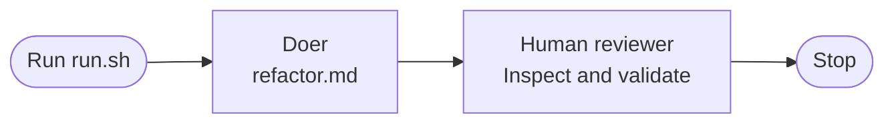

# Invoke a doer

Run one agent operation, then review its work yourself.

## Key concept

The heart of every factory is a validation loop: a **doer** changes something, then a **reviewer** validates the change. This first iteration builds only the doer. You are the reviewer for now.

The doer receives a focused prompt, works in the calculator directory, and may inspect and edit files. It does not run a shell, tests, or quality tools. Keeping those activities outside the doer gives the reviewer independent evidence.

## Decision flow

Show this Mermaid diagram when introducing the iteration:



## Implementation order

Teach and build this iteration in this order. Complete each small step before moving to the next one:

1. **Write the doer prompt.** Create `factory/refactor.md`. Tell the doer to inspect the calculator and make one small, behaviour-preserving refactoring. Tell it to edit files directly, not run tests, npm, or shell commands, and keep its response concise.
2. **Invoke Pi.** Create `factory/run.sh`. Change to the script's directory, then pipe `refactor.md` to Pi running from `calculator/`. Give Pi only file-inspection and file-editing tools; it must not receive its `bash` tool. Use this script:

   ```sh
   #!/usr/bin/env bash
   set -euo pipefail

   cd "$(dirname "$0")"
   cat refactor.md | (cd ../calculator && pi --no-session --tools read,edit,write,grep,find,ls -p)
   ```

`run.sh` performs one doer turn and exits. It has no Bash loop, validation command, recovery path, or reviewer agent.

## Alternatives: choose another doer

Pi is the default doer, but the boundary is not tied to Pi. Claude Code and Codex can also act as the doer when configured for non-interactive use. Read the same prompt, run the chosen CLI from `calculator/`, and give it only the access you intend. For example:

```sh
prompt=$(<refactor.md)
(cd ../calculator && claude -p "$prompt")
(cd ../calculator && codex exec "$prompt")
```

These commands illustrate the shape of the substitution, not a shared security model. Each CLI has different authentication, sandbox, and tool-permission options. Configure it so the doer can inspect and edit the calculator but cannot validate its own work or reach unrelated files.

## Checks

From the repository root, make the script executable and run it:

```sh
chmod +x factory/run.sh
./factory/run.sh
```

Then review the change yourself. Inspect the diff and run independent evidence such as:

```sh
(cd calculator && npm test)
```

You may also run the installed code-quality tools, such as `cognitive-complexity-ts` or `code-health-meter`, to judge whether the refactoring improved the code. Do not ask the doer to run or interpret these checks.

Verify manually that the doer receives `refactor.md`, works only in `calculator/`, makes at most one focused change, and cannot invoke a shell tool.

## Pressure test

Manual review makes the distinction between doer and reviewer clear, but it does not scale. The next iteration repeats the doer turn and gives the human a deliberate pause to review every change. A later iteration will make the reviewer an independent, automated part of the factory.
