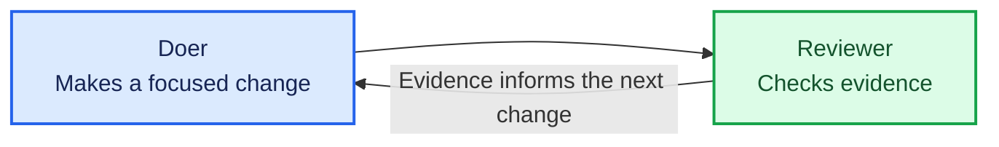

# Define success and invoke a doer

Define what a well-factored calculator looks like, run one agent operation, then review its work yourself.

## Key concept

Every factory is built around a validation loop: a **doer** makes a change, then a **reviewer** checks it against evidence before the next change. This first iteration defines success and builds only the doer. You are the reviewer for now.

The doer receives a focused prompt and the success criteria, works in the calculator directory, and may inspect and edit files. It does not run a shell, tests, or quality tools. Keeping those activities outside the doer gives the reviewer independent evidence.

## The validation loop

When introducing the tutorial, show this Mermaid diagram and explain that this iteration completes just one pass through the loop:



## Implementation order

Teach and build this iteration in this order. Complete each small step before moving to the next one:

1. **Define success.** Create `factory/success.md` before creating either agent prompt. Describe, in your own terms, the well-factored calculator the factory should produce after many refactorings. Default to Kent Beck's four rules of simple design: passes its tests, reveals intention, no duplication, and fewest elements. The learner may refine those criteria. For each, name evidence a reviewer can use to tell whether a change preserves or advances it—for example, tests, a diff, imports and dependencies, or one of the calculator's quality scripts (`npm run lint`, `duplication`, `cycles`, `deadcode`, `complexity`). Evidence should be a command whose output the reviewer can quote, not a package name it has to work out how to run. Make the criteria a durable strategy for the whole factory, not a checklist for the next refactoring. They should guide the doer's choice of tactic without prescribing it. Help the learner make their criteria evidence-based if they are stuck.
2. **Write the doer prompt.** Create `factory/refactor.md`. Tell the doer to study `../factory/success.md` and use those criteria to choose one small, behaviour-preserving refactoring that moves the calculator towards the desired state. It must edit files directly. Tell it not to run tests, npm, or shell commands, and to keep its response concise.
3. **Invoke Pi.** Create `factory/run.sh`. Change to the script's directory, then pipe `refactor.md` to Pi running from `calculator/`. Give Pi only file-inspection and file-editing tools; it must not receive its `bash` tool. Use this script:

   ```sh
   #!/usr/bin/env bash
   set -euo pipefail

   cd "$(dirname "$0")"
   echo "Starting doer..."
   cat refactor.md | (cd ../calculator && pi --no-session --tools read,edit,write,grep,find,ls -p)
   ```

`run.sh` performs one doer turn and exits. It has no Bash loop, validation command, recovery path, or reviewer agent.

## Alternatives: choose another doer

Pi is the default doer, but the boundary is not tied to Pi. Claude Code and Codex can also act as the doer when configured for non-interactive use. Read the same prompt, run the chosen CLI from `calculator/`, and give it only the access you intend. The prompt directs the doer to `../factory/success.md`. For example:

```sh
prompt=$(<refactor.md)
(cd ../calculator && claude -p "$prompt")
(cd ../calculator && codex exec "$prompt")
```

These commands illustrate the shape of the substitution, not a shared security model. Each CLI has different authentication, sandbox, and tool-permission options. Configure it so the doer can inspect and edit the calculator but cannot validate its own work or reach unrelated files.

## Checks

From the repository root, make the script executable and run it:

```sh
chmod +x factory/run.sh
./factory/run.sh
```

Then review the change yourself against `factory/success.md`. Inspect the diff and run independent evidence such as:

```sh
(cd calculator && npm test)
```

You may also run the installed code-quality tools, such as `cognitive-complexity-ts` or `code-health-meter`, to judge whether the refactoring improved the code. Do not ask the doer to run or interpret these checks.

Verify manually that `run.sh` announces the doer before invoking Pi, the doer can study `success.md`, works only in `calculator/`, makes at most one focused change, and cannot invoke a shell tool.

## Pressure test

Manual review makes the distinction between doer and reviewer clear, but it does not scale. The next iteration adds a second agent as a reviewer. It will apply the learner's criteria, run the checks, and report a pass-or-fail verdict for the doer's change.
