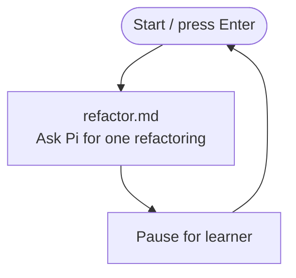

# Unvalidated refactoring loop

Build the smallest repeated refactoring loop.

## Key concept

A factory starts by repeating one useful action. Bash owns the loop and invokes Pi as a worker; the worker can inspect and edit the calculator but cannot use a shell. Each turn announces itself in the console before Pi starts.

## Decision flow

Show this Mermaid diagram when introducing the iteration:



## Implementation order

Teach and build this iteration in this order. Complete each small step before moving to the next one:

1. **Start the Bash loop.** Create `factory/run.sh`, change to the `factory/` directory, and add the `while true; do ... done` structure that repeats a factory turn. Leave a temporary placeholder in the loop body while establishing the structure.
2. **Add the pause and control flow.** Replace the placeholder with a `read -r -p` pause at the end of each turn so the learner must press Enter before the next turn. Ctrl-C stops the shell and therefore the factory.
3. **Announce and invoke Pi.** Before that pause, print `Starting refactoring iteration...`, then pipe the refactoring prompt to Pi from `calculator/`. Give Pi only file-inspection and file-editing tools; it must not receive its `bash` tool. Use these commands:

   ```sh
   echo "Starting refactoring iteration..."
   cat refactor.md | (cd ../calculator && pi --no-session --tools read,edit,write,grep,find,ls -p)
   ```

4. **Write the worker prompt.** Create `factory/refactor.md`. Tell Pi to inspect the calculator and make one small, behaviour-preserving refactoring. Tell Pi to edit files directly, not run tests, npm, or shell commands, and keep its response concise.

The completed `factory/run.sh` loops until the learner stops it: Bash announces the refactoring turn, Pi refactors, then Bash pauses for Enter before the next iteration.

## Advanced: substitute another worker

Pi is the blessed default worker. Advanced users may replace the Pi subshell with another CLI harness, but it must receive the prompt on standard input, run from `calculator/`, edit the kata files, and leave validation to Bash. Its authentication, sandboxing, and tool restrictions are your responsibility; do not assume another harness supports Pi's flags or restrictions.

## Checks

From the repository root:

```sh
./factory/run.sh
```

Verify manually that the console announces each refactoring turn, Pi can inspect and edit the calculator, Pi cannot invoke a shell tool, and the loop waits for Enter before the next turn.

## Pressure test

A refactoring can break the calculator and this loop will continue without noticing. We could let Pi run `npm test` itself, but an agent report is not independent evidence: it might skip the command, misread the output, or claim success without a successful run. Bash must run the test outside the agent loop before the result is trustworthy. The next iteration adds that independent validation and a recovery path.
