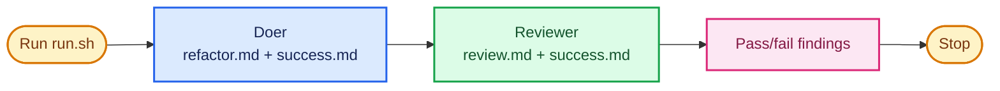

# Review a doer

Add an agent that reviews the doer's change against the success criteria.

## Key concept

A factory needs a doer and a reviewer with different responsibilities. The doer changes the calculator. The reviewer examines that change, runs independent checks, and reports whether it preserves behaviour and moves the calculator towards the learner's definition of success.

This iteration performs one doer turn followed by one reviewer turn. It is still not a repeated loop and has no recovery path.

## Decision flow

Show this Mermaid diagram when introducing the iteration:



## Implementation order

Keep `factory/success.md`, `factory/refactor.md`, and the one-shot doer invocation from the first iteration. Teach and build this iteration in this order. Complete each small step before moving to the next one:

1. **Write the reviewer prompt.** Create `factory/review.md`. Tell the reviewer to inspect the doer's previous change against the supplied `success.md` criteria. It should read the code and diff, run tests and relevant installed complexity or quality tools, and report independent evidence. It must verify preserved behaviour and assess whether the change advances, or at least does not compromise, each criterion. It must not expect one small refactoring to achieve the factory's whole destination, and it must not modify files.

   Name the commands rather than the packages, because the wrong entry point in the same package can stall the loop. The calculator workspace exposes one script per measurement, each printing to the terminal and exiting non-zero when it finds a problem:

   ```sh
   npm run lint         # eslint: complexity, depth, function length, duplicated branches
   npm run duplication  # jscpd: copy-paste clones, with locations
   npm run cycles       # madge: circular imports
   npm run deadcode     # knip: unused files, exports, and dependencies
   npm run quality      # all four in sequence, stopping at the first failure
   npm run complexity   # ccts-json: cognitive complexity scores, no threshold
   ```

   Tell the reviewer to prefer these scripts over calling the tools directly. Two of the installed packages misbehave when invoked by name: `cognitive-complexity-ts`'s default `ccts` binary starts a web server on port 5678 and never exits, so only the `ccts-json` form behind `npm run complexity` is safe; and `code-health-meter` writes HTML instead of terminal output, shells out to `pnpm` and Graphviz, and still exits `0` when those are missing, so a reviewer cannot read a verdict from it.

   Require this response format:

   ```text
   VERDICT: PASS

   FINDINGS:
   - [PASS] <success criterion>: <specific evidence>
   - [FAIL] <success criterion>: <specific evidence>
   ```

   The first non-empty line must be exactly `VERDICT: PASS` or `VERDICT: FAIL`. The reviewer must give one finding for every criterion in `success.md`. A passing test alone is not a passing review.
2. **Invoke the reviewer.** Update `factory/run.sh` so it invokes the reviewer after the doer. Give the reviewer file-inspection tools and `bash` so it can run tests and metrics, but do not give it `edit` or `write`. Its prompt must forbid shell commands that modify files. Every Pi invocation must have a preceding `echo` that identifies its role. Keep the doer's announcement from the first iteration and add this command after the doer invocation:

   ```sh
   echo "Starting review..."
   cat review.md success.md | (cd ../calculator && pi --no-session --tools read,grep,find,ls,bash -p)
   ```

The completed `factory/run.sh` runs a doer once, then a reviewer once, then exits. The reviewer prints its verdict and findings to the terminal. Bash does not yet parse the verdict, repeat the work, or direct a repair.

## Advanced: substitute another reviewer

Pi is the default reviewer, but Claude Code or Codex may take this role if configured for non-interactive, read-only review with permission to run the required checks. Its access must differ from the doer's: it may inspect the calculator and run validation commands, but it must not edit files. Do not assume another CLI's default sandbox or permission model provides that boundary.

## Checks

From the repository root:

```sh
./factory/run.sh
```

Verify manually that the reviewer:

- is announced before Pi is invoked, runs after the doer, and does not edit calculator files;
- can run `npm test` and the quality scripts it needs, and cites their output rather than a package name;
- returns exactly one `PASS` or `FAIL` verdict; and
- reports a specific pass-or-fail finding for every criterion in `factory/success.md`.

Read the report yourself. At this stage, the human decides what to do with a failing review.

## Pressure test

The doer and reviewer now form one validation loop, but a human must start every turn and act on every result. The next iteration repeats this sequence, with a pause after each review so the learner remains in control.
