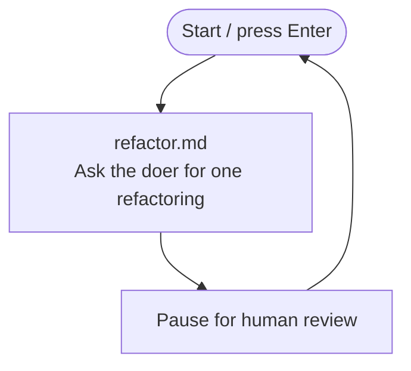

# Unvalidated refactoring loop

Repeat the doer turn, but leave review with the human.

## Key concept

The first iteration ran one doer turn. This iteration repeats it. Bash owns the loop and invokes Pi as a doer; the doer can inspect and edit the calculator but cannot use a shell. After each turn, Bash pauses so the human reviewer can inspect the change and run the checks they choose.

This is not yet a validation loop in the factory. Bash does not run tests, interpret results, or choose a recovery action.

## Decision flow

Show this Mermaid diagram when introducing the iteration:



## Implementation order

Keep `factory/refactor.md` from the first iteration. Teach and build this iteration in this order. Complete each small step before moving to the next one:

1. **Start the Bash loop.** Update `factory/run.sh`. Keep its setup, then add the `while true; do ... done` structure that repeats a doer turn. Leave a temporary placeholder in the loop body while establishing the structure.
2. **Add the pause and control flow.** Replace the placeholder with a `read -r -p` pause at the end of each turn so the learner must press Enter before the next turn. Ctrl-C stops the shell and therefore the factory.
3. **Announce and invoke Pi.** Before that pause, print `Starting refactoring iteration...`, then pipe the refactoring prompt to Pi from `calculator/`. Give Pi only file-inspection and file-editing tools; it must not receive its `bash` tool. Use these commands:

   ```sh
   echo "Starting refactoring iteration..."
   cat refactor.md | (cd ../calculator && pi --no-session --tools read,edit,write,grep,find,ls -p)
   ```

The completed `factory/run.sh` loops until the learner stops it: Bash announces the doer turn, Pi refactors, then Bash pauses for Enter and human review before the next iteration.

## Advanced: substitute another doer

Pi is the default doer. Advanced users may replace the Pi subshell with another CLI harness, but it must receive the prompt, run from `calculator/`, edit the kata files, and leave review to the human. Its authentication, sandboxing, and tool restrictions are your responsibility; do not assume another harness supports Pi's flags or restrictions.

## Checks

From the repository root:

```sh
./factory/run.sh
```

After each pause, inspect the diff and review the change yourself. Run `npm test` or a code-quality metric before pressing Enter. Verify manually that the console announces each doer turn, Pi can inspect and edit the calculator, Pi cannot invoke a shell tool, and the loop waits for Enter before the next turn.

## Pressure test

A refactoring can break the calculator and this loop will continue without noticing. A human reviewer may forget to run a check or misread its output. We could let Pi validate itself, but an agent report is not independent evidence: it might skip a command, misread the output, or claim success without a successful run. The next iteration gives Bash the reviewer role: it runs validation outside the doer and routes failures to recovery.
