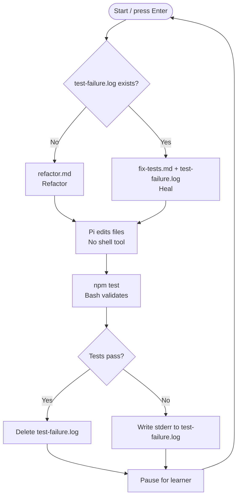

# Validation and recovery

Validate every refactoring independently and send failures to a repair turn.

## Key concept

A reliable factory separates ordinary work from healing. Bash, not Pi, runs the tests and uses their result to choose the next prompt.

## Decision flow

Show this Mermaid diagram when introducing the iteration:



## Behaviour

Keep `factory/refactor.md` from the previous iteration and add `factory/fix-tests.md`.

`fix-tests.md` tells Pi that the last validation failed, supplies the test-failure evidence, and asks it to make the smallest correction it can infer. Like `refactor.md`, it tells Pi to edit files directly and not run tests, npm, or shell commands.

Update `factory/run.sh`. Each iteration:

1. Checks for `test-failure.log`.
2. If it is absent, pipes `refactor.md` to Pi. If it is present, pipes `fix-tests.md` and `test-failure.log` to Pi.
3. Runs Pi from `calculator/` with file-inspection and file-editing tools only.
4. Runs `npm test` independently, streaming standard output and writing standard error to `test-failure.log`.
5. If the tests pass, deletes `test-failure.log`. If they fail, prints it; the saved evidence becomes the next worker turn’s input.
6. Pauses until the learner presses Enter; Ctrl-C stops the factory.

The worker cannot run tests. Bash chooses the normal work path (`refactor.md`) or the healing path (`fix-tests.md`) only from independent validation evidence.

Use this exact Pi invocation in the normal-work branch:

```sh
cat refactor.md | (cd ../calculator && pi --no-session --tools read,edit,write,grep,find,ls -p)
```

In the healing branch, replace `cat refactor.md` with `cat fix-tests.md test-failure.log`.

## Advanced: substitute another worker

Pi is the blessed default worker. Advanced users may replace the Pi subshell with another CLI harness, but it must receive the normal or recovery prompt on standard input, run from `calculator/`, edit the kata files, and leave validation to Bash. Its authentication, sandboxing, and tool restrictions are your responsibility; do not assume another harness supports Pi's flags or restrictions.

## Checks

From the repository root:

```sh
./factory/run.sh
```

Verify manually that:

- `npm test` runs after every Pi turn;
- a failing test does not end the factory;
- a failed test leaves `test-failure.log`, and the next Pi turn uses `fix-tests.md` with that evidence;
- a passing test deletes `test-failure.log`, and the next Pi turn uses `refactor.md`;
- the learner can stop the loop with Ctrl-C.

## Pressure test

The factory has only one worker and two opaque prompts. It cannot show why a particular refactoring was chosen, distinguish focused from broad validation, or safely divide independent work. Later iterations will add only the next piece needed to relieve those pressures.
