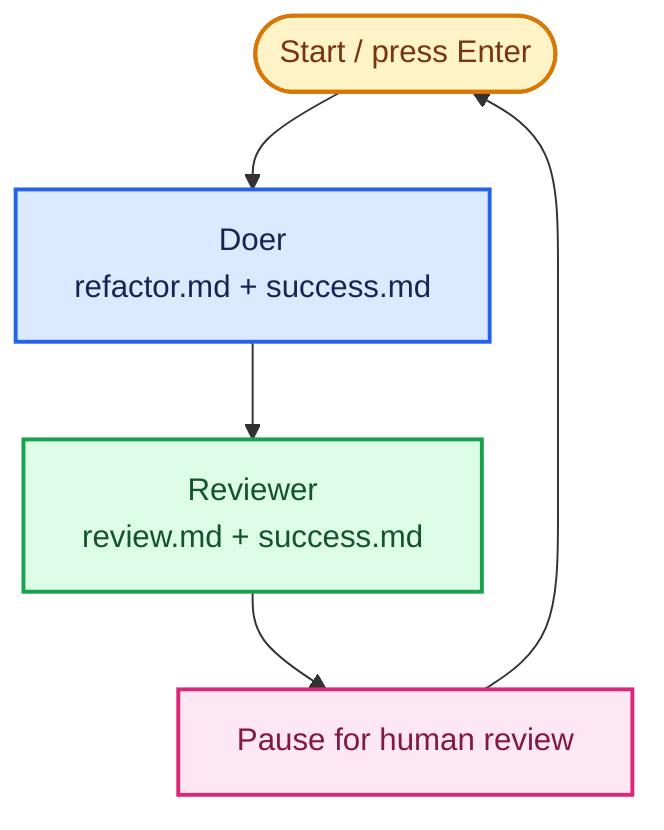

# Repeat the validation loop

Repeat the doer-and-reviewer sequence, but leave decisions with the human.

## Key concept

The first two iterations completed one validation loop: a doer changed the calculator and a reviewer assessed that change against `success.md`. This iteration repeats the whole sequence. Bash owns the loop and pauses after each review so the human can read the verdict before starting another turn.

Bash does not yet interpret the verdict, choose a repair prompt, or recover automatically.

## Decision flow

Show this Mermaid diagram when introducing the iteration:



## Implementation order

Keep `factory/refactor.md`, `factory/review.md`, and `factory/success.md` from the previous iterations. Teach and build this iteration in this order. Complete each small step before moving to the next one:

1. **Start the Bash loop.** Update `factory/run.sh`. Keep its setup and both agent invocations, then add the `while true; do ... done` structure that repeats one complete validation loop. Leave a temporary placeholder in the loop body while establishing the structure.
2. **Add the pause and control flow.** Replace the placeholder with a `read -r -p` pause after the reviewer has reported its findings. The learner must press Enter before the next turn. Ctrl-C stops the shell and therefore the factory.
3. **Announce each role.** Before each invocation, announce the role so the learner can follow the sequence. Use these commands inside the loop:

   ```sh
   echo "Starting doer iteration..."
   cat refactor.md | (cd ../calculator && pi --no-session --tools read,edit,write,grep,find,ls -p)

   echo "Starting review..."
   cat review.md success.md | (cd ../calculator && pi --no-session --tools read,grep,find,ls,bash -p)
   ```

The completed `factory/run.sh` loops until the learner stops it: Bash invokes the doer, invokes the reviewer, then pauses for Enter and human review before the next validation loop.

## Advanced: substitute another agent

Pi is the default doer and reviewer. Advanced users may replace either subshell with another CLI harness, but the doer must receive the prompt and criteria, run from `calculator/`, and only edit the kata files. The reviewer must receive the criteria, run from `calculator/`, inspect the kata and run validation commands, but not edit files. Its authentication, sandboxing, and tool restrictions are your responsibility; do not assume another harness supports Pi's flags or restrictions.

## Checks

From the repository root:

```sh
./factory/run.sh
```

After each pause, read the review report. Verify manually that the console announces the doer and reviewer in order, the reviewer reports every success criterion, neither agent has more access than its role requires, and the loop waits for Enter before the next turn.

## Pressure test

The reviewer can identify a failure, but its verdict is only terminal text. A human must still decide whether to retry a refactoring or ask the doer to repair it. The next iteration saves the report and lets Bash route failed reviews to a repair turn.
