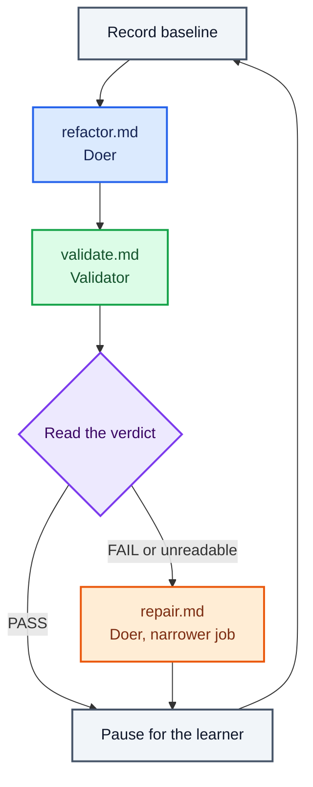

# Route failed verdicts to repair

Read the verdict in Bash, and send a failed one somewhere different.

## Key concept

In lesson 004 the learner read a `FAIL`, carried the findings to the doer, and ran it again. This
lesson gives those decisions to the line.

Everything built so far runs the same sequence whatever happens. Baseline, doer, validator, pause —
a `FAIL` scrolls past and the next iteration is identical to the one that would have followed a
`PASS`. The graph is a straight line because nothing on it has ever looked at a result.

Now it branches. For the first time, what runs next depends on what just happened. Deciding which
machine runs next is the **orchestrator**'s job, and here `run.sh` is doing it. In lesson 004 the
learner was the orchestrator; this lesson is where that job moves into software.



## Implementation order

Build this lesson in this order. Complete each small step before moving to the next one:

1. **Write the repair prompt.** Create `factory/refactor/repair.md`. Its job to be done is narrower
   than the doer's: given the validator's findings, make the smallest change that addresses them. It
   does not start a new refactoring, and it does not go looking for other things worth improving.
   Same tools as the doer, and the same prohibition on running checks.

   This is still a doer. It changes code, it is handed a job and run to completion, and it is judged
   by the validator like anything else on the line. What it has is a narrower job, not a new role.

   The obvious question is why the doer's own prompt will not do, when lesson 004 handed it the
   findings and it behaved. The answer is that a human chose to run it that way, once. `refactor.md`
   tells a machine to find something worth improving and improve it; hand that machine some findings
   and they become one more thing in its context, competing with the job it was actually given. On an
   unattended loop it will pick something new most times it is asked. Give a machine one job, and
   repair's job is not the doer's job.

   Keep the prohibition on running checks for the same reason the doer has it. The validator holds
   the only judgement on this line, and a machine that grades its own work has no reason to report a
   problem with it.

   Like every other prompt on the line, `repair.md` names no path to go and fetch. Its inputs — the
   criteria and the findings — arrive appended to it by the caller.

2. **Branch on the verdict.** `run.sh` scans `validate-findings.txt` for the first `VERDICT: PASS`
   or `VERDICT: FAIL` it can find, and chooses the next machine from it:

   ```sh
   verdict=$(grep -m1 -o 'VERDICT: \(PASS\|FAIL\)' validate-findings.txt || echo "VERDICT: FAIL")
   if [ "$verdict" = "VERDICT: FAIL" ]; then
     echo "Starting repair..."
     cat repair.md success.md validate-findings.txt \
       | (cd ../../calculator && pi --no-session --tools read,edit,write,grep,find,ls -p)
   fi
   ```

   The repair machine gets three files, in the order it was taught to expect them: its job, the
   criteria the line is working towards, and the findings it is answering. Leave the findings out and
   it has nothing to repair.

   That block goes after the validation phase and before the `read`, so the loop becomes:

   ```sh
   while true; do
     echo "Recording quality baseline..."
     (cd ../../calculator && node scripts/quality.mjs) > quality-before.txt || true
     echo "Starting doer..."
     cat refactor.md success.md | (cd ../../calculator && pi --no-session --tools read,edit,write,grep,find,ls -p)
     echo "Starting validation..."
     cat validate.md success.md quality-before.txt \
       | (cd ../../calculator && pi --no-session --tools read,grep,find,ls,bash -p) \
       | tee validate-findings.txt
     verdict=$(grep -m1 -o 'VERDICT: \(PASS\|FAIL\)' validate-findings.txt || echo "VERDICT: FAIL")
     if [ "$verdict" = "VERDICT: FAIL" ]; then
       echo "Starting repair..."
       cat repair.md success.md validate-findings.txt \
         | (cd ../../calculator && pi --no-session --tools read,edit,write,grep,find,ls -p)
     fi
     read -r -p "Press Enter for the next iteration, or Ctrl-C to stop. "
   done
   ```

   Two placement decisions are worth being explicit about, because both could plausibly have gone the
   other way.

   **The branch reads the verdict it has just been handed, not the one left over from last time.**
   Putting the branch at the top of the loop instead — inspect the previous run's findings, then pick
   which prompt to send the doer — sounds tidier and breaks on the very first pass, when
   `validate-findings.txt` does not exist yet. The fallback below would call that a failure, and the
   line would try to `cat` a file that is not there and die under `set -e` before the doer had run
   once. Placed after the `tee`, the file always exists and always describes the change just made.
   The learner gets the same benefit: the findings scroll past, and the repair that answers them
   starts immediately underneath, in the same pass.

   **A repair is not validated before the pause.** The pause is where the line hands control back,
   and after a repair that is exactly where a learner wants to be — reading the diff themselves,
   before anything else touches the code. Spending another machine turn on a judgement the learner is
   about to make with their own eyes buys little, and it would give the loop two shapes depending on
   the verdict. The next iteration's validator sees the repaired code either way.

   The cost of that choice should be said out loud, because the pressure test needs it: the repair
   shares its verdict with the refactoring that follows it. The validator on the next pass reports on
   the code as it now stands, and cannot separate what the repair fixed from what the new refactoring
   changed. Nothing on this line ever tells you whether a repair worked on its own.

   **An unreadable or missing verdict is treated as a failure.** The validator is a model, and models
   wander from the format they were given. The alternative is a line that treats "I could not tell" as
   "everything is fine": it would carry on refactoring on top of a change nobody checked, and it would
   do it quietly, because a missing verdict prints nothing. Read the other way, the worst case is one
   repair turn that was not needed. The two mistakes are not the same size.

   Note what the `if` does not have: an `else`. A `PASS` is not a branch that does something else, it
   is the branch that does nothing — the loop falls through to the pause, and the next iteration
   starts a fresh refactoring exactly as it always did. The pass behaviour is the line the learner
   already built.

   The `tee` overwrites `validate-findings.txt` on every iteration, so the verdict being read is
   always the current one. A `FAIL` cannot stick around and trigger a repair on some later pass.

## Checks

From the repository root:

```sh
./factory/refactor/run.sh
```

Verify by hand that:

- a failing verdict starts a repair, announced with `Starting repair...` before Pi is invoked;
- the repair machine is handed the findings — the validator's own words are in what was piped to it;
- a passing verdict starts no repair, and the next iteration is a fresh refactoring;
- the loop still pauses for Enter once per iteration, whichever way the verdict went; and
- a run in which the validator produces no recognisable verdict routes to repair rather than past it.

The last one is easier to arrange than to wait for. With the line stopped, overwrite
`validate-findings.txt` with a few lines of prose containing no verdict, then run just the `verdict=`
line and the `if` in a shell to see which way it goes.

## Pressure test

The line now does by itself what the learner did by hand in lesson 004. It reads a verdict, it
carries the evidence, and it chooses what runs next. That was the whole of the orchestrator's job as
lesson 004 described it — and the learner is still sitting at the keyboard.

So ask what is left. What can the learner do at that pause that the line cannot do for itself?

- It cannot notice it is going backwards. Every iteration is judged against the criteria, and no
  iteration is judged against the one before it. A repair that reintroduces the duplication the last
  refactoring removed reads as a normal failing pass, and the line will happily oscillate between two
  states for as long as someone keeps pressing Enter.
- It cannot tell whether a repair worked. As above: the repair's verdict is folded into the next
  refactoring's.
- It cannot decide the criteria were wrong. `success.md` is the one thing on this line nothing ever
  questions. If a criterion is unreachable, or has been misread the same way ten times running, the
  line will keep failing against it and keep repairing towards it.
- It cannot stop. There is no state in which this loop decides it is finished, and no verdict that
  ends it. It stops when a human stops pressing Enter.

Every one of those is a judgement, and every one of them is still the learner's. The line has taken
over the mechanical part of the orchestrator's job — routing — and left the part that requires
knowing what the work is for.
