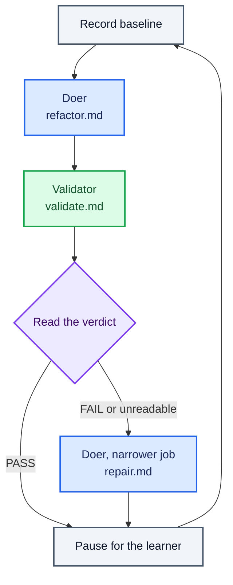

# Route failed verdicts to repair

Read the verdict in Bash, and send a failed one somewhere different.

## Key concept

In lesson 004 the learner read a `FAIL`, carried the findings to the doer, and ran it again. This
lesson gives those decisions to the line.

Everything built so far runs the same sequence whatever happens. Baseline, doer, validator, pause —
a `FAIL` scrolls past and the next iteration is identical to the one that would have followed a
`PASS`. The graph is a straight line because nothing on it has ever looked at a result.

Now it branches. For the first time, what runs next depends on what just happened. Deciding which
machine runs next is the **orchestrator**'s job, and here `run.sh` is doing it. In lesson 004 the
learner was the orchestrator; this lesson is where the routing part of that job moves into software.
The rest of it stays with the learner, and the pressure test is about which rest.



## Implementation order

Build this lesson in this order. Complete each small step before moving to the next one:

1. **Write the repair prompt.** Create `factory/refactor/repair.md`. Its job to be done is narrower
   than the doer's: given the validator's findings, make the smallest change that addresses them. It
   does not start a new refactoring, and it does not go looking for other things worth improving.
   Same tools as the doer, and the same prohibition on running checks.

   This is still a doer. It changes code, it is handed a job and run to completion, and it is judged
   by the validator like anything else on the line. What it has is a narrower job, not a new role.

   The obvious question is why the doer's own prompt will not do, when lesson 004 handed it the
   findings and it behaved. The answer is that a human chose to run it that way, once. `refactor.md`
   tells a machine to find something worth improving and improve it; hand that machine some findings
   and they become one more thing in its context, competing with the job it was actually given. On an
   unattended loop it will pick something new most times it is asked. Give a machine one job, and
   repair's job is not the doer's job.

   Keep the prohibition on running checks for the same reason the doer has it. The validator holds
   the only judgement on this line, and a machine that grades its own work has no reason to report a
   problem with it.

   Like every other prompt on the line, `repair.md` names no path to go and fetch. Its inputs — the
   criteria and the findings — arrive appended to it by the caller.

2. **Branch on the verdict.** `run.sh` takes the first line of `validate-findings.txt` that *begins*
   with `VERDICT: PASS` or `VERDICT: FAIL`, and chooses the next machine from it:

   ```sh
   verdict=$(grep -m1 -o '^VERDICT: \(PASS\|FAIL\)' validate-findings.txt || echo "VERDICT: FAIL")
   if [ "$verdict" = "VERDICT: FAIL" ]; then
     echo "Starting repair..."
     cat repair.md success.md validate-findings.txt \
       | (cd ../../calculator && pi --no-session --tools read,edit,write,grep,find,ls -p)
   fi
   ```

   The repair machine gets three files, in the order it was taught to expect them: its job, the
   criteria the line is working towards, and the findings it is answering. Leave the findings out and
   it has nothing to repair.

   **That `^` is the whole of the parse's correctness, and it is worth stopping on.** Without it the
   pattern matches a verdict string anywhere on a line, including inside a sentence about verdicts.
   The validator is a model being asked to justify itself, and a model justifying itself quotes the
   rules it was given. "The verdict must be `VERDICT: PASS` or `VERDICT: FAIL`, and mine is:" is an
   entirely ordinary thing for it to write above its actual answer — and an unanchored `grep` would
   read `PASS` out of that sentence and skip the repair the file below it was asking for. The line
   would carry on refactoring on top of a change the validator had just failed, having been told so
   in writing.

   Anchored, the pattern can only match a line that opens with `VERDICT:`, so prose about verdicts is
   invisible to it however the validator phrases its reasoning. `-m1` then stops at the first such
   line, and `-o` trims it to the verdict itself, discarding anything the validator appended after it.

   Be clear about what that rests on, because it is this lesson's real subject. The anchor works
   because lesson 005 told the validator to open its response with `VERDICT:` on the first non-empty
   line, and for no other reason. The orchestrator does not understand the verdict; it recognises a
   shape, and the shape is a promise the validator makes and could break. Every branch in every line
   the learner builds after this one will rest on some agreement of that kind between a machine that
   writes and a machine that reads. When routing goes wrong, this is usually where to look — not at
   the branch, but at whether the thing being read still looks the way the reader was told to expect.

   That block goes after the validation phase and before the `read`. The first three lines of
   `run.sh` — the shebang, `set -euo pipefail`, and `cd "$(dirname "$0")"` — are unchanged from
   lesson 005 and are not repeated below; keep them. Every relative path in the loop depends on that
   `cd`, which is what lets Checks invoke the script from the repository root. The loop becomes:

   ```sh
   while true; do
     echo "Recording quality baseline..."
     (cd ../../calculator && node scripts/quality.mjs) > quality-before.txt || true
     echo "Starting doer..."
     cat refactor.md success.md | (cd ../../calculator && pi --no-session --tools read,edit,write,grep,find,ls -p)
     echo "Starting validation..."
     cat validate.md success.md quality-before.txt \
       | (cd ../../calculator && pi --no-session --tools read,grep,find,ls,bash -p) \
       | tee validate-findings.txt
     verdict=$(grep -m1 -o '^VERDICT: \(PASS\|FAIL\)' validate-findings.txt || echo "VERDICT: FAIL")
     if [ "$verdict" = "VERDICT: FAIL" ]; then
       echo "Starting repair..."
       cat repair.md success.md validate-findings.txt \
         | (cd ../../calculator && pi --no-session --tools read,edit,write,grep,find,ls -p)
     fi
     read -r -p "Press Enter for the next iteration, or Ctrl-C to stop. "
   done
   ```

   Two placement decisions are worth being explicit about, because both could plausibly have gone the
   other way.

   **The branch reads the verdict it has just been handed, not the one left over from last time.**
   Putting the branch at the top of the loop instead — inspect the previous run's findings, then pick
   which prompt to send the doer — sounds tidier and breaks on the very first pass, when
   `validate-findings.txt` does not exist yet. The fallback below would call that a failure, and the
   line would try to `cat` a file that is not there and die under `set -e` before the doer had run
   once. Placed after the `tee`, the file always exists and always describes the change just made.
   The learner gets the same benefit: the findings scroll past, and the repair that answers them
   starts immediately underneath, in the same pass.

   **A repair is not validated before the pause.** The pause is where the line hands control back,
   and after a repair that is exactly where a learner wants to be — reading the diff themselves,
   before anything else touches the code. Spending another machine turn on a judgement the learner is
   about to make with their own eyes buys little, and it would give the loop two shapes depending on
   the verdict. The next iteration's validator sees the repaired code either way.

   The cost of that choice should be said out loud, because the pressure test needs it: the repair
   shares its verdict with the refactoring that follows it. The validator on the next pass reports on
   the code as it now stands, and cannot separate what the repair fixed from what the new refactoring
   changed. Nothing on this line ever tells you whether a repair worked on its own.

   **An unreadable or missing verdict is treated as a failure.** The validator is a model, and models
   wander from the format they were given. The alternative is a line that treats "I could not tell" as
   "everything is fine": it would carry on refactoring on top of a change nobody checked, and it would
   do it quietly, because a missing verdict prints nothing. Read the other way, the worst case is one
   repair turn that was not needed. The two mistakes are not the same size.

   Note what the `if` does not have: an `else`. A `PASS` is not a branch that does something else, it
   is the branch that does nothing — the loop falls through to the pause, and the next iteration
   starts a fresh refactoring exactly as it always did. The pass behaviour is the line the learner
   already built.

   The `tee` overwrites `validate-findings.txt` on every iteration, so the verdict being read is
   always the current one. A `FAIL` cannot stick around and trigger a repair on some later pass.

   Lesson 005 printed the folder as the whole line. It has gained exactly one file:

   ```text
   factory/refactor/
     do.sh              validate.sh          run.sh
     refactor.md        validate.md          success.md
     repair.md
     quality-before.txt validate-findings.txt
   ```

   Three scripts, four prompts, and the two files the machines pass between them.

## Checks

From the repository root:

```sh
./factory/refactor/run.sh
```

Verify by hand that:

- a failing verdict starts a repair, announced with `Starting repair...` before Pi is invoked;
- the repair machine is handed the findings — the validator's own words are in what was piped to it;
- a passing verdict starts no repair, and the next iteration is a fresh refactoring;
- the loop still pauses for Enter once per iteration, whichever way the verdict went; and
- a run in which the validator produces no recognisable verdict routes to repair rather than past it;
  and
- a report whose opening sentence quotes both `PASS` and `FAIL` is still routed on the verdict line
  underneath it, not on the sentence.

The last two are easier to arrange than to wait for. Feed the parse some prose directly:

```sh
bash -c 'printf "The code looks fine to me.\n" > d.txt
  grep -m1 -o "^VERDICT: \(PASS\|FAIL\)" d.txt || echo "VERDICT: FAIL"'

bash -c 'printf "must be VERDICT: PASS or VERDICT: FAIL, and mine is:\nVERDICT: FAIL\n" > d.txt
  grep -m1 -o "^VERDICT: \(PASS\|FAIL\)" d.txt || echo "VERDICT: FAIL"'
```

Both must print `VERDICT: FAIL`, the second from its verdict line rather than from the sentence above
it. Delete `d.txt` afterwards. Drop the `^` from either command and watch the second one change its
mind — that is the whole reason the anchor is there.

## Pressure test

The line now does by itself two of the three things the learner did by hand in lesson 004. It reads a
verdict and chooses what runs next, and it carries the evidence from the validator to the machine
that needs it. Lesson 004 named a third: judging when to stop. That one has not moved, and the
learner is still sitting at the keyboard supplying it.

So ask what is left. What can the learner do at that pause that the line cannot do for itself?

- It cannot notice it is going backwards. Every iteration is judged against the criteria, and no
  iteration is judged against the one before it. A repair that reintroduces the duplication the last
  refactoring removed reads as a normal failing pass, and the line will happily oscillate between two
  states for as long as someone keeps pressing Enter.
- It cannot tell whether a repair worked. As above: the repair's verdict is folded into the next
  refactoring's.
- It cannot decide the criteria were wrong. `success.md` is the one thing on this line nothing ever
  questions. If a criterion is unreachable, or has been misread the same way ten times running, the
  line will keep failing against it and keep repairing towards it.
- It cannot stop. There is no state in which this loop decides it is finished, and no verdict that
  ends it. It stops when a human stops pressing Enter.

Every one of those is a judgement, and every one of them is still the learner's. The line has taken
over the mechanical part of the orchestrator's job — routing the work and carrying the evidence — and
left the part that requires knowing what the work is for.
