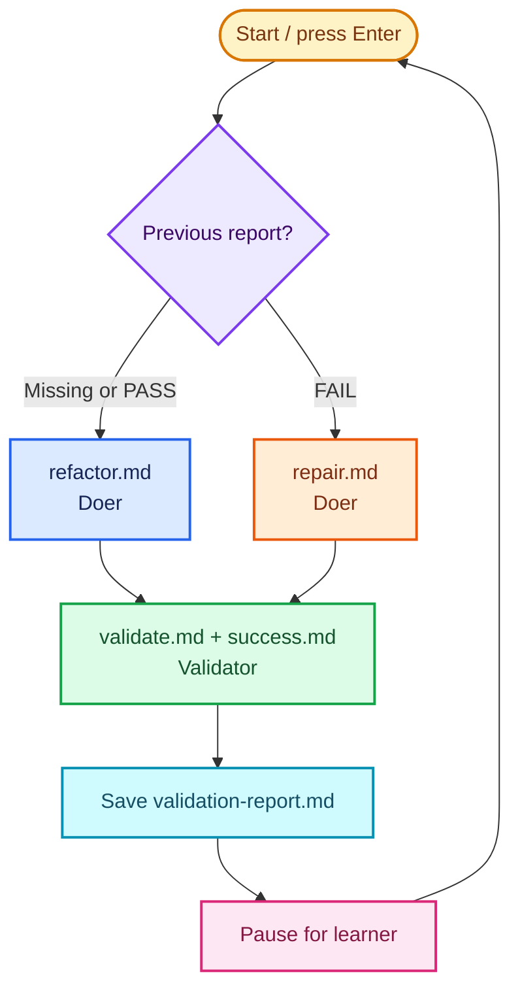

# Route failed verdicts to repair

Use the validator's verdict to send failed work to a repair turn.

## Key concept

The repeated factory already has a doer and a validator. This lesson makes the validator's structured verdict operational. Bash saves the validation report, then uses the previous report to select the next doer prompt: normal refactoring after a pass, or focused repair after a failure.

Bash does not judge the code. It routes the validator's evidence. The doer still changes code; the validator still validates it against `success.md`.

## Decision flow

Show this Mermaid diagram when introducing the lesson:



## Implementation order

Keep `factory/refactor.md`, `factory/validate.md`, `factory/success.md`, and the repeated validation loop from the previous lesson. Teach and build this lesson in this order. Complete each small step before moving to the next one:

1. **Write the repair prompt.** Create `factory/repair.md`. Tell the repair doer to read `../factory/success.md` and `../factory/validation-report.md`, then make the smallest correction that addresses the failed criteria. It must edit files directly, not run tests, npm, or shell commands, and keep its response concise. `repair.md` references those documents; Bash need only pipe `repair.md` to Pi.
2. **Save the validator output.** Update the validator command so Bash displays its report and saves the same output to `factory/validation-report.md`. Keep the role announcement immediately before Pi:

   ```sh
   echo "Starting validation..."
   cat validate.md success.md | (cd ../calculator && pi --no-session --tools read,grep,find,ls,bash -p) | tee validation-report.md
   ```

   `validation-report.md` belongs to Bash, not the validator. The validator still has no `edit` or `write` tool.
3. **Route the next doer turn.** At the start of each loop iteration, inspect the previous report. A missing report or an exact `VERDICT: PASS` selects normal refactoring. An exact `VERDICT: FAIL` selects repair. Announce the selected role before each Pi call:

   ```sh
   if [ ! -f validation-report.md ] || grep -qx 'VERDICT: PASS' validation-report.md; then
     echo "Starting doer iteration..."
     cat refactor.md | (cd ../calculator && pi --no-session --tools read,edit,write,grep,find,ls -p)
   elif grep -qx 'VERDICT: FAIL' validation-report.md; then
     echo "Starting repair iteration..."
     cat repair.md | (cd ../calculator && pi --no-session --tools read,edit,write,grep,find,ls -p)
   else
     echo "Validation report has no valid verdict; stopping for human review." >&2
     exit 1
   fi
   ```

The completed `factory/run.sh` retains its loop and learner pause. Every pass announces the selected doer role, invokes it once, announces the validator, saves the validation report, and pauses. A failed verdict becomes the next pass's repair input. A passed verdict returns to normal refactoring.

## Advanced: substitute another agent

Pi is the default doer and validator. Advanced users may replace either subshell with another CLI harness, but the doer must run from `calculator/` and only edit the kata files. The validator must run from `calculator/`, inspect the kata, and run validation commands without editing files. Its authentication, sandboxing, and tool restrictions are your responsibility; do not assume another harness supports Pi's flags or restrictions.

## Checks

From the repository root:

```sh
./factory/run.sh
```

Verify manually that:

- the first pass uses `refactor.md` because no report exists;
- Bash announces the doer, repair doer, or validator before every Pi invocation;
- the validator output appears in the terminal and is saved in `factory/validation-report.md`;
- a `VERDICT: FAIL` sends the next turn to `repair.md` with the previous report available to it;
- a `VERDICT: PASS` sends the next turn to `refactor.md`; and
- an absent or malformed verdict stops the script rather than guessing.

## Pressure test

The factory now reacts to every verdict, but one broad validator still decides everything at once. It cannot distinguish focused checks from broad ones, explain why a refactoring was chosen, or safely divide independent work. Later lessons will add only the next piece needed to relieve those pressures.
