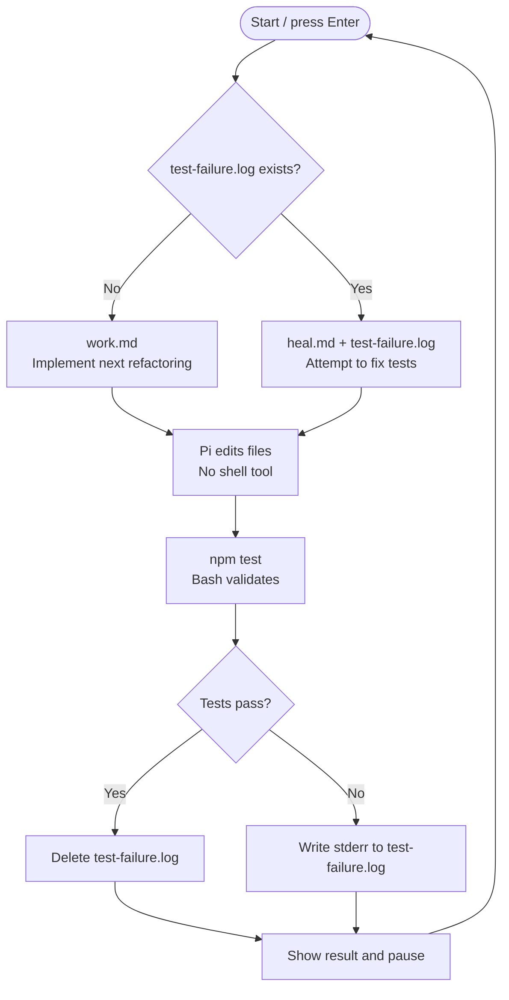

# 001 — Bash validation loop

## Goal

Build the smallest useful software factory. On each iteration, Pi makes one small refactoring to the calculator. Bash runs the tests independently, shows the result, and waits for the learner.

The learner should be able to read the entire factory in under a minute.

## Decision flow

Show this Mermaid diagram when introducing the iteration:



## Behaviour

Create these files at the kata root:

- `factory.sh`
- `work.md`
- `heal.md`

`work.md` tells Pi to inspect the current code and make one small, behaviour-preserving refactoring. `heal.md` tells Pi to inspect the supplied test-failure evidence and make the smallest correction it can infer. Both prompts tell Pi to edit files directly, not run tests or shell commands, and keep their response concise.

`factory.sh` loops until the learner stops it. Each iteration:

1. Checks for `test-failure.log`.
2. If it is absent, pipes `work.md` to Pi. If it is present, pipes `heal.md` and `test-failure.log` to Pi.
3. Runs Pi with file-inspection and file-editing tools only. Pi must not receive its `bash` tool.
4. Runs `npm test`, letting standard output stream to the terminal and writing standard error to `test-failure.log`.
5. If the tests pass, deletes `test-failure.log`.
6. If the tests fail, prints `test-failure.log`; it will become the next worker turn's input.
7. Pauses until the learner presses Enter; Ctrl-C stops the factory.

The worker cannot run the tests. Bash alone chooses `work.md` or `heal.md`, based only on whether the last validation failed.

Use this exact Pi invocation in each branch; the option is `--tools` (plural):

```sh
cat work.md | pi --no-session --tools read,edit,write,grep,find,ls -p
```

In the failure branch, replace `cat work.md` with `cat heal.md test-failure.log`.

## Checks

From the kata directory:

```sh
./factory.sh
```

Verify manually that:

- Pi can read and edit the kata but cannot invoke a shell tool.
- `npm test` runs after every Pi turn.
- a failing `npm test` does not end the factory.
- a failed test leaves `test-failure.log`, and the next Pi turn uses `heal.md` with that evidence;
- a passing test deletes `test-failure.log`, and the next Pi turn uses `work.md`.
- the learner can stop the loop with Ctrl-C.

## Out of scope

Do not add commits, run logs, structured state, retries, roles, parallel agents, a workflow graph, or automatic recovery. Those pressures belong to later iterations.

## Pressure test

The factory has only one worker and one opaque prompt. It cannot show why a particular refactoring was chosen, distinguish focused from broad validation, or safely divide independent work. Later iterations will add only the next piece needed to relieve those pressures.
