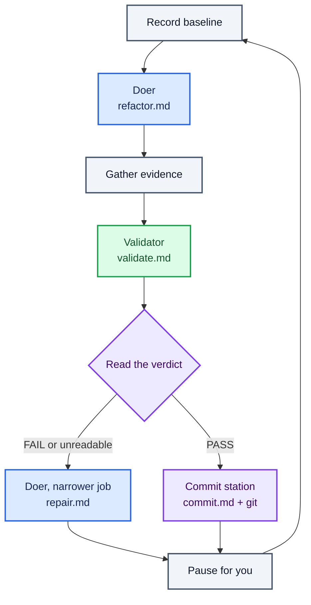

## Key concept

In lesson 004 you read a `FAIL`, carried the findings to the doer, and ran it again. This lesson
gives those decisions to the line.

Everything built so far runs the same sequence whatever happens. Baseline, doer, evidence,
validator,
pause — a `FAIL` scrolls past and the next iteration is identical to the one that would have
followed a
`PASS`. The graph is a straight line because nothing on it has ever looked at a result.

Now it branches. Deciding which station runs next is the **orchestrator**'s job, and here `run.sh`
is
doing it. In lesson 004 you were the orchestrator; this lesson is where the routing part of that
job moves into software.

This is not an extension of what an assembly line is. The line has been "an ordered sequence of
stations, arranged as a directed graph… the graph may branch" since the words arrived in lesson
005. This is the first lesson in which it becomes what the word already meant.

Two stations join the line, and between them they make a second point: **a station is its job, its
boundary, and its contract — not its tool, and not necessarily a model.**

