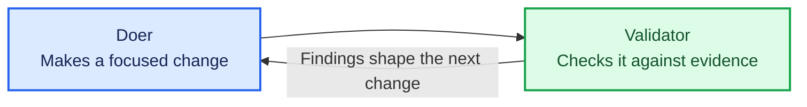

## The loop you just ran

Show this diagram after the learner has completed a cycle, not before:

```mermaid
flowchart LR
    Doer[Doer\nMakes a focused change] --> Validator[Validator\nChecks it against evidence]
    Validator -->|Findings shape the next change| Doer

    classDef doer fill:#dbeafe,stroke:#2563eb,color:#172554,stroke-width:2px
    classDef validator fill:#dcfce7,stroke:#16a34a,color:#14532d,stroke-width:2px
    class Doer doer
    class Validator validator
```
