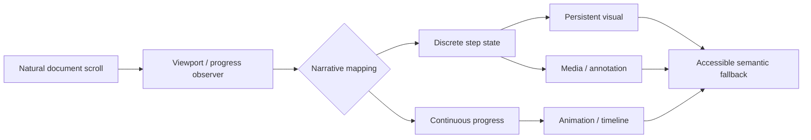
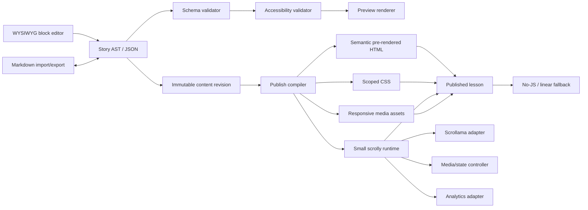
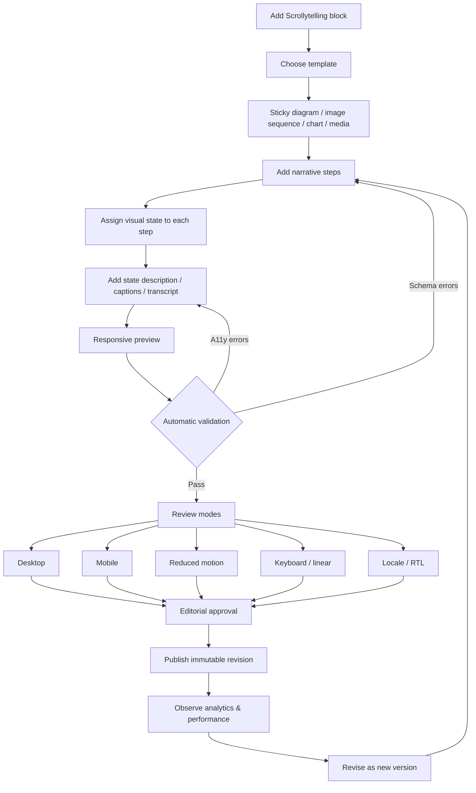

# Scrollytelling for Online Training Authoring: UX, Technology and Product Architecture

## Executive summary

Scrollytelling is a digital storytelling technique in which **scroll position controls the revelation or transformation of content**: text enters and leaves, a chart changes state, a map advances, media is synchronised, or an image remains sticky while explanatory steps move past it. The important distinction is that good scrollytelling uses the browser's normal scroll as an input signal; it does **not** seize or rewrite scrolling. The European Commission's Data Visualisation Guide describes the format in essentially these terms, while both academic work and practitioners such as *The Pudding* distinguish it from “scrolljacking”, where code manipulates the user's native scrolling behaviour. citeturn8search17turn1search1turn8search4

For an online training product, scrollytelling is best understood not as an animation feature but as a **progressive-explanation component**. Its strongest applications are concepts in which successive explanations should update a persistent visual model: a process diagram, system architecture, timeline, geographic map, labelled photograph, worked calculation, anatomy illustration, simulation state or before/after comparison. Research into scrollytelling and guided visual narratives points to its value in combining reader-controlled pacing with guided sequencing, while visual-authoring research such as *ScrollyVis* shows why authoring support becomes the hard part once rich media and dynamic states are involved. citeturn1search1turn9search14

The recommended design is therefore deliberately conservative:

**Use ordinary document scrolling, CSS `position: sticky`, semantic HTML and step triggers powered by `IntersectionObserver`.** Scrollama is the strongest current starting point for this pattern: it is MIT-licensed, has roughly 6,000 GitHub stars, first-party TypeScript declarations, uses `IntersectionObserver`, has built-in resize observation, and provides well-documented sticky, progress, mobile and iframe examples. Its latest repository commit was 13 November 2025. citeturn19view0turn23view0

Do **not**, however, make Scrollama's DOM structure your content model. A training platform should own a versioned, framework-neutral **Story AST/JSON schema** representing scrolly sections, steps, visual states, media, branching choices, fallbacks and accessibility descriptions. A Markdown directive syntax should be an import/export and power-user authoring representation of the same schema; the WYSIWYG editor should edit that schema directly. This decouples authored courses from any particular scrollytelling library.

The most important requirements are not animation capabilities but **graceful degradation and alternative representations**. Every learner must be able to read the instructional narrative without executing the scroll animation. Non-essential motion should respect `prefers-reduced-motion`; automatically changing media needs suitable controls; videos need captions/transcripts; a scrolly should keep its logical reading order in the DOM; viewport activation should not steal keyboard focus; and important visual state changes require text equivalents rather than being communicated only through motion or colour. WCAG 2.2 explicitly addresses interaction-triggered motion and content that moves or updates, and W3C provides a specific technique for honouring reduced-motion preferences. citeturn2search13turn2search12turn2search0turn2search1

Performance must be treated as an authoring constraint. A lightweight trigger library rarely causes the real problem; oversized photographs, canvases, chart libraries, video decoding and third-party embeds do. The Web Vitals targets remain a useful production bar—LCP at or below 2.5 seconds, INP at or below 200 ms and CLS at or below 0.1—and web.dev specifically recommends prioritising the LCP resource, deferring non-critical work, reserving media dimensions and avoiding expensive layout-inducing animation. citeturn3search4turn3search18

SEO should follow a similar “HTML first, enhancement second” principle. Google's documented JavaScript pipeline separates crawling, rendering and indexing; Google advises against dynamic rendering as a general solution. The instructional text, headings, captions and meaningful fallback descriptions should therefore be present in initial server-rendered or statically generated HTML, rather than created only after a scrolling callback fires. citeturn3search3turn3search0turn3search17

Analytics deserves special treatment because ordinary “scroll depth” is almost useless for scrollytelling. GA4's enhanced-measurement `scroll` event fires when roughly 90% of the page has become visible, not at every instructional step. A training product should instead emit explicit, versioned events for scrolly impressions, step exposure and engagement, branch selection, media interaction and completion. citeturn4search0turn4search7

**Overall recommendation:** make scrollytelling a first-class training-content block, but restrict the initial feature set to linear step narratives, sticky/inline visuals, discrete state changes, accessible motion, responsive layouts and optional progress. Treat parallax, continuous video scrubbing and branching as advanced capabilities. The core runtime is **Medium** effort; a production-quality editor, preview system, localisation model, accessibility tooling and version-safe export pipeline make the complete product **High** effort.

## What scrollytelling is and how it behaves

### Definition and goals

A useful product definition is:

> **Scrollytelling is progressive narrative disclosure in which natural scrolling changes the state of one or more accompanying media or interface elements while preserving user control over reading pace.**

This encompasses considerably more than “animations while scrolling”. The European Commission guide describes scrollytelling as a format in which visual or textual elements appear or change as the reader scrolls, frequently using scrolling text beside a fixed or updating visual. Research literature similarly characterises it as scroll-controlled dynamic narrative, and *ScrollyVis* explicitly frames scrolling as a simple interaction that both guides a narrative and gives users control over progression. citeturn8search17turn1search0turn9search14

The UX goals normally fall into four related categories.

**Progressive explanation.** Rather than present a complex diagram and a long block of prose simultaneously, expose one relationship at a time. This can reduce visual competition between the thing being explained and the explanation, although good information design—not scrolling itself—creates the benefit. Academic work has investigated how scrollytelling changes the experience of reading long-form journalism, providing evidence that the presentation mechanism meaningfully alters the reading experience rather than acting as decoration. citeturn1search1

**Visual continuity.** Keep the learner's spatial reference stable while changing only the relevant state. Bloomberg's *What's Really Warming the World?* is a canonical example: one evolving visual framework is reused to evaluate different explanatory factors rather than forcing the reader to repeatedly reorient to unrelated charts. Its underlying climate comparison is based on NASA/GISS modelling. citeturn8search13turn8search24

**Reader-controlled pacing.** Scrolling is already understood, reversible and available on touchpads, wheels, keyboards and touchscreens. A learner can pause, reverse and reread—provided the implementation has not “helpfully” taken over the browser. *The Pudding* is particularly clear that scrollytelling should *monitor* scrolling, while scrolljacking changes how scrolling works. citeturn8search4

**Narrative sequencing.** Scroll position acts as an implicit timeline: “first see this; now add this; now compare it with this”. That makes the technique especially suited to explaining processes and causal sequences, but also means that authors can accidentally confuse presentation order with evidence or causality.

A useful conceptual model is:



The final box is important: the rendered dynamic visual is a **presentation of the underlying meaning**, not the sole location where that meaning exists.

### Common interaction and visual patterns

| Pattern | Typical implementation | Best use | Principal risk |
|---|---|---|---|
| **Sticky panel** | `position: sticky` graphic + scrolling narrative column | Diagrams, maps, charts, before/after | Sticky region occupies too much mobile viewport |
| **Step-based trigger** | `IntersectionObserver` activates discrete states | Explanatory sequences | State may change before learner understands preceding step |
| **Continuous progress** | Map 0–1 step progress to animation | Timelines, reveals, controlled transforms | Motion sensitivity; frame-time work |
| **Parallax** | Different transform rates according to scroll progress | Atmosphere or spatial depth | Decorative motion overwhelms content |
| **Progress indicator** | Chapter/step counter or total-story progress | Long narratives | “Progress” can incorrectly imply learning completion |
| **Multimedia synchronisation** | Scroll progress maps to video/audio/playhead or annotated frames | Physical processes, demonstrations | Large media, decoding, captions, reduced-motion handling |
| **Branching narrative** | Explicit choice changes subsequent step/state graph | Scenarios, decision training | Backtracking and URL/history semantics become complicated |
| **Adaptive/responsive mode** | Desktop sticky split → mobile sticky-top or linear snapshots | Almost every production implementation | Fixed heights and trigger offsets break with text reflow |

Scrollama's own examples are a useful compact catalogue: basic step triggers, continuous progress, sticky side-by-side, sticky overlay, custom offsets, a mobile pattern and iframe embedding. Since Scrollama 2, the project has explicitly recommended CSS `position: sticky` rather than using JavaScript to simulate pinning. citeturn19view0

**Sticky panels** are the workhorse pattern for training. A visual remains fixed while explanatory cards or paragraphs scroll. Each text step changes a highlight, annotation or state. The decisive UX advantage is referential continuity: “this valve”, “this component”, or “this line of code” remains in the same visual location.

**Step-based triggers** should be the default state model. A step crossing a defined viewport threshold activates state `B`; reversing upward restores `A`. `IntersectionObserver` is well suited to this task and avoids continuously polling layout through heavyweight scroll handlers. MDN specifically presents it as an efficient mechanism for observing element intersection with a viewport or scroll container. citeturn2search15

**Continuous progress** is justified when the concept itself is continuous—a timeline advancing, two shapes interpolating, a path being drawn. It should not be used merely because the library exposes a `progress` callback. Continuous callbacks create more rendering work and can encourage meaningless animation.

**Parallax** is principally atmospheric. In a training product, it should be exceptional rather than a standard content block because it generally contributes less to instructional meaning than discrete state changes, while increasing vestibular and performance risk. W3C's reduced-motion guidance explicitly identifies scroll-caused motion as a potential vestibular trigger. citeturn2search0

**Progress indicators** work well for orientation: “Step 3 of 7” is often more informative than a thin 43% line. For training, separate **story position** from **learning completion**. Scrolling past six steps proves exposure, not comprehension.

**Multimedia synchronisation** ranges from modest—change an image when a step enters—to technically demanding scroll-linked video. ScrollyVideo illustrates why the latter deserves its own subsystem: it uses WebCodecs/canvas where available and falls back to HTML video playback-rate or `currentTime` techniques, with different behavioural/performance trade-offs between browsers. citeturn25view3turn26view1

**Branching narratives** should not infer a branch from scroll direction, velocity or an invisible gesture. Give the learner an explicit, focusable choice such as “Inspect the pump” / “Continue to the control panel”, persist that choice in story state, and expose it in the URL or restorable session data. Scrolling remains the navigation *within* a branch; a button or link changes the branch.

**Responsive/adaptive behaviour** should alter the composition, not merely scale it. On wide screens, a sticky visual beside a 35–45rem narrative column works well. On a portrait phone, the same component usually needs either a smaller sticky visual above the active text, an overlay with sufficient contrast, or a completely linear set of visual snapshots. Scrollama warns specifically against brittle reliance on `vh`, because mobile browser chrome can change viewport height during scrolling and trigger layout/resizing effects. citeturn19view0

CSS scroll-driven animations are increasingly attractive for continuous effects, but they should still be treated as progressive enhancement rather than the core product runtime: MDN continued to mark major scroll-timeline functionality as having limited availability rather than Baseline coverage in 2026. citeturn2search6turn2search10turn2search29

## UX quality, accessibility and operational constraints

### Accessibility is an architectural property

The most damaging misconception is that accessibility can be added by writing an `aria-label` on the sticky graphic. A scrollytelling implementation changes **timing, visibility, spatial arrangement, motion and sometimes media state**; accessible design therefore begins with the content model.

A strong scrolly has two simultaneously valid forms:

1. an enhanced visual/interactive presentation; and
2. a coherent linear document representation.

The DOM should contain the instructional text in logical reading order whether or not JavaScript runs. Visual changes that carry essential meaning need text equivalents—for example a step heading, caption, data table or concise description of the resulting state. Screen-reader users should not need to “trigger” an invisible viewport threshold to discover the explanation.

The following should be product requirements rather than author recommendations:

**Natural keyboard scrolling.** Arrow keys, Page Up/Down, Space and browser mechanisms must continue to operate. Do not trap focus inside the scrolly and do not intercept wheel/touch gestures. Shorthand's own accessibility documentation highlights ordinary directional-key navigation through its stories, which is a sensible baseline for authoring systems. citeturn20search24

**No focus theft on step activation.** Entering a viewport step is a visual state transition, not a keyboard focus event. Automatically calling `focus()` would cause especially confusing behaviour for keyboard and screen-reader users.

**Reduced motion.** Honour `@media (prefers-reduced-motion: reduce)`. Replace parallax, zooming, long interpolations and scroll-scrubbed movement with instant or very short state changes unless motion is genuinely essential to the instruction. WCAG 2.2's Motion Animation criterion addresses the ability to disable interaction-triggered motion, and W3C Technique C39 gives a concrete reduced-motion implementation pattern. citeturn2search12turn2search0

**Pause/control moving media.** Automatically moving, blinking or updating content has explicit WCAG implications. Authors need controls whenever applicable rather than having the platform assume that scroll control alone is sufficient. citeturn2search1turn2search5

**Caption and transcribe media.** A scroll-controlled video's visible animation is not a substitute for its spoken or instructional content. The editor should require caption/transcript metadata for relevant media before publication.

**Do not overuse live regions.** An `aria-live` announcement every time a paragraph crosses an offset can turn scrolling into a flood of announcements. Prefer ordinary document text; live announcements should be reserved for genuinely asynchronous state that is otherwise unavailable.

**Zoom/reflow testing.** Sticky regions can obscure narrative text or keyboard focus at increased zoom. The author preview should include 200% zoom and narrow-width modes.

**No information solely in colour, position or movement.** “The red pipe now moves left” needs a semantic explanation of what has changed and why.

One instructive real-world warning appeared in Reuters' 2025 *Faith in Numbers* Maha Kumbh graphic: at crawl time, text associated with the page included a literal `TODO screen reader description` placeholder. This does not establish that the whole Reuters graphic was inaccessible, but it is a vivid example of how visual production can get ahead of semantic description in sophisticated interactives. citeturn7search14

### Performance and responsiveness

The trigger mechanism should be almost boring. `IntersectionObserver` plus CSS sticky positioning means the runtime can spend its budget on meaningful visualisation rather than measuring every scroll event. citeturn2search15turn19view0

The bigger performance hazards are:

* eager-loading all chapter photographs or video;
* decoding several videos simultaneously;
* full-screen canvases rendered at excessive device-pixel ratio;
* recomputing chart layouts on every progress tick;
* animating layout properties rather than compositor-friendly transforms/opacity;
* allowing late media dimensions to push step triggers around;
* third-party embeds and analytics scripts;
* retaining media decoders, observers or event listeners after a story leaves the viewport.

Native image lazy loading can defer off-screen imagery, while web.dev also cautions that third-party embeds can have significant Core Web Vitals cost. citeturn2search7turn2search11

For production, establish both **asset budgets and runtime budgets**:

| Budget | Recommended training-product policy |
|---|---|
| Initial scrolly runtime JS | Prefer \<20 kB gzip excluding the host application's existing framework |
| Initial above-fold media | One properly sized responsive image/poster; avoid eager video decoding |
| Additional step images | Lazy-load upcoming one or two states |
| Animation work | Aim for compositor transforms/opacity; no synchronous DOM measurement in every scroll callback |
| Layout shift | Explicit image/video aspect ratios and stable sticky-region dimensions |
| Video | Poster first; opt-in decoding; encode variants; supply non-scrub fallback |
| Third-party embeds | Load on demand or after interaction |

The numeric 20 kB runtime recommendation above is a **product budget**, not a web standard. The standards-oriented performance targets to measure against are the Core Web Vitals thresholds—LCP ≤2.5 s, INP ≤200 ms and CLS ≤0.1—and web.dev recommends reserving layout dimensions and deferring non-critical work as part of achieving them. citeturn3search4turn3search18

### SEO and discoverability

A scrollytelling lesson should look like a meaningful article to a crawler before its interactive runtime starts.

Google documents a crawl → render → index pipeline for JavaScript sites and warns that rendering is a distinct processing phase. It also describes dynamic rendering as a workaround rather than the recommended architecture. citeturn3search3turn3search0

Therefore:

**Pre-render the prose.** Headings, steps, captions and text alternatives belong in generated HTML.

**Do not hide each subsequent narrative step behind client-side construction.** CSS may style inactive steps differently, but their textual meaning should remain part of the accessible document.

**Give major lessons stable canonical URLs.** Branch states can use anchors or query/state mechanisms where useful, but the canonical course/lesson should not depend on a transient scroll position. Google's guidance also recommends placing canonical information reliably in the document rather than depending on fragile client-side changes. citeturn3search17

**Use structured data at the page/course layer where applicable**, produced during server/static rendering rather than assembled only after the scrolly initialises. Google's structured-data guidance supports server-side rendering of such markup. citeturn3search9

### Analytics: observe learning interactions, not pixels

GA4's automatic scroll measurement is a classic analytics blind spot for scrollytelling: enhanced measurement records a scroll event once roughly 90% of a page is reached. Google's migration documentation recommends a custom implementation where customised scroll tracking is required rather than allowing overlapping automatic and custom events. citeturn4search0turn4search7

A useful event contract is:

| Event | Fires when | Important fields |
|---|---|---|
| `scrolly_impression` | Component first meaningfully visible | `story_id`, `story_version`, `locale` |
| `scrolly_step_enter` | Step becomes the active narrative state | `step_id`, `index`, `direction` |
| `scrolly_step_engaged` | Active for a defined dwell period | `step_id`, `dwell_ms` |
| `scrolly_branch_select` | Learner explicitly chooses branch | `choice_id`, `from_step`, `to_branch` |
| `scrolly_media_start` | Learner/media timeline begins | `asset_id`, `media_type` |
| `scrolly_media_complete` | Meaningful media completion | `asset_id` |
| `scrolly_complete` | Final meaningful step reached/acknowledged | `story_id`, `version` |
| `scrolly_fallback_view` | Reduced-motion/linear fallback used | `reason` |

Do not emit an analytics hit for every `onProgress` change. Keep high-frequency progress local and convert it into meaningful milestones. Also record whether reduced-motion or a linear fallback was used—not to profile disability, but to identify whether an experience depends too strongly on animation; privacy review is required before collecting any environment-derived characteristic.

For learning analytics, **scroll completion should not equal course completion**. A platform can use step exposure as engagement telemetry, while actual learning completion continues to derive from explicit content completion rules, knowledge checks or assessment.

### Authoring and localisation

Scrollytelling multiplies the normal content-management problem because narrative text, visual states and trigger relationships must remain synchronised.

The authoring schema therefore needs **stable IDs independent of display text**:

```text
story: hydraulic-pump-v4
step: inlet-valve-open
visualState: pump/inlet/open
asset: pump-diagram@sha256:…
```

Never derive a branch key or chart state from translated copy such as `"Open the inlet valve"`.

Localisation also invalidates layout assumptions. German or Finnish copy may expand substantially relative to English; Arabic changes directionality; a translator may turn a short sentence into a multi-line explanation that shifts every following trigger. The W3C internationalisation guidance recommends CSS logical properties to support directional variation, and ITS provides a standardised vocabulary for carrying localisation-related metadata through content processing. citeturn3search2turn3search5

The editor should therefore test:

* text expansion without fixed-height step boxes;
* right-to-left layout;
* media labels that are not baked into raster images;
* translated alt text, captions and transcripts;
* independent locale versions attached to the same stable step IDs;
* fallback fonts and font-loading reflow;
* locale-specific visual assets where a screenshot itself contains language.

## Exemplary scrollytelling: classic and recent cases

The value of these examples lies less in copying their visual style than in understanding what each does to the relationship between **reader, text and persistent visual state**.

### *Snow Fall: The Avalanche at Tunnel Creek* — The New York Times, 2012

**Canonical URL:** `https://www.nytimes.com/projects/2012/snow-fall/`

*Snow Fall* is the historical reference point most often associated with the rise of newsroom “snowfalling”: a six-part long-form feature combining writing with interactive graphics, simulation, photographs and aerial/video material. It received major journalism recognition and became influential enough that its title effectively became shorthand for elaborate immersive features. citeturn8search5

**Representative visual:** long-form narrative punctuated by full-width environmental imagery, animated explanatory material and cinematic transitions rather than a single repeated sticky chart.

**What is good.** The multimedia serves distinct narrative functions: geography establishes orientation; animation explains physical events that prose alone would struggle to reconstruct; photographs establish character and atmosphere. The production demonstrates the central scrollytelling idea that media should unfold *with* the story rather than be placed as unrelated illustration. citeturn8search5

**What to avoid copying.** Its bespoke production model is precisely what a reusable authoring product should eliminate. The lesson is not “every module should look like *Snow Fall*”; it is “build reusable primitives so an author can achieve explanatory continuity without a one-off engineering project”.

### *Firestorm* — The Guardian, 2013

**URL:** `https://www.theguardian.com/world/interactive/2013/may/26/firestorm-bushfire-dunalley-holmes-family`

The Guardian's *Firestorm* combined text, photography and video in a cinematic, chapter-like treatment of the Dunalley bushfire. Its published interface included an explicit autoplay control, an early and important example of acknowledging that cinematic sequencing should remain under reader control. citeturn5search0

**What is good.** Very strong emotional-media integration, clear narrative chapters, and an explicit control model around automatic progression.

**Risk.** Full-screen imagery and rich video can make the experience feel more like a film than a document. For training, that can become a problem when learners need to scan, search, revisit a specific definition or use assistive technology. Provide a linear content index and transcript rather than making cinematography the only path through information.

### *What's Really Warming the World?* — Bloomberg, 2015

**URL:** `https://www.bloomberg.com/graphics/2015-whats-warming-the-world/`

The Bloomberg graphic walks through competing explanations for observed global temperature change and progressively compares modelled factors with the temperature record, using NASA/GISS-related modelling. The work reached a very large audience and was one of Bloomberg's major 2015 graphics. citeturn8search6turn8search24turn8search13

**Representative visual:** essentially one persistent chart whose explanatory state changes as the reader advances through candidate causal factors.

**What is exceptionally good.** This is perhaps the most transferable pattern for training. The user does not have to repeatedly learn a new chart. Scale, axes and basic visual grammar persist; the *hypothesis* changes. That gives each narrative step a very specific job.

**Risk.** A linear sequence of chart states can make non-adjacent comparisons difficult. A final summary state, tabs or “compare all” view is valuable so that narrative ordering does not prevent exploratory comparison.

### *Year in Graphics* — Reuters, 2020

**URL:** `https://www.reuters.com/graphics/NEWS-YEARENDER/GRAPHICS/rlgvdqqkqpo/`

Reuters' account of the project describes layered visuals attached to scrolling, a horizontally scrolling landscape and the work required to make the presentation operate across screen sizes. citeturn6search9turn7search0

**What is good.** It shows how a newsroom can combine multiple interaction types without abandoning normal scrolling and highlights responsiveness as an engineering concern rather than a final CSS patch.

**What is less suitable for training authoring.** Multiple special layouts in one story multiply testing permutations. A training authoring system should offer a much smaller vocabulary of highly tested layouts rather than a blank canvas that permits every newsroom-style experiment.

### *Guatemala in Crisis as Hunger Rises* — Reuters, 2023

**URL:** `https://www.reuters.com/graphics/GUATEMALA-CLIMATECHANGE/HUNGER/jnvwwbjzyvw/`

Reuters explicitly describes visual transitions occurring “as you scroll”, changing a comparative visual representation while the narrative advances. citeturn7search6

**What is good.** The interaction is explanatory rather than ornamental: the scrolling text tells the reader what relationship to inspect while the visual changes accordingly.

**Training lesson.** This is the right mental model for a “guided diagram” component: each step has a concise instructional claim and a deterministic corresponding visual state.

### *30 Minutes with a Stranger* — The Pudding, 2025

**URL:** `https://pudding.cool/2025/06/hello-stranger/`

This 2025 project combines a temporally structured conversation with video and changing contextual/mood visualisations, interweaving time-indexed media and explanatory material. citeturn5search2

**What is good.** The time axis provides a strong conceptual anchor for multimedia synchronisation; the reader can understand why the visual is changing rather than experiencing arbitrary animation.

**Risk.** Long timelines plus video create heavy assets, long physical page length and substantial orientation demands. This is the kind of experience that requires a transcript, explicit navigation and a deliberately designed reduced-motion/low-bandwidth mode.

### *Investment in AI is Exploding* — Reuters, 2025

**URL:** `https://www.reuters.com/graphics/USA-ECONOMY/AI-INVESTMENT/gkvlqbgxkpb/`

Reuters' December 2025 piece progressively compares the scale of artificial-intelligence investment with familiar historical projects, presenting repeated chart states as readers scroll. citeturn7search5

**What is good.** It demonstrates progressive comparison very cleanly: retain scale, introduce one benchmark at a time, and keep the copy short.

**Risk.** Progressive reveal can become rhetorical. By choosing which comparison appears first and how long each occupies the viewport, authors control perceived significance. A training authoring system should encourage sources, labels and a final all-state summary rather than allowing dramatic sequencing to substitute for evidence.

### *Faith in Numbers: India's Maha Kumbh* — Reuters, 2025

**URL:** `https://www.reuters.com/graphics/INDIA-RELIGION/KUMBH/klpymweyypg/`

The project uses scale-building graphics to communicate an extraordinary number of people. The visual idea is strong, but the crawled page material contained a `TODO screen reader description` placeholder. citeturn7search14

**Why it belongs in a product-design review.** This is exactly the failure an authoring platform can prevent automatically: do not allow a visual state with an empty or placeholder accessibility description to reach publication. The defect is not an argument against scrollytelling; it is an argument for a typed authoring schema and publication gates.

## Open-source libraries, DSLs and authoring tools

### Practical open-source inventory

Repository statistics below are snapshots observed on **28 August 2026**; GitHub stars are a crude adoption signal, not a quality score.

| Project | Licence / maturity | TS and dependencies | Authoring / examples | Integration and training-product fit |
|---|---|---|---|---|
| **Scrollama** — `https://github.com/russellsamora/scrollama` | MIT; ~6.0k stars; latest commit **13 Nov 2025**. citeturn19view0turn23view0 | JavaScript with first-party `index.d.ts`; uses `IntersectionObserver` and `ResizeObserver`; no framework requirement; D3 is used only in many examples. citeturn19view0 | Basic, progress, sticky side, sticky overlay, custom offset, mobile and iframe examples. | **Low runtime integration; High suitability. Recommended baseline.** Wrap behind your own TS interface and own the semantic/a11y layer. |
| **ScrollMagic 3** — `https://github.com/janpaepke/ScrollMagic` | MIT; ~15.0k stars across project history; latest main commit **25 Jun 2026**; v3 was still beta (`3.0.0-beta.5`). citeturn17search2turn24view1 | Native TypeScript, zero runtime dependencies, framework agnostic, SSR safe; project reports about **6 kB gzip**. citeturn17search2turn22search1 | General enter/leave/progress API; supports vertical/horizontal containers and plugins. | **Low–Medium; High potential**, but beta status argues against making v3 a hard long-term content dependency yet. |
| **Scrolleo** — `https://github.com/ZeitOnline/scrolleo` | MIT; **8 stars**; latest commit **7 Jul 2026**. Maintained by ZEIT Online as a modernisation of Scrollama. citeturn18search0turn23view1 | Vanilla JS, no dependencies, ESM-only; project advertises improved TS definitions. citeturn18search0 | Scrollama-like trigger/progress API and examples. | **Low integration; Medium suitability.** Attractive technically and actively maintained, but very small adoption footprint. |
| **React Scrollama** — `https://github.com/squirrelsquirrel78/react-scrollama` | MIT; **405 stars**; latest commit **8 Jul 2026**. citeturn25view0turn25view1 | React wrapper around IntersectionObserver/sticky patterns; TS support should be considered less strongly guaranteed than native-TS ScrollMagic. | `<Scrollama>` and `<Step>` components with enter/exit/progress callbacks; demo site. citeturn25view1turn22search10 | **Low in React-only products; Medium overall.** I would still put a product-owned abstraction between the editor/runtime and this component. |
| **ABC Scrollyteller** — `https://github.com/abcnews/scrollyteller` | MIT; **33 stars**; latest commit **13 Feb 2023**. citeturn26view0 | React; repo includes `tsconfig.json`, TypeScript examples and exported types. citeturn25view2turn26view0 | Accepts structured panels containing data + DOM nodes; marker and progress callbacks. | **Medium integration; Medium as design precedent, Low–Medium as a new dependency** because maintenance is old. Its `panels[]` model is particularly relevant to a training AST. |
| **Closeread** — `https://github.com/qmd-lab/closeread` | MIT; **236 stars**; latest main commit **1 Sep 2025**. citeturn17search0turn24view0 | Quarto custom format rather than a TS runtime library; depends on the Quarto publishing workflow. | **Markdown/Quarto-native scrollytelling**, with guides, gallery and option/reference documentation. citeturn17search0 | **High value as DSL inspiration; Medium for embedding.** Excellent model for author-friendly source, but adopting Quarto wholesale inside a SaaS training editor adds a separate publishing toolchain. |
| **ScrollyVideo** — `https://github.com/dkaoster/scrolly-video` | MIT; roughly **1.1k stars** in the repository snapshot; latest commit **7 Mar 2025**. citeturn19view1turn26view1 | Framework-neutral core plus React/Svelte/Vue/Astro integrations; browser video, canvas and optional WebCodecs are the important platform dependencies. citeturn25view3 | Demos for web and multiple frameworks; scroll or externally controlled playhead. | **Medium–High integration; Medium suitability as an optional media plug-in.** Do not make it the basic scrolly runtime. |
| **ABC Odyssey Scrollyteller** — `https://github.com/abcnews/odyssey-scrollyteller` | MIT; **112 stars** at crawl time; legacy ABC/Odyssey-era project. citeturn17search1turn26view2 | JavaScript tied to the Odyssey story format. | Text-marker DSL: `#scrollyteller`, narrative copy, `#mark…`, `#endscrollyteller`; options include alignment and trigger waypoint. citeturn17search1 | **Low suitability as a dependency; High value as DSL precedent.** It demonstrates that non-developers can author trigger points as content markers rather than JavaScript. |

Two additional precedents are worth knowing even though I would not put them in the primary dependency shortlist. ABC's `google-doc-scrollyteller` (`https://github.com/abcnews/google-doc-scrollyteller`) turns public Google Doc/Odyssey-like content into a React preview, demonstrating a document-centric editorial workflow. citeturn9search9turn26view3 IHME's BSD-3-Clause `ScrollyTeller` (`https://github.com/ihmeuw/ScrollyTeller`) links declarative CSV/JSON content to Scrollama triggers, another useful example of separating narrative configuration from low-level scrolling code. citeturn9search6turn9search32

### Cross-library comparison

Bundle-size figures need care: a minified browser bundle, gzip size, UNPKG package directory and build-time extension are not equivalent measurements. Bundlephobia itself is useful for estimates, but even maintainers in the JavaScript ecosystem note that package-level estimates can differ materially from a real application's tree-shaken, deduplicated bundle. Measure the exact chosen runtime in CI before setting the final budget. citeturn21search0turn21search11

| Tool | Licence | TypeScript | Markdown / content DSL | Built-in accessibility | Size signal | Mobile | Product verdict |
|---|---|---|---|---|---|---|---|
| Scrollama | MIT | **Yes, declarations** | No | None; author/runtime responsibility | **Small/lightweight**, exact current gzip not published in README | Explicit mobile example | **Best baseline** citeturn19view0 |
| ScrollMagic 3 | MIT | **Native TS** | No | Low-level only | **~6 kB gzip** | Yes; documented modern mobile browser support | **Excellent technical candidate; monitor v3 stabilisation** citeturn17search2turn22search1 |
| Scrolleo | MIT | Improved declarations | No | Low-level only | Small, zero-dependency; no published gzip figure surfaced | Yes by vanilla/browser design | **Promising, immature adoption** citeturn18search0turn23view1 |
| React Scrollama | MIT | Partial/consumer support; not native-TS-led | No | None intrinsic | UNPKG exposes ~90 kB `dist/` directory; **not** comparable to gzip bundle cost | Yes | **Useful React convenience layer** citeturn22search8turn25view1 |
| Closeread | MIT | N/A as API | **Yes — Quarto/Markdown** | Format/author dependent | N/A: build-time format | Responsive web output | **Best OSS authoring-language reference** citeturn17search0 |
| ABC Scrollyteller | MIT | **Yes** | Structured panel data, not Markdown | Minimal intrinsic | No current comparable figure published | Had mobile-browser work in project history | **Good architecture precedent; stale dependency** citeturn25view2turn26view0 |
| ScrollyVideo | MIT | Partial/build TS infrastructure | No | Captions/transcript must be supplied outside core | JS cost secondary to video assets | Browser-specific fallbacks incl. mobile Safari | **Optional advanced-media module only** citeturn25view3 |
| Odyssey Scrollyteller | MIT | No modern TS focus | **Yes, marker-style text DSL** | Minimal intrinsic | Legacy/not material | Historical responsive support | **Study the DSL; do not base new product architecture on it** citeturn17search1 |

There is a meaningful ecosystem split here:

**Trigger libraries** such as Scrollama, ScrollMagic and Scrolleo answer *“where is this element relative to the viewport?”* They deliberately do not solve authoring, semantics, media accessibility or visualisation.

**Framework wrappers** such as React Scrollama and ABC Scrollyteller make trigger libraries easier to express in component trees, but can couple authored content to a rendering framework.

**Specialist media libraries** such as ScrollyVideo solve one difficult visual type rather than the story model.

**Authoring formats** such as Closeread and Odyssey demonstrate how far more valuable a declarative story representation can be than exposing JavaScript callbacks to authors.

For a training authoring platform, the last insight matters most.

### Authoring UIs and WYSIWYG products

Several mature products show what users will expect from an authoring experience.

**Shorthand** — `https://shorthand.com/features/scrollytelling/`

Shorthand has explicit no-code scrollytelling sections including Scrollmation and Reveal; its wider authoring model includes Scrollpoints, Text Over Media, charts, galleries and custom HTML. It also publishes a current accessibility checklist and supports embedding published stories into a CMS as HTML rather than necessarily isolating everything in an iframe. citeturn20search0turn20search8turn20search16turn20search24turn20search32

**Product lesson:** authors should choose a *semantic section type* (“scrolling image sequence”, “sticky chart explanation”), not configure observer offsets and CSS.

**Flourish** — `https://flourish.studio/visualisations/scrollytelling/`

Flourish's story editor can produce no-code scrollytelling around charts/maps and narrative slides. Its documentation distinguishes ordinary slide-like story control from a scrolling presentation, and recent material continues to position scrollies as a first-class visual storytelling format. citeturn20search5turn20search21turn20search9

**Product lesson:** a visual can have named **states/slides**, and scrollytelling simply maps narrative steps to those states. That is a particularly strong model for training diagrams and charts.

**Vev** — `https://www.vev.design/guides/scrollytelling/`

Vev is a general visual/no-code builder rather than a specialised scrolly runtime. Its scrollytelling tooling spans scroll-speed/parallax, pinned elements and interactive composition; it also documents responsive/touch considerations for horizontal scrolling. citeturn20search10turn20search14turn20search34

**Product lesson:** flexibility is attractive but dangerous. A training product should resist becoming a general animation canvas unless that is a strategic goal.

**Pageflow** — `https://www.pageflow.io/en/` and `https://github.com/codevise/pageflow`

Pageflow combines an open-source publishing stack with live preview editing, user/collaboration facilities and media processing; the public product describes inline multimedia story editing. citeturn20search7turn20search19

**Product lesson:** media transcoding, publishing and preview infrastructure quickly become as important as the scroll runtime itself.

**ScrollyVis**

The research prototype *ScrollyVis* is noteworthy because it attacks the authoring problem directly: guided, dynamic, media-rich scientific scrollytelling via visual authoring rather than requiring authors to construct each interactive by hand. citeturn9search14turn1search2

**Product lesson:** treat state transitions as authorable data. This is a closer analogue to what an educational tool needs than a raw animation library.

## Common failure modes and things to avoid

### Scrolljacking and over-control

The cardinal failure is modifying native scroll behaviour—snapping unexpectedly, slowing it, forcing horizontal motion from vertical input, intercepting a trackpad or “smoothly” driving the viewport somewhere the learner did not request. *The Pudding* explicitly distinguishes scrollytelling from this scrolljacking behaviour. citeturn8search4

The rule should be enforceable at runtime:

> **Observe scrolling; never own scrolling.**

Scroll snapping may be appropriate inside an explicitly labelled carousel or presentation mode, but it should not become the hidden operating system of an ordinary lesson.

### Meaningless motion

Do not animate something merely because a step changed. The visual transition should answer a question: What was added? What changed? Where did it move? Which part matters now?

Avoid large parallax fields, zooming backgrounds and scroll-linked rotations in ordinary instructional material. They compete for attention and carry reduced-motion obligations. W3C specifically recognises motion triggered by interaction as an accessibility concern. citeturn2search12turn2search0

### Content overload

A bad scrolly often has all of the following simultaneously: a full-screen image, moving chart, floating caption, background video, progress indicator, navigation, ambient animation and three paragraphs of prose.

The sticky visual should usually have **one dominant instructional change per step**. If a step changes six things, break it up—or conclude that the concept would be clearer as a normal diagram.

### Giant artificial scroll distances

Do not set each step to `150vh` merely to slow the reader down. It creates blank travel on large screens and absurd page length on phones. Content should determine step size, with modest minimum spacing only where needed to make triggers robust.

Scrollama's mobile guidance and warning around viewport-height units reflect the practical fragility of viewport-dependent sizing. citeturn19view0

### Sticky regions that become cages

A sticky panel can obscure the narrative on small screens, prevent users from seeing enough context around the current paragraph, or consume nearly all the viewport under browser chrome and accessibility zoom.

At narrow widths, switch layout rather than squeezing the desktop design.

### Scroll-scrubbed video as a default

Scroll-controlled video looks impressive but has poor cost/benefit for routine training content. ScrollyVideo's multiple browser strategies—WebCodecs/canvas, playback rate and `currentTime` fallback—demonstrate the complexity; the project also documents behaviour differences on mobile Safari. citeturn25view3

Prefer a sequence of optimised still frames or short semantic states unless smooth temporal scrubbing itself teaches something.

### Accessibility added after visual design

Do not allow an author to publish:

* missing alt/state descriptions;
* unlabeled controls;
* essential animation with no reduced-motion equivalent;
* video without required text alternatives;
* visual state changes whose explanation exists only in an inaccessible canvas;
* focus order that differs from narrative order.

The Reuters placeholder example is exactly the kind of defect a schema validator can catch mechanically. citeturn7search14

### Analytics blind spots

A 90%-page-depth event cannot tell you whether a learner understood, paused at or even meaningfully saw a particular scrolly state. GA4's default behaviour makes this explicit. citeturn4search0

Conversely, do not compensate by sending hundreds of continuous progress events. Instrument semantic state transitions.

### SEO and no-JavaScript failure

Do not build a page whose initial HTML contains one empty `<div id="scrolly">` and whose entire educational narrative is constructed by a client bundle. Google's rendering architecture makes that both a robustness and search-discoverability risk. citeturn3search3turn3search0

### Localisation coupled to geometry

Avoid logic such as “Step 2 starts 800 px after Step 1”, assumptions that a caption fits on one line, or images containing English-only labels.

Narrative relationships should be ID-based; geometry should be recalculated from actual layout. W3C's internationalisation guidance around logical styling and directionality supports this content/layout separation. citeturn3search2turn3search11

### Branching without history

A learner who takes branch B, opens a definition, uses Back, and unexpectedly returns to branch A has encountered an information-architecture problem, not merely an animation bug. Explicit choices should be serialisable and restorable.

### Confusing exposure with learning

This is especially important for a training product. A learner can fling a page to its bottom in two seconds. **Scroll position is presentation state, not evidence of cognition.** Treat it as engagement telemetry, not assessment.

## Recommended architecture and authoring workflow

### Concrete technology choice

I recommend a layered architecture rather than exposing any open-source scrollytelling library directly to authored course content.

**Runtime language:** TypeScript.

**Scroll detection:** Scrollama 3.2.x initially, hidden behind a small product-owned adapter. It has the strongest combination of adoption, simple semantics, mature examples, first-party type declarations and permissive licensing. Its implementation is deliberately focused on observing steps rather than becoming an animation framework. citeturn19view0turn23view0

**Alternative under evaluation:** ScrollMagic 3 after a stable v3 release. Its native TypeScript API, zero dependencies, small reported gzip footprint and active 2026 work are attractive, but the June 2026 branch was still beta. citeturn17search2turn24view1turn22search1

**Layout:** semantic HTML + modern CSS, with `position: sticky` handling pinning.

**Motion:** CSS transitions / Web Animations for small discrete state changes. Scroll-driven CSS may be used as an enhancement where supported, not as a mandatory dependency while browser support remains incomplete. citeturn2search10turn2search29

**Media:** ordinary responsive `<picture>`, `<video>`, `<audio>` and product visualisation components. Add ScrollyVideo or an equivalent media controller only for an advanced “scroll-controlled video” block. citeturn25view3

**Editor:** React + TypeScript is a pragmatic implementation choice for a browser-based authoring application. Use a schema-based rich-text/block editor such as ProseMirror/Tiptap or Lexical around a product-owned Story AST; the choice of editor framework should *not* leak into the exported course format.

**Source representation:** CommonMark-style Markdown plus controlled directives, inspired conceptually by Closeread and Odyssey's content-marker approach rather than MDX containing executable arbitrary JavaScript. Closeread demonstrates the viability of Markdown-centric scrollytelling, while Odyssey shows the simplicity of text-authored marker triggers. citeturn17search0turn17search1

### Proposed content model

The canonical persisted representation should be JSON/AST:

```json
{
  "type": "scrolly",
  "schemaVersion": 1,
  "id": "pump-cycle",
  "layout": {
    "desktop": "sticky-side",
    "mobile": "sticky-top"
  },
  "motion": "non-essential",
  "visual": {
    "type": "diagram",
    "assetId": "pump-v3"
  },
  "steps": [
    {
      "id": "intake",
      "body": "...rich-text AST...",
      "visualState": "intake-open",
      "a11yStateDescription": "The inlet valve opens and fluid enters the chamber."
    },
    {
      "id": "compression",
      "body": "...rich-text AST...",
      "visualState": "both-valves-closed",
      "a11yStateDescription": "Both valves close while the piston compresses the fluid."
    }
  ],
  "fallback": {
    "type": "linear-diagram-sequence"
  }
}
```

The Markdown view can be:

```markdown
:::scrolly {#pump-cycle layout="sticky-side" mobile="sticky-top"}

::step {#intake state="intake-open"}
### Intake

The inlet valve opens and fluid enters the chamber.

::a11y
The inlet valve is highlighted as open. Arrows show fluid entering
the chamber from the left.
::
::

::step {#compression state="both-valves-closed"}
### Compression

Both valves close as the piston compresses the fluid.

::a11y
Both valves are closed and the piston has moved into the chamber.
::
::

::fallback


A static description of all four stages …
::

:::
```

This design deliberately has **no executable JavaScript, arbitrary observer configuration or CSS in authored Markdown**. That keeps content portable, validates cleanly, is safer for multi-tenant authoring, and gives the WYSIWYG editor a deterministic schema.

The editor may offer an “Advanced source” view, but the AST remains canonical. This is preferable to making Markdown itself the database: structured content makes migrations, localisation, media references, branching and validation easier.

### Runtime/export architecture



The key boundary is **Publish compiler → semantic HTML**. JavaScript enhances the already meaningful document rather than generating the lesson. That aligns with Google's JavaScript/search guidance and materially improves resilience. citeturn3search3turn3search0

The published HTML might look conceptually like:

```html
<section class="scrolly" aria-labelledby="pump-cycle-heading">
  <div class="scrolly__visual">
    <!-- interactive enhancement -->
  </div>

  <div class="scrolly__steps">
    <article id="intake" data-state="intake-open">
      <h3>Intake</h3>
      <p>The inlet valve opens…</p>
    </article>

    <article id="compression" data-state="both-valves-closed">
      <h3>Compression</h3>
      <p>Both valves close…</p>
    </article>
  </div>

  <details class="scrolly__accessible-summary">
    <summary>View the complete pump-cycle description</summary>
    …
  </details>
</section>
```

Do not automatically add ARIA roles to ordinary semantic articles unless they solve a specific accessibility requirement. HTML structure should do most of the work.

### Authoring workflow



The author should never have to understand `IntersectionObserver`. Their workflow should be:

**Choose a narrative pattern → write steps → assign visual states → preview → satisfy accessibility requirements → publish.**

For a diagram, state authoring could resemble slide animation:

```text
Base visual
  ├── State: overview
  ├── State: highlight inlet
  ├── State: highlight chamber
  └── State: highlight outlet
```

A step dropdown selects one of those states. This is considerably more maintainable than allowing every author to write arbitrary “on scroll, move x by 72 pixels” instructions.

### Editor design

Offer a constrained initial set of templates:

| Template | Author supplies | Runtime behaviour | MVP? |
|---|---|---|---|
| **Sticky image states** | Text steps + one image/state per step | Swap/cross-fade | **Yes** |
| **Sticky annotated diagram** | Base SVG/image + named highlights | Change active annotations | **Yes** |
| **Sticky chart states** | Product chart + saved states | Update data/highlight | **Yes** |
| **Before/after/reveal** | Two visual states | Discrete or controlled reveal | **Yes** |
| **Map journey** | Places/map states | Change camera/markers | Later |
| **Scroll-linked video** | Video + timeline ranges | Scrub media | Later |
| **Branching scenario** | Explicit choices + subgraphs | State routing | Later |
| **Freeform animation canvas** | Arbitrary layers/timeline | Arbitrary | **Avoid initially** |

A “freeform” mode is seductive but would convert the training product into a web-animation authoring suite, vastly increasing responsive, accessibility and browser-testing complexity.

### Content versioning and migrations

Published content needs three distinct versions:

**Schema version** — e.g. `scrolly@1`. Used by migration code when the product changes its format.

**Content revision** — immutable revision of authored copy/state configuration.

**Runtime version** — which JavaScript/CSS renderer produced the experience.

Store asset references by stable IDs and content hashes. Never mutate a published story in place merely because the editor schema changed.

A published record should be reproducible:

```json
{
  "storyId": "pump-cycle",
  "contentRevision": 17,
  "schemaVersion": 2,
  "runtimeVersion": "scrolly-runtime@1.8.3",
  "locale": "en-GB",
  "assets": {
    "pump": "sha256:..."
  }
}
```

The runtime should retain backward-compatible renderers or apply deterministic schema migrations at build time. This is especially important in training products where a published module may remain in service for years.

### Preview and validation

The author preview should expose **modes**, not just a resize handle:

**Desktop / tablet / portrait phone.**

**Reduced motion**, forcing the same CSS media condition that the learner receives. W3C's reduced-motion technique provides the rationale for making this a first-class preview. citeturn2search0

**Linear/no-animation preview**, showing exactly what a learner receives if enhancement fails.

**Keyboard preview**, with visible focus and no mouse.

**200% zoom / narrow reflow.**

**Locale switch and RTL.** W3C's internationalisation guidance supports designing with direction-independent layout abstractions. citeturn3search2

**Slow network/media simulation.** Authors should see whether a story remains comprehensible while a visual is loading.

Automated publication gates should include schema validation, missing alt/state descriptions, missing captions/transcripts where required, duplicate IDs, broken branch targets, invalid asset references, excessive media weights and placeholder text such as `TODO`.

### Accessibility and quality checks

A practical pipeline combines automated and manual checks.

Automated checks should cover semantic headings, accessible names, contrast where computable, missing alt text, duplicate IDs, focusable hidden elements, and structural rules. Automated tooling cannot determine whether “Diagram” is an adequate explanation or whether the animation itself conveys a concept unavailable in text; those remain editorial checks.

Manual release testing should include at least:

* keyboard-only progression;
* VoiceOver/Safari and NVDA/Firefox or Chrome;
* reduced-motion preference;
* 200% zoom;
* narrow portrait phone;
* reverse scrolling;
* orientation/resize while the scrolly is active;
* slow media loading;
* RTL and an expanded-copy locale;
* back/forward navigation for branches;
* no-JavaScript or deliberately failed-runtime fallback.

### Performance testing

Keep performance budgets in CI rather than relying on authors to remember them. Web Vitals give the user-facing targets, while web.dev specifically recommends explicit media sizing, resource prioritisation and deferring non-critical work. citeturn3search4turn3search18

At build time check:

```text
runtime JS gzip
total initial media
largest single image
video size / bitrate / duration
third-party origins
number of active observers
layout shift in automated browser run
long tasks during representative scrolling
```

At runtime, lazy-load the *next* likely state rather than every remaining state. Preserve enough prefetching to prevent a blank sticky panel as the learner moves naturally.

### Analytics architecture

Do not call Google Analytics directly from the scrolly component. Emit a product-owned event:

```ts
type ScrollyEvent =
  | { type: "impression"; storyId: string; version: number }
  | { type: "step_enter"; storyId: string; stepId: string; direction: "forward" | "back" }
  | { type: "step_engaged"; storyId: string; stepId: string; dwellMs: number }
  | { type: "branch_select"; storyId: string; choiceId: string; branchId: string }
  | { type: "media_start"; storyId: string; assetId: string }
  | { type: "media_complete"; storyId: string; assetId: string }
  | { type: "complete"; storyId: string };
```

Then adapters can translate that contract to GA4, an internal event bus or a learning-record system. GA4 supports custom events; its default 90%-scroll event is not enough for this purpose. citeturn4search1turn4search0

Version every event with the authored story revision. Without that, an analytics result saying “step 4 has a 32% drop-off” becomes ambiguous after an editor inserts a new step at position two.

### CMS strategy

With no fixed CMS constraint, I would make the scrolly schema **CMS-neutral**.

The best default is the training product's own content store holding the JSON AST, media metadata, locale relationships and revision history. Provide:

**Markdown import/export** for Git/developer workflows.

**JSON API representation** for headless-CMS integration.

**Static HTML export** for portable publishing.

**Optional iframe/custom-element embed** only where a third-party host cannot accept first-party rendered HTML.

Avoid making a commercial CMS's proprietary rich-text schema the canonical course format. The value of the feature lies in the portable relationship `step → state`, not in the editor vendor.

### Development effort and maintenance

These are engineering-planning estimates, not figures taken from the open-source projects.

| Capability | Development effort | Ongoing maintenance | Why |
|---|---|---|---|
| Natural-scroll runtime + step triggers | **Low–Medium** | Low | Scrollama/IO solves detection |
| Sticky desktop + adaptive mobile layouts | **Medium** | Medium | Browser chrome, zoom, responsive text |
| Image/SVG state authoring | **Medium** | Low–Medium | Well-bounded state model |
| Chart-state integration | **Medium** | Medium | Depends on existing chart system |
| WYSIWYG block + preview | **High** | Medium | Selection, state editing, undo/redo, migrations |
| Markdown import/export | **Medium** | Medium | Round-trip fidelity and schema evolution |
| Accessibility validation/fallbacks | **Medium–High** | Medium | Requires both automation and editorial UX |
| Localisation/RTL | **Medium** | Medium | Text reflow and visual labels |
| Analytics instrumentation | **Low–Medium** | Low | Simple if event contract is designed early |
| Branching stories | **High** | Medium–High | Graph state, preview, history and analytics |
| Scroll-linked video | **High** | **High** | Browser/media decoding variability |
| General-purpose visual animation editor | **Very high** | **Very high** | Effectively a second design application |

A sensible programme would phase the work:

**Initial production feature:** linear scrolly block, sticky image/diagram/chart, step triggers, responsive mobile mode, reduced motion, semantic static fallback, analytics, Markdown representation and WYSIWYG step editor. Overall: **High product effort**, despite only **Medium runtime effort**.

**Second phase:** branching, shared reusable visual-state libraries, richer chart/map integration, author analytics and locale tooling.

**Optional advanced phase:** scroll-linked video or continuous simulation only where customer demand demonstrates educational value.

The main maintenance burden will not be the observer library. Scrollama itself is intentionally small, and alternatives such as ScrollMagic and Scrolleo make the low-level trigger mechanism replaceable. citeturn19view0turn17search2turn18search0 The long-term cost lies in **content-schema compatibility, browser/media behaviour, editor migrations, accessibility expectations, responsive edge cases and keeping old published lessons renderable**.

The architectural decision with the highest long-term leverage is therefore to ensure that:

> **Authored content describes narrative states, not scrolling implementation.**

A learner's scroll should simply be one controller that advances those states. That makes the same authored material capable of rendering as an animated desktop scrolly, a reduced-motion experience, a linear mobile document, a static export or a future presentation mode—without rewriting the course.