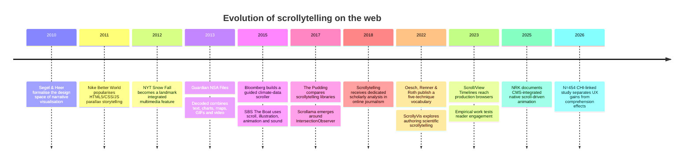
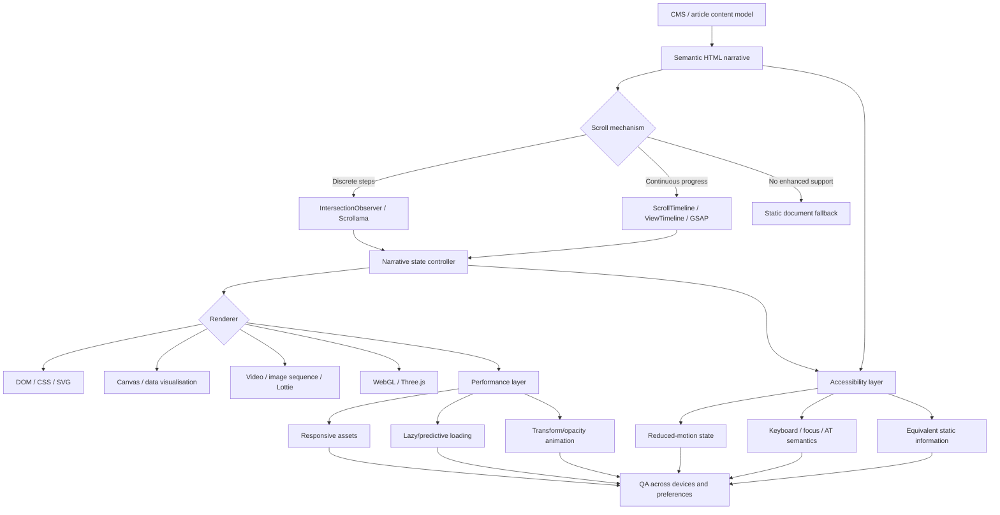

# Scrollytelling as a UX Technique: Design Patterns, Evidence, Technology and Practice

## Executive summary

**Scrollytelling is best understood not as “a long page with animation”, but as a narrative interaction model in which ordinary scrolling controls the sequencing, state or continuous progression of content.** A useful operational definition is: *content is revealed, transformed or advanced in response to the reader’s scroll position, while native scrolling remains the navigation mechanism*. The European Commission’s Data Visualisation Guide describes scrollytelling as situations where something beyond conventional document movement happens as the reader scrolls; The Pudding makes an especially useful distinction: scrollytelling *monitors* native scrolling, whereas **scrolljacking changes the browser’s scroll mechanics**. citeturn15search1turn20view1

The technique sits at the intersection of **narrative design, information visualisation, animation and interaction design**. It is narrower than an *interactive article*, which may use filters, maps, sliders, quizzes or other reader-controlled interactions, and independent of *long-form journalism*, which describes editorial length/form rather than interaction. **Parallax** is merely one visual technique—layers moving at different relative rates—and can appear inside a scrollytelling experience without itself constituting scrollytelling. The distinction matters because the UX value of scrollytelling comes primarily from **sequencing and pacing information**, not from spectacle. citeturn14search1turn15search5turn19search0

The most robust contemporary pattern is surprisingly simple: **semantic text remains in normal document flow; a graphic is made sticky with CSS; `IntersectionObserver` or equivalent logic observes narrative “steps”; entering a step changes the graphic’s state**. Scrollama explicitly recommends CSS `position: sticky` for the fixed graphic and uses `IntersectionObserver` rather than continuous scroll-event polling. More animation-intensive work can use GSAP ScrollTrigger or the emerging native Scroll-Driven Animations APIs. citeturn20view2turn20view3turn1search2

The evidence base is promising but does **not** justify the blanket claim that scrollytelling is inherently more effective than static presentation. A 2023 study of long-form journalism found significantly higher perceived engagement and stronger emotional response for its scrollytelling version, while also finding circumstances in which static content was more efficient for locating known information. A much larger 2026 online experiment, with **454 participants**, found a scrollytelling privacy policy produced higher engagement, lower cognitive load, greater perceived clarity and greater willingness to use the format than plain text, while comprehension was generally comparable rather than superior. In other words: **the most defensible empirical advantage is engagement and guided comprehension experience, not guaranteed factual comprehension**. citeturn16search6turn16search0turn17view1

Accessibility is not an optional refinement. Scrollytelling is unusually capable of creating barriers because visual state may exist only temporarily, because scrolling can generate substantial motion, and because keyboard or screen-reader users can move through a document in larger jumps than a pointer user. W3C guidance explicitly recommends respecting `prefers-reduced-motion`; WCAG also requires control over certain moving content and addresses flashing, meaningful sequence, keyboard access and reflow. NRK’s production guidance is particularly instructive: critical information must remain available when animation is suppressed or skipped, users navigating with Space, arrow keys or assistive technology must not miss intermediate states, and animations should avoid abrupt luminance changes. citeturn1search0turn1search1turn17view3

Performance architecture has likewise changed. Earlier implementations commonly listened to every scroll event and repeatedly calculated geometry. `IntersectionObserver` made threshold-triggered stories cheaper and simpler; newer Scroll/View Timelines can directly associate animation progress with scroll progress. NRK reports substantially lower main-thread task time for its newer implementation, although that measurement is one organisation’s case study rather than a universal benchmark. Browser support for the newest CSS scroll-animation syntax is still not completely uniform as of August 2026, so **feature detection and progressive enhancement remain necessary**. citeturn20view2turn17view3turn12search3

For most editorial and explanatory work, the recommended default is therefore:

> **Native vertical scrolling + semantic HTML + CSS sticky graphic + discrete step triggers + restrained `transform`/`opacity` animation + an equivalent static/reduced-motion representation.**

Move to continuous scrubbed animation, canvas, WebGL or frame sequences only where the subject genuinely benefits from continuous transformation. Use reader-driven interaction after—not instead of—a guided explanation when exploration is the real goal. This aligns with the broader author-driven/reader-driven narrative design space identified by Segel and Heer. citeturn14search1turn20view2

**Scope note.** “Scrollytelling” has no single standards-body definition, and practitioners use the term somewhat differently. “Narrative anchor” in this report is a practical design label for the textual or semantic unit that causes/justifies a visual state change, rather than a universally standardised term. Likewise, the case-study table gives **accessibility evidence/notes rather than invented Lighthouse or WCAG scores**: no comparable formal accessibility audit exists across all the historical examples reviewed.

## Definition, scope and design language

Scrollytelling evolved out of broader work on narrative visualisation, multimedia journalism and scroll-linked web animation. Segel and Heer’s influential 2010 work did not define “scrollytelling” specifically, but established a useful continuum between **author-driven narrative** and **reader-driven exploration**, showing that digital visualisation can combine narrative sequencing with interaction. Later newsroom research by Oesch, Renner and Roth formalised scrollytelling more directly and identified recurring techniques such as graphic sequences, animated transitions, pan-and-zoom, moviescrollers and show-and-play experiences. citeturn14search1turn15search5

| Technique | What controls progression? | Does the visual state change with scrolling? | Narrative structure | Relationship to scrollytelling |
|---|---|---:|---|---|
| **Scrollytelling** | Native scroll position | Usually yes | Usually guided/sequential | The core technique. Text, graphics or media reveal/change as scrolling advances. citeturn20view1turn15search1 |
| **Parallax scrolling** | Scroll position | Yes, usually position/depth only | Not necessarily narrative | A visual effect in which layers move at different rates. It can support a scrollytelling narrative but may be entirely decorative. Nike Better World popularised this distinction. citeturn19search0turn19search2 |
| **Long-form storytelling** | Conventional reading/navigation | Not necessarily | Long, editorially structured | Describes format/length, not mechanics. A long article can be completely static; *Snow Fall* combined the two. citeturn14search2 |
| **Interactive article** | Clicks, taps, filters, drag, scroll, search, etc. | Possibly | Guided, exploratory or hybrid | Umbrella category. Scrollytelling is one interaction strategy within it. Segel/Heer’s author/reader-driven continuum is useful here. citeturn14search1 |
| **Scroll-triggered animation** | Crossing a threshold | Yes, discretely | Optional | A mechanism: “when section B enters, play animation B”. Frequently used by scrollytelling. citeturn20view3turn20view2 |
| **Scroll-driven/scrubbed animation** | Continuous scroll progress | Continuously | Optional | Animation time is mapped to scroll progress; useful for transformations, maps, products or timelines. Modern CSS supports Scroll/View Timelines. citeturn12search2turn17view3 |
| **Scrolljacking** | Script changes expected scrolling | Often | Any | **Not a requirement of scrollytelling and normally an anti-pattern.** It changes speed, distance, direction, snapping or expected browser behaviour. citeturn20view1 |

This distinction leads to an important UX rule: **scroll should normally remain input, not output**. The user chooses how far and how quickly to move; the page interprets that movement. Automatically moving the viewport, changing wheel sensitivity, blocking reverse scrolling or forcing every wheel gesture into a predefined transition removes that agency and can interfere with keyboard navigation and browser expectations. The Pudding explicitly defines its preferred scrollytelling approach in opposition to such scrolljacking. citeturn20view1

A second distinction is between **triggered** and **driven** behaviour. Triggered behaviour is state based:

```text
Step enters viewport → change chart from state A to state B
```

Driven behaviour is continuous:

```text
0% ───────── scroll progress ───────── 100%
 │                                      │
animation frame 0                 animation frame N
```

The former generally produces more predictable prose-plus-chart explainers. The latter is appropriate where intermediate states carry meaning—for example, moving through geographic scale, assembling a product, interpolating a time series, or progressing through an illustrated environment. GSAP exposes both trigger and `scrub` patterns; native Scroll/View Timelines increasingly make the second possible without hand-writing a scroll loop. citeturn20view3turn12search2

**Common interaction and visual patterns**

| Pattern | Description | Strong use case | Principal risk | Recommended implementation |
|---|---|---|---|---|
| **Pinned/sticky element** | Graphic remains visible while narrative text passes alongside or over it. | Data explanation, process explanation, maps. | “Scroll jail”; graphic occupies too much mobile viewport. | Prefer CSS `position: sticky`; let text remain normal DOM flow. Scrollama explicitly moved from JS container pinning to CSS sticky. citeturn20view2 |
| **Step-triggered state change** | A prose block crossing an activation line updates a chart/image/state. | Discrete arguments or chapters. | Ambiguous thresholds; abrupt backward transitions. | `IntersectionObserver`/Scrollama; make states deterministic in both scroll directions. citeturn1search2turn20view2 |
| **Continuous scrub** | Scroll distance maps to animation progress. | Processes, time, spatial transformations, product assembly. | Excessive physical scrolling, motion sickness, expensive rendering. | Scroll/View Timeline or GSAP `scrub`; reserve for meaningful continuous state. citeturn20view3turn17view3 |
| **Progress indicator** | Reading percentage, chapter rail, dots or position marker. | Long narrative with identifiable stages. | False precision when steps have unequal semantic weight. | Tie to meaningful chapters where possible; make it supplementary rather than the only navigation cue. |
| **Parallax layers** | Foreground/background move at different rates to create depth. | Place, atmosphere, illustrated stories, brand storytelling. | Decorative motion overwhelms information or causes vestibular discomfort. | Keep displacement small; suppress or flatten under reduced-motion preference. citeturn19search0turn1search0 |
| **Narrative anchors** | Textual sections/chapter markers establish why the visual changes. | Almost all explanatory scrollytelling. | Graphic changes before reader understands the new state. | Align triggers with semantic paragraphs/headings rather than arbitrary pixel distances. |
| **Reveal on scroll** | Items fade, draw, expand or appear as they enter view. | Emphasis and progressive disclosure. | Content may be effectively absent for AT, zoom or non-JS users. | Content exists in the DOM first; animation is progressive enhancement. NRK specifically cautions about hidden/revealed information. citeturn17view3 |
| **Show-and-play** | Reaching an item automatically plays a bounded animation/video. | Short simulations or demonstrations. | Competing motion, autoplay/media-accessibility problems. | Trigger once or provide pause/replay; captions/transcript for meaningful media. Oesch et al. identify this as a recurring scrollytelling class. citeturn15search5 |
| **Horizontal-scroll section** | Vertical scrolling temporarily translates content horizontally, or a genuinely horizontal rail appears. | Finite sequences where horizontal spatial relationships matter. | Weak discoverability and reflow problems; unexpected horizontal scrolling has historically tested poorly. | Preserve vertical fallback; avoid site-wide sideways navigation; ensure keyboard controls and visible affordance. citeturn0search38turn1search1 |
| **Micro-interactions** | Tooltips, hover/tap details, highlighting or small controls embedded in a guided story. | Secondary detail without breaking narrative. | Hover-only information; competing interaction models. | Every essential interaction needs keyboard/touch equivalents and clear focus state. citeturn1search1 |
| **Responsive/adaptive behaviour** | Layout, trigger offsets, animation complexity or asset choice changes by viewport/device. | All production work. | “Desktop shrunk to mobile”, sticky collisions, dynamic mobile viewport jumps. | Recompose rather than merely scale: side-by-side → stacked/overlay/static; use media queries and measured offsets. Scrollama and GSAP explicitly support mobile/responsive patterns. citeturn20view2turn20view3 |

A useful analytical shorthand is therefore:

**good scrollytelling = narrative state + semantic anchor + scroll mapping + reversible presentation**

rather than:

**good scrollytelling = lots of movement**.

That distinction explains why some almost motionless annotated-chart explainers are stronger examples of the technique than spectacular parallax landing pages.

## Evidence base and evolution

The scholarly evidence should be interpreted cautiously because studies compare different subjects, narratives and implementations. “Scrollytelling” is not a single treatment: a sticky annotated chart, a cinematic image sequence and an immersive parallax comic introduce very different cognitive demands. Consequently, engagement results from one implementation cannot simply be transferred to another. This methodological heterogeneity is visible both in specific scrollytelling studies and in the broader narrative-visualisation literature. citeturn15search2turn14academia29

| Evidence | Design / sample | Main finding | What it does **not** establish |
|---|---|---|---|
| **Tjärnhage et al., ECCE 2023, “The Impact of Scrollytelling on the Reading Experience of Long-Form Journalism”** | Younger participants experienced static and scrollytelling versions of long-form journalism; small qualitative/quantitative study. | Significant difference in **perceived engagement favouring scrollytelling** and evidence of stronger emotional response. Participants also exposed weaknesses around locating information and abrupt visual-state changes. citeturn16search6turn16search0 | It does not prove universal improvement in comprehension, nor generalise safely to all audiences/content because of the small, targeted sample. |
| **Méndez & Such, CHI 2026-linked paper/preprint** | Online experiment, **N=454**; scrollytelling privacy policy vs conventional text, two “nutrition label” formats and standalone interactive visualisation. | Scrollytelling improved engagement, perceived clarity and willingness to adopt, and reduced reported cognitive load relative to text. Comprehension accuracy/confidence was broadly comparable, with one label format slightly better; trust/transparency effects were small and inconclusive. citeturn17view1 | It does not show scrollytelling improves comprehension over every alternative, nor that engagement automatically creates trust. |
| **Mörth, Bruckner & Smit, ScrollyVis** | Scientific-story authoring system; diverse media, interactive scientific visualisation and a 12-participant user study plus expert assessment. | Demonstrates that guided scrolling can be combined technically with reader-driven parameter exploration and packaged in an authoring environment. citeturn15search2 | The study is primarily evidence about the authoring approach/system, not a large-scale test proving audience-learning superiority. |
| **NRK production/user insights, 2025** | Newsroom case study rather than controlled academic trial. | NRK reports that highlighting/animation helps readers identify key points while skimming and can make relationships/changes easier to explain; its team has institutionalised the pattern in its CMS. citeturn17view3 | Internal user insights cannot establish the same causal strength as a controlled independent experiment. |
| **Nielsen Norman Group scrolling research** | Broader web-reading/attention research rather than a scrollytelling-specific experiment. | Attention remains disproportionately concentrated toward the top of pages; users will scroll, but scrolling has interaction cost and lower content does not receive equal attention. citeturn0search3turn0search31 | It does not mean users “do not scroll”, nor does it directly compare modern scrollytelling against ordinary articles. |

The practical conclusion is more nuanced than promotional descriptions of the technique often suggest:

**Scrollytelling has credible evidence for increasing perceived engagement and making guided presentation more attractive, but the evidence for superior comprehension is conditional.** Indeed, the 2026 privacy-policy study is particularly informative precisely because it separates the two: user experience improved without a general comprehension advantage. citeturn17view1

That suggests two separate design objectives:

1. **Engagement objective:** make a reader willing to stay with material, perceive its structure and advance through it.
2. **Information-retrieval objective:** let a reader quickly locate, compare or revisit information.

Scrollytelling is naturally strong at the first and can be weak at the second unless designers deliberately add headings, overview navigation, stable visual states, summaries and direct access to the underlying data. Tjärnhage et al. explicitly identify goal-directed lookup as a context in which the static format may be preferable. citeturn16search0

The historical development also shows a shift from **effect-led scrolling** to **semantic storytelling and increasingly native browser primitives**:



The milestones above are grounded in the publication histories and case-study sources reviewed here; they should be read as **representative milestones, not a claim that any one organisation “invented” scrollytelling**. citeturn14search1turn19search2turn14search2turn18search0turn18search8turn18search5turn20view1turn15search5turn17view3turn17view1

## Case studies and comparative analysis

The following examples were selected to span news, data journalism, public-interest communication, long-form narrative and commercial/product experience. In several historical projects the precise production framework was never publicly documented, or the surviving page has changed; where that is the case, **“custom” is preferable to guessing a JavaScript framework**.

There is also no meaningful way to compare them with a single “accessibility score” after the fact. Lighthouse scores are version-, browser- and page-state-dependent, and several examples are historical or no longer served in their original form. The accessibility column therefore records **documented or observable accessibility characteristics, not a WCAG conformance claim**.

| Example / URL | Purpose and platform/technology | Why it is effective | Accessibility evidence / notes | Weaknesses or cautions |
|---|---|---|---|---|
| **Nike — Better World** (2011). Original experience is no longer reliably live; [technical retrospective](https://www.smashingmagazine.com/2011/07/behind-the-scenes-of-nike-better-world/) | Brand/CSR landing page. HTML5, CSS3 and extensive JavaScript created layered parallax scrolling; contemporary reporting described it as a scrolling storyboard. citeturn19search0turn19search2 | Historically important because scroll becomes expressive: depth and movement create continuity between brand messages instead of dividing them into conventional pages. | Contemporary coverage says it degraded for less capable browsers, but it predates modern reduced-motion and WCAG-oriented scrollytelling practice. citeturn19search0 | A useful **precursor**, but also an example of how parallax can dominate the experience. Its implementation belongs to an earlier browser/performance era. |
| **The New York Times — [Snow Fall: The Avalanche at Tunnel Creek](https://www.nytimes.com/projects/2012/snow-fall/)** (2012) | Long-form news feature with integrated text, video and graphical/visual explanation. The Pulitzer organisation records its December 2012 publication and subsequent 2013 Feature Writing award. citeturn14search2 | Multimedia is embedded into the narrative rather than functioning as unrelated sidebars, creating a continuous sense of place, people and physical process. Its influence on digital feature storytelling was substantial. citeturn14search2 | Historical implementation; no comparable modern accessibility audit located. Its significance is primarily editorial/design-historical. | Very high bespoke-production cost helped encourage a wave of “Snow Fall clones” in which visual spectacle was sometimes copied without equivalent editorial justification. |
| **The Guardian — [NSA Files: Decoded](https://www.theguardian.com/world/interactive/2013/nov/01/snowden-nsa-files-surveillance-revelations-decoded)** (2013) | News explainer combining text, interview video, maps, charts, GIFs and interactives in a custom web-native article. MIT Docubase describes its organising question as what the surveillance revelations meant to the reader. citeturn18search0turn18search3 | Converts an abstract, institutionally complex investigation into a sequence of consequences and explanations. Mixed media are used for different semantic jobs rather than as identical decoration. It won a 2014 Webby for Best Practices. citeturn18news35 | Historical project; some embedded/autoplay media patterns would merit re-audit against current requirements. | Large multimedia packages can interrupt scanning and make maintenance/archive preservation harder. |
| **Waterwise / Nice and Serious — [Every Last Drop](https://everylastdrop.co.uk/)** | Public-interest persuasion/education. The agency describes a parallax website following a character through an ordinary day; scrolling triggers animations and exposes water-use statistics. citeturn14search3turn14search7 | Excellent example of **metaphorical spatial storytelling**: everyday activities provide narrative anchors, so statistics emerge in contexts the user recognises. | The core historic design is highly visual, so equivalent textual information and reduced-motion behaviour are crucial in any modern recreation. | Illustrative novelty can make individual facts less findable later; pronounced parallax can be unsuitable for motion-sensitive users. |
| **Bloomberg — [What’s Really Warming the World?](https://www.bloomberg.com/graphics/2015-whats-warming-the-world/)** (2015) | Data journalism. Custom browser-based visualisation walks through candidate climate drivers using climate-model data; a project interview describes the piece explicitly as scrollytelling. citeturn18search8 | A particularly strong **explanatory sequence**: each alternative hypothesis is introduced and tested in a shared visual grammar, reducing the need to mentally compare unrelated charts. Contemporary award material reported more than two million unique visitors and substantial social distribution. citeturn18search12 | Exact modern accessibility status/framework is unspecified in reviewed primary material. A static representation of every comparison is desirable. | The strong directed argument is excellent for explanation but deliberately less suitable for unconstrained exploration than a dashboard would be. |
| **SBS — [The Boat](https://www.sbs.com.au/theboat/)** (2015) | Interactive long-form graphic novel based on Nam Le’s story, illustrated by Matt Huynh. SBS and the artist describe a combination of hand-drawn art, animation, text and sound; Matt Smith is credited for project design/development and Sam Petty for sound. citeturn18search5turn18search2 | Scroll is integrated with *mood and embodiment*, not merely chart change: movement, layered imagery and sound create an unstable physical atmosphere appropriate to a refugee voyage. | Rich sound/motion means captions/transcripts, mute controls and motion alternatives are particularly important. No comparable formal WCAG audit was located. | High sensory density can reduce readability, consume bandwidth and create significant motion/sound barriers if no equivalent presentation is supplied. |
| **The Pudding — [The Naked Truth](https://pudding.cool/2021/03/foundation-names/)** (2021) | Data journalism analysing 6,816 complexion-product shade names. Custom data/code and scroll-driven graphical sequences. citeturn20view0 | The scroll states incrementally reconstruct the analytical argument instead of presenting a finished dense chart and asking readers to discover its significance independently. | **Standout design choice:** immediately before its scroll-driven graphics, the story explicitly offers a toggle to turn animations off and view static graphics. citeturn20view0 | Even with an accessible alternative, the scrolled version needs careful trigger spacing and mobile composition so text and graphic states remain synchronised. |
| **Apple — [AirPods Pro](https://www.apple.com/airpods-pro/)** product-page lineage | Product persuasion. Apple’s AirPods Pro pages became well-known for scroll-triggered product sequences; the historical 2019 treatment was catalogued as scrolling/WebGL. The current 2026 page is AirPods Pro 3, so its implementation should not be assumed identical to the 2019 version. citeturn19search8turn19search9 | Product form and feature explanation can be mapped directly to scroll progress, producing a controlled “digital product demo” without requiring the user to understand a separate player UI. | Apple’s current page should be assessed independently; no stable historical audit was found. | An influential **mixed example**: the original treatment was publicly criticised for CPU use, jerkiness and feeling like scrolljacking. That critique illustrates the danger of prioritising cinematic control over scrolling autonomy. citeturn19search20 |
| **NRK — [“The man who wasn’t missed”](https://www.nrk.no/stor-oslo/xl/mann-la-dod-i-leilighet-i-oslo-i-ni-ar-1.15337692)**; English [technical case study](https://developer.chrome.com/blog/nrk-casestudy) | Public-service journalism. NRK uses an in-house `<scroll-animation-driver>`, Web Animations, View/Scroll Timelines and components that can drive keyframe layers, Lottie, MP4, Three.js and canvas; the authoring workflow is integrated into Sanity CMS. citeturn17view3 | Perhaps the strongest contemporary production case: animation supports dramaturgy where photography is unavailable, while the underlying implementation has been standardised into an editorial tool instead of remaining one-off code. citeturn17view3 | **Strong published evidence:** reduced-motion handling, semantic treatment of animated typography, explicit concern for keyboard/Space/screen-reader jumps, zoom and flashing, plus fallbacks for browser support. citeturn17view3 | More capable technology makes over-animation easier; NRK’s own accessibility rules are essential precisely because the component can drive many media types. |

Several principles recur across the strongest examples.

First, there is usually a **stable narrative object**: Bloomberg keeps returning to essentially the same climate graph; The Pudding preserves the same population of shade swatches while changing what is emphasised; a product scroller preserves the product while altering angle/detail; an illustrated story preserves its scene or characters. This reduces context-switching.

Second, the strongest transitions have **semantic causality**. The graphic changes *because the sentence introduces a new claim*. Arbitrary scroll effects fail this test. In Oesch, Renner and Roth’s taxonomy, graphic sequences and animated transitions are useful precisely because they allow the reader to see one information state become another. citeturn15search5turn15search9

Third, the examples reveal a useful distinction between **immersive** and **explanatory** scrollytelling. *The Boat*, Nike and product pages allocate much of their motion budget to atmosphere or embodiment. Bloomberg, NRK’s budget work and The Pudding allocate it to changing the explanatory state. Neither approach is intrinsically superior, but the success criterion is different: immersion should be judged partly by emotional/narrative coherence; explanation should be judged by whether state changes reduce rather than increase interpretive work. NRK explicitly reports both dramaturgical and pedagogical uses. citeturn17view3

## Implementation technologies and architecture

A maintainable scrollytelling system benefits from separating **document semantics**, **scroll sensing**, **narrative state** and **rendering**. The common mistake is to let rendering code directly interrogate `scrollY` everywhere. That couples content, viewport geometry and animation so tightly that responsive changes become difficult to reason about.

A more resilient architecture looks like this:



This model synthesises current browser primitives, Scrollama’s architecture and NRK’s production design, rather than representing a single prescribed framework. citeturn20view2turn17view3turn1search2

**Technology comparison**

| Technology | Best suited to | Advantages | Constraints / judgement |
|---|---|---|---|
| **CSS `position: sticky`** | Pinned side-by-side or overlay graphics | Native layout mechanism; no scroll listener required; graceful degradation. Scrollama deprecated its old JS container-enter/exit approach in favour of CSS sticky. citeturn20view2 | Sticky positioning can fail or behave unexpectedly because of ancestor overflow/layout choices; mobile viewport occupation must be designed deliberately. |
| **`IntersectionObserver`** | “Step enters/leaves viewport” narrative state | Asynchronous browser API created to observe target/viewport intersection without continuously polling geometry. Widely available in modern browsers. citeturn1search2 | Threshold based rather than a high-fidelity animation timeline. Excellent for discrete steps, less direct for frame-perfect scrubbing. |
| **Scrollama** | Editorial/data scrollytelling | Small, focused library around `IntersectionObserver`; supports step entry/exit, progress, custom offsets, sticky examples and mobile patterns; current repository lists v3.2.0. citeturn20view2 | Deliberately not an animation engine. Pair it with D3, SVG, CSS, Canvas, etc. |
| **GSAP ScrollTrigger** | Sophisticated animation choreography/product pages | Rich trigger, pin, scrub, snap, callbacks, velocity and responsive `matchMedia()` functionality. citeturn20view3 | Greater expressive power also makes it easier to over-engineer or alter expected scrolling. Separate animation ambition from UX necessity. |
| **Native CSS Scroll-Driven Animations** (`animation-timeline`, `scroll()`, `view()`) | Continuous compositor-friendly animation and progress effects | Declaratively associates animation with scrolling; avoids hand-maintaining many scroll handlers. W3C is standardising Scroll/View Timelines. citeturn12search2turn12search0 | As of August 2026, portions remain outside MDN’s Baseline designation across all widely used browsers, so feature detection/fallback is still prudent. citeturn12search3 |
| **Web Animations API + Scroll/View Timeline** | Programmatic native animation | Gives JavaScript explicit keyframe objects while retaining browser-managed timelines; NRK uses this model in production. citeturn17view3 | More low-level than GSAP; progressive enhancement still needed. |
| **ScrollMagic** | Existing/legacy scroll-animation applications | Supports triggers, pinning, class toggling, parallax-style effects and callbacks. Its published documentation is for the older 2.0.x line. citeturn2search1 | For a greenfield 2026 application, newer primitives or actively evolving approaches are normally easier to justify unless compatibility with an existing ScrollMagic codebase matters. |
| **D3 + Scrollama/native observers** | Data journalism | D3 owns data joins/scales/visual state while observer logic owns narrative progression; Scrollama explicitly notes that its examples often use D3 but that it is renderer-agnostic. citeturn20view2 | Designers need to maintain a clear state model; imperatively mutating a chart at every trigger can become difficult to reverse/debug. |
| **Canvas/WebGL/Three.js** | Large particle systems, maps, 3D, image/product rendering | Handles visual forms not practical as ordinary DOM/SVG. NRK’s component model supports canvas and Three.js. citeturn17view3 | Content inside Canvas/WebGL is not inherently semantic; memory/GPU cost and accessibility alternatives become first-class design work. |
| **Flourish scrollytelling** | Low/no-code data stories and editorial teams | Provides authoring of scroll-driven visualisation sequences without building the entire runtime manually. citeturn3search2turn3search17 | Less bespoke control than hand-coded systems; teams should verify generated accessibility, loading strategy and embedding constraints for their context. |

A vanilla implementation does not necessarily need a framework at all. In conceptual form:

```text
HTML:
  article
    scrolly
      figure.sticky       ← one persistent visual
      section.steps
        p.step[data-state="intro"]
        p.step[data-state="compare"]
        p.step[data-state="result"]

JavaScript:
  observe .step elements
  on enter:
      state = step.dataset.state
      render(state)

CSS:
  figure { position: sticky; top: ... }
```

This separation is more important than the choice between React, Vue, Svelte or plain JavaScript. Component frameworks can manage the renderer and story state, but the article should not require the framework to reconstruct basic reading order. Scrollama itself is library/framework agnostic. citeturn20view2

For complex continuous motion, the same state architecture should remain: the difference is that **progress becomes a number in `[0,1]` rather than a discrete step ID**. GSAP’s `scrub` facility and Scroll/View Timelines directly embody that model. citeturn20view3turn12search2

## Accessibility, performance and SEO

Scrollytelling should be treated as **progressive enhancement of a readable document**, not as an application in which the document exists only after JavaScript has reconstructed it. That single architectural decision resolves a large fraction of its accessibility and SEO risk.

**Motion and vestibular accessibility.** W3C documents `prefers-reduced-motion` as a technique for reducing motion triggered by interaction, explicitly noting that scrolling-induced movement can cause difficulties for people with vestibular disorders. A reduced-motion mode should therefore do more than make animation 20% slower: for parallax, zoom, rotation and large translations it should generally replace motion with a stable state, dissolve or simple state transition. citeturn1search0turn1search8

NRK’s pattern is exemplary: apply motion only inside `@media (prefers-reduced-motion: no-preference)`, or set the corresponding scroll animation to a meaningful static progress state when reduced motion is requested. The objective is **information equivalence, not animation equivalence**. citeturn17view3

**Keyboard and assistive technology.** Native page scrolling already supports keyboard input well; scrolljacking can damage that advantage. But even without scrolljacking, a person pressing Space/Page Down or jumping between headings/landmarks with a screen reader may skip animation ranges that a trackpad user traverses slowly. NRK therefore advises authors to ensure no crucial information exists only in an intermediate animated frame. citeturn17view3

This leads to a useful test:

> Jump directly from the heading before a scrolly to the heading after it. Is the article’s essential argument still available?

If not, the implementation has confused **visual transition state** with **document content**.

Animated text needs special care as well. Splitting a heading into one `<span>` per character for visual animation can make assistive output nonsensical unless the semantic label remains intact. NRK demonstrates this by attaching an accessible label to an animated heading while using individual visual spans for its letters. citeturn17view3

**Reflow, zoom and sticky content.** Sticky and fixed elements can cover prose at high zoom, while “reveal” designs can leave a user uncertain that more content will appear. NRK explicitly warns that users relying on operating-system zoom may struggle with scroll-dependent hide/show behaviour. WCAG 2.2’s reflow and meaningful-sequence requirements make responsive fallback especially important: a two-column sticky story should commonly become a single ordered stream at narrow widths rather than preserve a tiny pinned graphic beside cramped text. citeturn17view3turn1search1

**Horizontal scroll.** Page-level horizontal navigation is a particularly poor default because its affordance is weaker than conventional vertical reading, and it can run against reflow requirements. Historical NN/g research also found horizontal scrolling difficult for users to discover and use. A contained horizontal sequence can still be justified—for example a timeline—but it should expose visible affordances, support keyboard/touch, and retain a vertical or static small-screen alternative. citeturn0search38turn1search1

**Flashing and contrast transitions.** Scroll control does not make flashing safe. A rapid user can scrub backward and forward through abrupt changes in luminance. NRK explicitly warns about large brightness/contrast changes, and WCAG contains protections against seizure-inducing flashes. citeturn17view3turn1search19

**Performance.** The highest-value interventions are architectural rather than micro-optimisations:

| Concern | Poor implementation | Preferred implementation |
|---|---|---|
| Viewport detection | Repeated `scroll` event + `getBoundingClientRect()` for many nodes | `IntersectionObserver` for threshold events. citeturn1search2turn20view2 |
| Sticky positioning | JS recomputes `position: fixed` and offsets | CSS `position: sticky`. citeturn20view2 |
| Continuous animation | Main-thread geometry/layout mutation every scroll tick | Native Scroll/View Timeline where supported, or disciplined `requestAnimationFrame` fallback. citeturn17view3turn12search2 |
| Animated property | Repeated `top`, `left`, width/height/layout-heavy changes | Prefer `transform` and `opacity` where the design permits; web.dev recommends these for high-performance animation. citeturn2search2 |
| Images/video | Download complete media collection immediately | Load appropriately sized media and defer genuinely below-the-fold resources. Lazy loading is a recognised performance technique. citeturn1search17turn14search0 |
| Frame sequence | Hundreds of large full-resolution frames | Reduce frame count/dimensions, use efficient video where appropriate, preload a small forward window, and provide a static reduced-motion state. |
| Responsive rendering | Desktop WebGL/animation unchanged on low-end mobile | Adapt scene complexity, media density and rendering strategy to viewport/device capability. |
| Unsupported new APIs | Blank/broken experience | `@supports`/feature detection plus static or JS fallback. NRK conditionally loads its ScrollTimeline fallback. citeturn17view3 |

NRK’s Chrome case study reports that a particular scroll-driven-animation implementation reduced per-frame task duration in its test from approximately **1 ms to 0.16 ms** under the described test conditions, and reminds developers that a 60 fps frame budget is approximately 16.7 ms. This is useful evidence that browser-managed timelines can reduce overhead, but it should **not** be turned into a universal “6× performance improvement” claim: rendering complexity, animation properties, hardware and browser differ. citeturn17view3

Native Scroll-Driven Animations are also not magic: animating properties that force expensive layout or paint can still perform badly. The browser primitive improves *timing and coordination*; the normal rules of high-performance animation still apply. citeturn2search2turn12search0

**SEO and crawlability.** Google explicitly warns that lazy-loading implementations can inadvertently hide content from Search, and recommends ensuring relevant material can load when visible to the renderer. Its mobile-first guidance further warns not to make primary content dependent on user interaction because Google does not perform interactions such as swiping, clicking or typing to uncover it. citeturn14search0turn14search4

For scrollytelling, the safest corresponding architecture is:

```text
Searchable/semantic layer
    heading
    explanatory paragraph
    data/table or meaningful image alternative
    next heading
    ...

           +
Progressive visual layer
    sticky chart
    transitions
    canvas / video
    motion
```

Rather than:

```text
empty <div id="app">
        ↓ JavaScript
scroll to 37%
        ↓
inject the only copy of important factual content
```

Google does render JavaScript with a modern Chromium-based renderer, but rendering support is not a reason to hide the primary narrative behind interaction-dependent state. citeturn14search14turn14search0

The same architecture benefits accessibility, linkability, printing, archiving, reader modes and failure recovery. This is an important example where **SEO and inclusive design point to essentially the same solution: preserve the document beneath the experience**.

## Best practices, anti-patterns and goal-based recommendations

The strongest general principle is **make scrolling meaningful before making it beautiful**. A scroll transition should ideally answer one of four questions:

**What changed? What caused it? Where are we now? What should I look at next?**

If it cannot answer one of those questions, it is likely decorative animation rather than explanatory interaction.

| Anti-pattern | Why it fails | Concrete mitigation |
|---|---|---|
| **Scrolljacking / altered wheel speed** | Breaks learned scrolling behaviour, can frustrate keyboard and trackpad users, and converts an accessible browser primitive into a custom control. The Pudding explicitly separates good scrollytelling from this pattern. citeturn20view1 | Observe native scroll; never require a particular wheel velocity. Use sticky/triggered states rather than manipulating viewport position. |
| **“Scroll jail”** | User must scroll excessive physical distance while a section barely changes, making the interface feel trapped. Apple’s historical AirPods Pro treatment received precisely this sort of criticism. citeturn19search20 | Minimise blank runway; one normal gesture should produce perceptible progress; allow rapid scrolling to pass through cleanly. |
| **Motion without semantic change** | Consumes attention but communicates nothing; increases accessibility/performance cost. | Require an editorial justification for every animation. Decorative effects should be subtle and removable. |
| **Critical information exists only mid-animation** | Keyboard/AT/fast-scroll users can skip it entirely. citeturn17view3 | Put the claim in text/semantic data as well; make beginning/end states sufficient to understand essentials. |
| **Irreversible state machine** | Scrolling upward yields a different or broken state than scrolling downward, undermining the reader’s ability to review. | Treat visual state as a pure function of current narrative step/progress, not as a chain of one-way side effects. |
| **Hover-only micro-interactions** | Excludes keyboard and touch users. | Click/focus equivalents; expose important data in text/table form. citeturn1search1 |
| **Desktop sticky layout merely squeezed onto mobile** | Tiny text/graphics, occlusion, viewport jumps and poor reflow. | Recompose: stack prose and graphics, shorten animation, use overlay only where readable, or replace with static sequence. citeturn20view2turn1search1 |
| **Unannounced horizontal mode** | User may not realise content extends sideways; can violate reflow expectations. | Visible cue, conventional vertical fallback, keyboard navigation, finite bounded rail. citeturn0search38turn1search1 |
| **No reduced-motion mode** | Can trigger vestibular symptoms and makes animation an accessibility requirement. | `prefers-reduced-motion`; eliminate parallax/large zoom/rotation and select meaningful static frames. citeturn1search0 |
| **Everything loads at page start** | Scrollytelling can contain unusually large video/image/frame assets, harming startup responsiveness. | Responsive sources, dimensions reserved up front, staged/lazy loading of genuinely later media. citeturn14search0turn1search17 |
| **Everything is lazy-created after the trigger** | Search, assistive technology, printing and failure states may lose primary content. | Semantic server-rendered/core DOM first; lazy-load enhancement rather than meaning. citeturn14search0turn14search4 |
| **Dwell time treated as proof of success** | Longer time may mean fascination—or confusion and slow controls. The empirical literature distinguishes engagement from comprehension. citeturn17view1turn16search6 | Measure task comprehension, completion, recall, lookup time, backtracking, accessibility errors and qualitative confidence as well as engagement. |

The appropriate pattern depends strongly on the communication goal.

| Goal | Recommended scrollytelling pattern | Reader agency | Avoid |
|---|---|---|---|
| **Persuasion / emotional narrative** | Full-width imagery/illustration, restrained parallax, chapter anchors, occasional scroll-driven scene changes; use motion to establish mood. NRK and *The Boat* exemplify this. citeturn17view3turn18search5 | Moderate: scrolling controls pace. | Dense controls, constant chart manipulation, aggressive scrolljacking. |
| **Explain a process or mechanism** | Sticky central diagram + 3–7 clearly differentiated narrative states; continuous scrub only where intermediate states matter. | Guided. | Replacing explanation with gratuitous animation. |
| **Explain a data argument** | Sticky chart + annotated graphic sequence; add/highlight one variable at a time while axes remain stable. Bloomberg and The Pudding are strong models. citeturn18search8turn20view0 | Guided initially. | Changing chart type/scale on every step without visual continuity. |
| **Enable data exploration** | **Guided scrolly → explicit transition to normal interactive exploration.** This resembles Segel & Heer’s “martini-glass” logic: author guidance followed by reader control. citeturn14search1 | High after introduction. | Trying to encode every possible exploration as hundreds of scroll steps. |
| **Product demonstration** | Sticky product visual; map distinct product benefits to coherent visual transformations; short chapters with conventional navigation. | Moderate. | Long frame sequences that make scrolling feel artificially slow; hidden feature copy. |
| **Policy/compliance explanation** | Restrained explanatory scrolly interleaved with complete accessible text; static option; clear section navigation. The 2026 privacy-policy study provides encouraging evidence. citeturn17view1 | Moderate/high. | Treating animation as a substitute for the legally/informationally complete text. |
| **Reference / lookup content** | Usually **do not make scrollytelling the primary interface**. Conventional headings, search and stable charts/tables should dominate. | High. | Long mandatory narrative sequence before known information; Tjärnhage et al. found lookup to be a weak context for scrollytelling. citeturn16search0 |

A particularly valuable design strategy for data work is **“guided first, exploratory second”**. The scroll sequence establishes vocabulary, axes, causal hypotheses or the important comparison; then the visualisation is released into an ordinary interactive state. This mitigates a fundamental tension: author-driven sequencing is good at telling the reader *what matters*, whereas an exploratory visualisation is good at letting the reader ask *what else?* Segel and Heer’s narrative-visualisation framework provides the conceptual foundation for this hybrid. citeturn14search1

Likewise, **progress indicators should represent conceptual progress, not simply pixels travelled** where possible. A “Climate drivers — 3 of 7” indicator is semantically more useful than “42%” when individual chapters have unequal lengths. This is a design inference from the step-based narrative model rather than a formal WCAG rule.

Responsive design should also be **adaptive rather than merely responsive**. A desktop side-by-side chart and prose layout may become:

```text
DESKTOP
┌─────────────────────┬───────────────┐
│                     │ Step A        │
│   sticky graphic    │               │
│                     │ Step B        │
│                     │               │
│                     │ Step C        │
└─────────────────────┴───────────────┘

MOBILE
┌─────────────────────────────────────┐
│ Graphic / meaningful state A        │
├─────────────────────────────────────┤
│ Step A                              │
├─────────────────────────────────────┤
│ Graphic / changed state B           │
├─────────────────────────────────────┤
│ Step B                              │
└─────────────────────────────────────┘
```

Scrollama explicitly supplies a mobile pattern and custom offsets, while GSAP supplies responsive setup through `matchMedia()`, supporting this idea of mode-specific composition. citeturn20view2turn20view3

## Implementation checklist and further reading

A production scrollytelling review should be able to answer **yes** to the following questions before launch. The checklist synthesises W3C accessibility requirements/techniques, Google crawling guidance, modern browser API documentation and production lessons from Scrollama and NRK. citeturn1search1turn1search0turn14search0turn20view2turn17view3

| Area | Launch criterion |
|---|---|
| **Editorial purpose** | Every pinned state or major animation has an explicit explanatory, persuasive or narrative purpose. |
| **Document structure** | Headings, paragraphs, links and meaningful images/data form a coherent reading sequence before animation is applied. |
| **Native scrolling** | Wheel, trackpad, touch, Space, Page Up/Down, arrow keys and browser scrollbar behave normally. |
| **Reverse navigation** | Scrolling backwards reconstructs the correct earlier state; no irreversible “played once” logic hides information. |
| **Fast navigation** | Skipping from the beginning to end of a scrolly does not make essential information unavailable. NRK specifically treats coarse keyboard/AT navigation as a design case. citeturn17view3 |
| **Sticky layout** | Sticky elements do not obscure narrative text at common breakpoints, zoom levels or orientation changes. |
| **Mobile adaptation** | Mobile has been deliberately recomposed, not merely scaled down. |
| **Reduced motion** | `prefers-reduced-motion: reduce` produces a genuinely stable presentation rather than merely slower parallax. citeturn1search0 |
| **Animation alternative** | Any meaningful visual transition has an equivalent static endpoint, text description, table or other representation. |
| **Keyboard** | All actual controls—toggles, tooltips, playback, filters—are keyboard operable with visible focus. citeturn1search1 |
| **Assistive technology** | Semantic order, labels and headings make sense when the visual animation layer is ignored; split/animated text has an intact accessible name. |
| **Audio/video** | Meaningful spoken/audio content has the appropriate captions/transcript and controllable playback. |
| **Flashing** | Rapid scrolling cannot generate unsafe flashing or extreme brightness changes. citeturn17view3turn1search19 |
| **Viewport sensing** | Discrete triggers use `IntersectionObserver` or equivalent rather than dozens of continuous geometry reads. citeturn1search2turn20view2 |
| **Animation properties** | High-frequency motion primarily uses compositor-friendly properties such as transform/opacity where possible. citeturn2search2 |
| **Media loading** | Media are responsively sized; genuinely later resources can be deferred; large image sequences have an explicit loading/memory strategy. citeturn14search0turn1search17 |
| **Layout stability** | Space for imagery/media is reserved rather than appearing unpredictably during scrolling. |
| **API fallbacks** | Scroll/View Timeline or other newer features are feature-detected and have meaningful fallback states. NRK demonstrates this in production. citeturn17view3 |
| **Search/indexing** | Primary textual content is available independently of interaction; lazy loading does not require an unperformed action before important material exists. citeturn14search0turn14search4 |
| **No-JS/failure behaviour** | A failed enhancement leaves a readable article rather than an empty scrolling shell. |
| **Deep linking/navigation** | Long pieces have useful headings/chapter anchors so readers can resume or locate information without replaying the complete sequence. |
| **Analytics** | Success measures go beyond “time on page”: comprehension/task outcome, completion, abandoned sections, backward navigation and accessibility errors are considered. The literature does not support equating longer engagement with superior comprehension. citeturn17view1turn16search6 |
| **Real-device QA** | Test touch phones, keyboard-only navigation, coarse scrolling, high zoom, reduced motion, lower-powered hardware and at least the browsers in the product’s actual support matrix. |

**Recommended default stack by complexity**

For a **basic explanatory article**, use semantic HTML, responsive CSS, `position: sticky`, `IntersectionObserver` or Scrollama, and CSS transitions. This provides the highest benefit-to-complexity ratio for the canonical sticky-chart pattern. citeturn20view2turn1search2

For **rich data journalism**, add D3/SVG or Canvas as the renderer but retain the same step/state separation. Scrollama intentionally does not prescribe the renderer and notes that many of its examples use D3. citeturn20view2

For **highly choreographed animation or product storytelling**, GSAP ScrollTrigger is appropriate when pinning, scrubbing, timelines and responsive animation orchestration materially simplify development. Its `scrub`, `pin`, `snap` and `matchMedia` capabilities cover most sophisticated scroll choreography. citeturn20view3

For **forward-looking native implementations**, CSS Scroll-Driven Animations and the Web Animations API reduce the need for bespoke scroll loops. NRK demonstrates that this architecture is now usable at newsroom scale, but its own implementation still carries browser fallbacks; MDN continues to mark some of the related CSS functionality as not universally Baseline. citeturn17view3turn12search3

For **non-developer editorial teams**, Flourish provides scrollytelling authoring around visualisations, while purpose-built publishing platforms can similarly reduce one-off engineering. The trade-off is that teams should audit the generated experience rather than assuming a no-code tool automatically solves accessibility or performance. citeturn3search2turn3search17

**Further reading and primary resources**

The most useful conceptual starting point remains Edward Segel and Jeffrey Heer, **“Narrative Visualization: Telling Stories with Data”** (Stanford/IEEE, 2010), which supplies the broader framework for guided versus exploratory visual narratives: [Stanford publication page](https://vis.stanford.edu/papers/narrative). citeturn14search1turn14search15

For a scrollytelling-specific taxonomy, Jonas Oesch, Adina Renner and Manuel Roth, **“Scrolling into the Newsroom: A Vocabulary for Scrollytelling Techniques in Visual Online Articles”**, identifies graphic sequence, animated transition, pan-and-zoom, moviescroller and show-and-play as recurring techniques. The European Commission’s Data Visualisation Guide provides unusually clear web demonstrations of this vocabulary: [Data.europa.eu introduction](https://data.europa.eu/apps/data-visualisation-guide/scrollytelling-introduction). citeturn15search3turn15search1

For implementation thinking, Russell Samora’s **The Pudding implementation comparison** remains valuable because it establishes the core scroll-to-trigger/fixed-graphic pattern and, importantly, distinguishes scrollytelling from scrolljacking: [How to implement scrollytelling with six different libraries](https://pudding.cool/process/how-to-implement-scrollytelling/). Its later architectural direction is represented by [Scrollama](https://github.com/russellsamora/scrollama). citeturn20view1turn20view2

For modern native-browser production, **NRK’s 2025 scroll-driven-animation case study** is one of the strongest practical resources because it addresses authoring, implementation, performance, browser fallback and accessibility in the same system: [Chrome for Developers — How NRK uses scroll-driven animations](https://developer.chrome.com/blog/nrk-casestudy). citeturn17view3

For animation infrastructure, consult the [W3C Scroll-Driven Animations specification](https://www.w3.org/TR/scroll-animations-1/), MDN’s scroll-driven-animation documentation and [GSAP ScrollTrigger documentation](https://gsap.com/docs/v3/Plugins/ScrollTrigger/). The W3C material defines the native model; MDN is the more useful source for current interoperability status; GSAP documents the mature library alternative. citeturn12search2turn12search3turn20view3

For accessibility, the central references are the [WCAG 2.2 Quick Reference](https://www.w3.org/WAI/WCAG22/quickref/), W3C’s `prefers-reduced-motion` technique and NRK’s practical guidance on skipped animation states, zoom and flashing. citeturn1search1turn1search0turn17view3

For search and loading architecture, Google Search Central’s **Fix Lazy-Loaded Website Content** is especially relevant: a scrollytelling enhancement must not cause primary information to disappear from the crawlable/renderable page merely because a human has not performed the intended interaction. [Google Search Central lazy-loading guidance](https://developers.google.com/search/docs/crawling-indexing/javascript/lazy-loading). citeturn14search0turn14search4

Finally, the empirical literature should be read with the distinction between **engagement, subjective clarity, cognitive load and actual comprehension** firmly in mind. Tjärnhage et al.’s 2023 long-form-journalism study supports an engagement/emotional advantage in its studied setting, while Méndez and Such’s substantially larger 2026 privacy-policy experiment found a clear UX advantage over plain text without a corresponding universal comprehension advantage. ScrollyVis demonstrates the feasibility of combining guided scroll narratives with later exploration rather than treating the two as mutually exclusive. Together, these studies support a restrained conclusion: **scrollytelling is a powerful technique when sequence itself helps the reader construct a mental model, but it is not a universal upgrade to ordinary reading, reference or exploration interfaces.** citeturn16search6turn17view1turn15search2