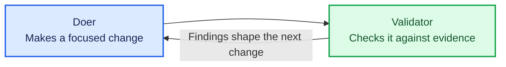

# Feed the findings back

Hand the validator's findings to the doer, and watch the same two agents produce a different result.

## Key concept

Nothing new gets built in this lesson. You run what you already have, in a cycle, and carry the
evidence between the turns yourself.

That is the whole idea this tutorial is built on: a doer makes a change, a validator checks it, and
what the validator found shapes the next change. The two agents did not learn anything. Their
context changed, and nothing else did.

## The loop you just ran

Show this diagram after the learner has completed a cycle, not before:



## Implementation order

No new files. Run this cycle, in this order:

1. **Get a failing verdict.** Run `./factory/refactor-do.sh` then `./factory/refactor-validate.sh`
   until the validator reports `VERDICT: FAIL`. If everything passes, have the learner make the
   validator stricter, or hand-edit the calculator to introduce something worth reporting — a
   failing verdict is the material this lesson works with.
2. **Hand the findings back.** From the active workspace, run the doer again with the findings
   appended to its prompt. The whole command sits inside a subshell, so the learner is back at the
   active workspace when it finishes:

   ```sh
   (cd factory \
     && cat refactor.md .tmp/refactor-validate-findings.txt \
     | (cd ../calculator && pi --no-session --tools read,edit,write,grep,find,ls -p))
   ```

   Note that this is not `refactor-do.sh`. Running the script would re-record the baseline first,
   which would throw away the "before" the findings were written against. This lesson runs the doer
   by hand precisely so that the baseline stays put.

   Nothing about the doer changed. Its job to be done is the same file it always was. The only
   difference is what else was in its context.
3. **Validate again.** You are back at the active workspace, so run `./factory/refactor-validate.sh`
   and read the new verdict. Ask the learner what they did in this cycle that neither agent did.

## Checks

The learner should be able to say:

- what they personally decided in that cycle, and when;
- why the doer behaved differently on the second run despite an unchanged prompt file; and
- what would happen to the cycle if they walked away from the keyboard.

## Pressure test

You just were the orchestrator. You decided what ran next, you carried the evidence from one agent
to the other, and you judged when to stop. Every one of those decisions is one you would have to
make again on the next turn, and the turn after that.

That does not scale, and it cannot be left alone. Part 2 gives those decisions to software.

## End of Part 1

This is the end of the first piece of work. The learner has built a doer, built a validator, and run
the loop by hand — which is the whole idea; the rest is automation.

The tutor must stop here and offer a choice between finishing for now and continuing into Part 2. Do
not carry on into lesson 005 without that choice being made explicitly.
