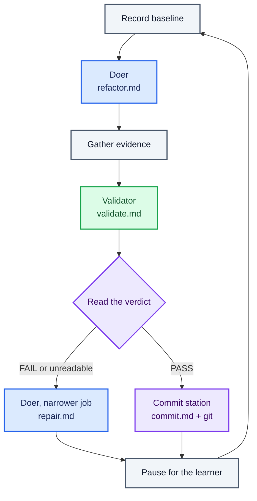

# Compose stations, and branch

Read the verdict in Bash, send a failed one to repair, and give a passing one somewhere to go.

## Key concept

In lesson 004 the learner read a `FAIL`, carried the findings to the doer, and ran it again. This
lesson gives those decisions to the line.

Everything built so far runs the same sequence whatever happens. Baseline, doer, evidence, validator,
pause — a `FAIL` scrolls past and the next iteration is identical to the one that would have followed a
`PASS`. The graph is a straight line because nothing on it has ever looked at a result.

Now it branches. Deciding which station runs next is the **orchestrator**'s job, and here `run.sh` is
doing it. In lesson 004 the learner was the orchestrator; this lesson is where the routing part of that
job moves into software.

This is not an extension of what an assembly line is. The line has been "an ordered sequence of
stations, arranged as a directed graph… the graph may branch" since the words arrived in lesson 005.
This is the first lesson in which it becomes what the word already meant.

Two stations join the line, and between them they make a second point: **a station is its job, its
boundary, and its contract — not its tool, and not necessarily a model.**



## Implementation order

Build this lesson in this order. Complete each small step before moving to the next one:

1. **Write the repair prompt.** Create `factory/refactor/repair.md`. Its job to be done is narrower than
   the doer's: given the validator's findings, make the smallest change that addresses them. It does
   not start a new refactoring, and it does not go looking for other things worth improving. Same tools
   as the doer, and the same prohibition on running checks.

   This is still a doer. It changes code, it is handed a job and run to completion, and it is judged by
   the validator like anything else on the line. What it has is a narrower job, not a new role.

   The obvious question is why the doer's own prompt will not do, when lesson 004 handed it the findings
   and it behaved. The answer is that a human chose to run it that way, once. `refactor.md` tells a
   station to find something worth improving and improve it; hand that station some findings and they
   become one more thing in its context, competing with the job it was actually given. On an unattended
   loop it will pick something new most times it is asked. Give a station one job, and repair's job is
   not the doer's job.

   Keep the prohibition on running checks for the same reason the doer has it. The validator holds the
   only judgement on this line, and a station that grades its own work has no reason to report a
   problem with it.

   Like every other prompt on the line, `repair.md` names no path to go and fetch. Its inputs — the
   criteria and the findings — arrive appended to it by the caller.

2. **Write the commit prompt.** Create `factory/refactor/commit.md`. Given the diff and the validator's
   findings, it writes the commit message for the change that was just made: a subject line under 72
   characters, a blank line, then two or three lines saying what changed and which success criteria it
   moved.

   It must not run anything, it must not edit anything, and it must emit **only** the message — no
   preamble, no code fences, no "here is the commit message".

   Its tools are `read,grep,find,ls`. It cannot commit, and it is not meant to.

3. **Branch on the verdict.** `run.sh` takes the first line of `.tmp/validate-findings.txt` that *begins*
   with `VERDICT: PASS` or `VERDICT: FAIL`, and chooses what happens next:

   ```sh
   verdict=$(grep -m1 -o '^VERDICT: \(PASS\|FAIL\)' .tmp/validate-findings.txt || echo "VERDICT: FAIL")
   if [ "$verdict" = "VERDICT: FAIL" ]; then
     echo "Starting repair..."
     cat repair.md success.md .tmp/validate-findings.txt \
       | (cd ../../calculator && pi --no-session --tools read,edit,write,grep,find,ls -p)
   else
     echo "Starting commit..."
     cat commit.md success.md .tmp/validate-findings.txt .tmp/evidence.txt \
       | (cd ../../calculator && pi --no-session --tools read,grep,find,ls -p) \
       > .tmp/commit-message.txt
     message="$PWD/commit-message.txt"
     (cd ../../calculator && git add -- . && git commit -q -F "$message")
   fi
   ```

   Each station gets its inputs in the order it was taught to expect them: its job, the criteria, then
   whatever it is working from. Leave the findings out of repair and it has nothing to repair.

   That `message=` line is not ceremony, and it is worth being precise about why. `run.sh` has already
   done `cd "$(dirname "$0")"`, so `$PWD` is the line's folder — but only until the subshell runs
   `cd ../../calculator`. A shell expands each command's arguments when that command is about to run,
   not when it reads the line, so a `"$PWD/commit-message.txt"` written inside the subshell would be
   expanded *after* the `cd` and resolve to `calculator/commit-message.txt`, which does not exist. The
   commit would fail, `set -e` would end the run, and the staging done by `git add` would be left
   behind. Capturing the path into `message` first pins it while `$PWD` still means the line's folder.

   `git add -- .` from inside `calculator/` stages that directory and nothing else. That pathspec is
   what keeps the learner's own work out of a station's commit: `factory/` is tracked too, and a bare
   `git add` from anywhere in the repository would sweep the line's own source into the change it is
   supposed to be recording.

   That block goes after the validation phase and before the `read`. The first three lines of `run.sh`
   are unchanged and are not repeated here; keep them.

4. **Run the line.** Get one of each verdict before moving on. A rename that nobody exercises is a
   rename nobody has checked, and a branch nobody has taken both ways is worse.

## Why that `^` is the whole of the parse's correctness

Without it the pattern matches a verdict string anywhere on a line, including inside a sentence about
verdicts. The validator is a model being asked to justify itself, and a model justifying itself quotes
the rules it was given. "The verdict must be `VERDICT: PASS` or `VERDICT: FAIL`, and mine is:" is an
entirely ordinary thing for it to write above its actual answer — and an unanchored `grep` would read
`PASS` out of that sentence and skip the repair the file below it was asking for. The line would carry
on refactoring on top of a change the validator had just failed, having been told so in writing. Worse,
it would commit it.

Anchored, the pattern can only match a line that opens with `VERDICT:`, so prose about verdicts is
invisible to it however the validator phrases its reasoning. `-m1` then stops at the first such line,
and `-o` trims it to the verdict itself.

Be exact about `-m1`, because it is easy to read as more than it is: it stops after the first matching
**line**, not the first match. With `-o`, a single line carrying two verdicts prints both, and
`$verdict` becomes a two-line string that equals neither `VERDICT: PASS` nor `VERDICT: FAIL` — which
sends it down the `else` arm and commits. The anchor is what makes that unreachable in practice, since
a line can only open with `VERDICT:` once. Both halves of the pattern are load-bearing, and neither
covers for the other.

Be clear about what that rests on, because it is this lesson's real subject. The anchor works because
lesson 005 told the validator to open its response with `VERDICT:` on the first non-empty line, and for
no other reason. The orchestrator does not understand the verdict; it recognises a shape, and the shape
is a promise the validator makes and could break. Every branch in every line the learner builds after
this one will rest on some agreement of that kind between a station that writes and a station that
reads.

**Then look at the commit station in that light.** Its output goes straight into `git commit -F`. If
that station opens with "Here's the commit message:", the sentence is now in the repository's history.
Same species of promise, equally load-bearing, and defended by nothing at all — there is no anchor to
save it. Unlike a misrouted verdict, which the next iteration overwrites, this failure is permanent and
visible in `git log` for as long as the repository exists.

## Why an agent writes the message and a script makes the commit

Four lines, and they carry the lesson's second idea.

A **station** is an agent running in a non-interactive harness, and its internals can be a model call
or ordinary deterministic code: from the line's point of view it makes no difference. The commit
station is both at once. Choosing what to say about a change is judgement, and a model does it.
Staging files and writing history is not judgement, and `git` does it.

There was never a reason to hand `bash` to the model so that it could run two commands the script
already knows how to run. A station is a job with a boundary, and this one's boundary is that it
writes text.

## What the branch buys beyond routing

Three things, none of which needed a lesson of its own:

- **A verdict now has a consequence.** A `PASS` produces something durable and a `FAIL` does not, and
  the difference survives the terminal being closed.
- **The line gains a discardable unit of work.** Every accepted iteration is one commit, which is what
  makes running the line unattended survivable in the next lesson. `git log` and `git revert` are the
  undo the learner has not needed until now.
- **The pass case stops being empty.** Note what the `if` used to lack: an `else`. A `PASS` was the
  branch that did nothing. Now both directions of the graph go somewhere, which is what makes it worth
  drawing.

## Checks

From the active workspace:

```sh
./factory/refactor/run.sh
```

Verify by hand that:

- a failing verdict starts a repair, announced with `Starting repair...` before Pi is invoked;
- the repair station is handed the findings — the validator's own words are in what was piped to it;
- a failing verdict produces **no** commit;
- a passing verdict starts a commit, announced with `Starting commit...`, and `git log -1` shows a
  message that describes the change rather than announcing itself;
- `git show --stat HEAD` touches only files under `calculator/`;
- the loop still pauses for Enter once per iteration, whichever way the verdict went; and
- a run in which the validator produces no recognisable verdict routes to repair rather than past it.

The last one is easier to arrange than to wait for. Feed the parse some prose directly:

```sh
bash -c 'printf "The code looks fine to me.\n" > d.txt
  grep -m1 -o "^VERDICT: \(PASS\|FAIL\)" d.txt || echo "VERDICT: FAIL"'

bash -c 'printf "must be VERDICT: PASS or VERDICT: FAIL, and mine is:\nVERDICT: FAIL\n" > d.txt
  grep -m1 -o "^VERDICT: \(PASS\|FAIL\)" d.txt || echo "VERDICT: FAIL"'
```

Both must print `VERDICT: FAIL`, the second from its verdict line rather than from the sentence above
it. Delete `d.txt` afterwards.

Now drop the `^` from the second command and run it again. It prints two lines — `VERDICT: PASS` from
the sentence, then `VERDICT: FAIL` from the actual verdict — because `-m1` stopped at the first
matching line and `-o` printed every match on it. That is the whole reason the anchor is there, and it
is worse than a misread verdict: `$verdict` is now a two-line string matching neither arm's test, so
the line takes the `else` and commits a change it was told had failed.

There is a second way to get an unreadable verdict, and it is more common than a model wandering from
its format: **Pi exits 0 when the model call itself fails.** A rate limit or a provider error produces a
run whose assistant message is empty and whose stop reason is an error, and the exit code says nothing
about it — so `set -euo pipefail` will not catch it, and the findings file ends up empty. The fallback
below is what turns that into a repair turn rather than a silent commit.

An unreadable or missing verdict is treated as a failure on purpose. The validator is a model, and
models wander from the format they were given. The alternative is a line that treats "I could not tell"
as "everything is fine", carries on refactoring on top of a change nobody checked, and commits it. Read
the other way, the worst case is one repair turn that was not needed. The two mistakes are not the same
size.

## Pressure test

The line now does two of the three things the learner did by hand in lesson 004. It reads a verdict and
chooses what runs next, and it carries the evidence from the validator to the station that needs it.

Lesson 004 named a third: judging when to stop. That one has not moved.

There is no state in which this loop decides it is finished and no verdict that ends it. It stops when
a human stops pressing Enter, and the human pressing Enter is doing the one job the orchestrator was
supposed to have taken over — the lexicon lists "deciding when the line is finished" alongside routing,
in the same sentence, as the same role's work.

The learner is still sitting at the keyboard supplying it. The next lesson takes the keyboard away.
