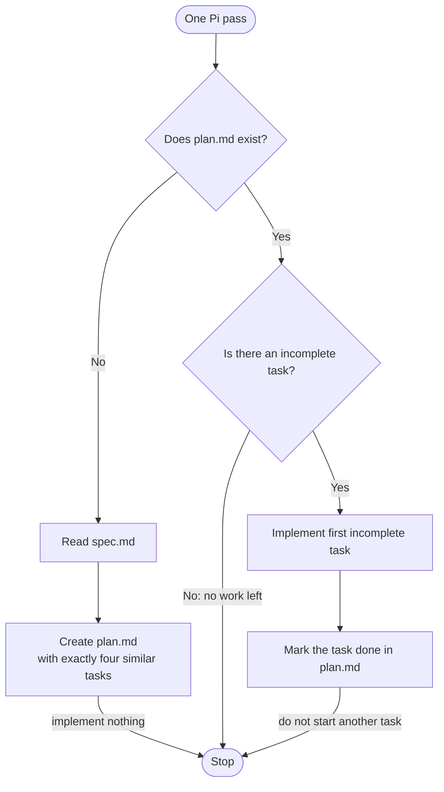

## Review the prompt

Review `prompt.md`, the instruction each Pi pass will follow.

```mermaid
flowchart TD
    Start([One Pi pass]) --> PlanExists{Does plan.md exist?}
    PlanExists -- No --> ReadSpec[Read spec.md]
    ReadSpec --> CreatePlan[Create plan.md\nwith exactly four similar tasks]
    CreatePlan -->|implement nothing| Stop([Stop])

    PlanExists -- Yes --> FindTask{Is there an incomplete task?}
    FindTask -->|No: no work left| Stop
    FindTask -- Yes --> ImplementTask[Implement first incomplete task]
    ImplementTask --> UpdatePlan[Mark the task done in plan.md]
    UpdatePlan -->|do not start another task| Stop
```
