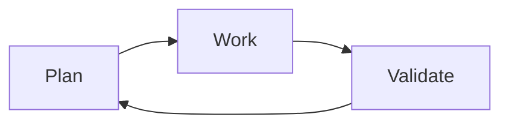

## Separate agents

Each step of a factory tends to use a new agent. There are subtle exceptions to this,
as some factory steps are deterministic instead of using an agent, and sometimes
we do want an agent to be aware of previous session history.

Normally though, we keep them separate.

If you think about our three agentic steps here in this factory, why do you think it's helpful to have one agent do the work, and a different one validate that work?
