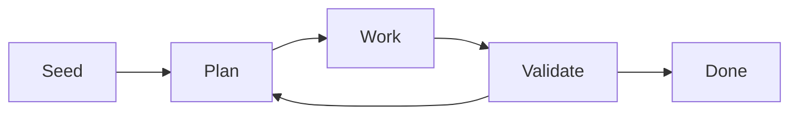

# What makes something a software factory?

A software factory combines multiple agents working together,
with some kind of feedback or validation loop, allowing them
to work autonomously towards an outcome you have described.

That description of the outcome you want is the _seed_: the raw materials going into the factory. It could be a detailed, formal specification, or a vague idea. 

An agent then plans some work towards that outcome, another agent picks up and does some of that work, and another agent validates the work when it's complete.

If the work is found to be invalid, we loop back to fix it. If the work is valid, we might loop back to plan some more work, or we might be done. The logic to run this loop is deterministic code, delegating to LLM agents at each step.

Many factories build out this pattern into much more complex flows, but that validation loop is the key ingredient.

Contrast this with the way you might work with a coding agent today, where you have a
continuous back-and-forth conversation with it, directing it at every turn.
