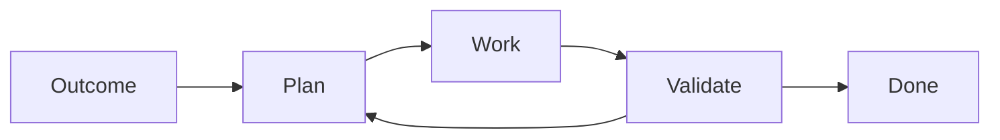

---
---

# Part 1 — The validation loop

What makes something a software factory?

A software factory combines multiple agents working together, with some kind of
feedback or validation loop, allowing them to work autonomously towards an outcome
you have described.

Let's start by learning to run our validation loop by hand.

1. Run an agent headlessly.
2. Build a "doer" agent that does some work
3. Build a validator agent that checks the work the doer just did
4. Feed the findings back.

By the end you will have a doer and a validator that keep each other honest, run one at a time,
by your own hand.
